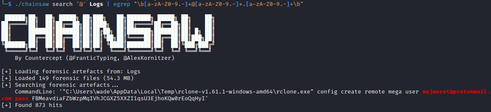
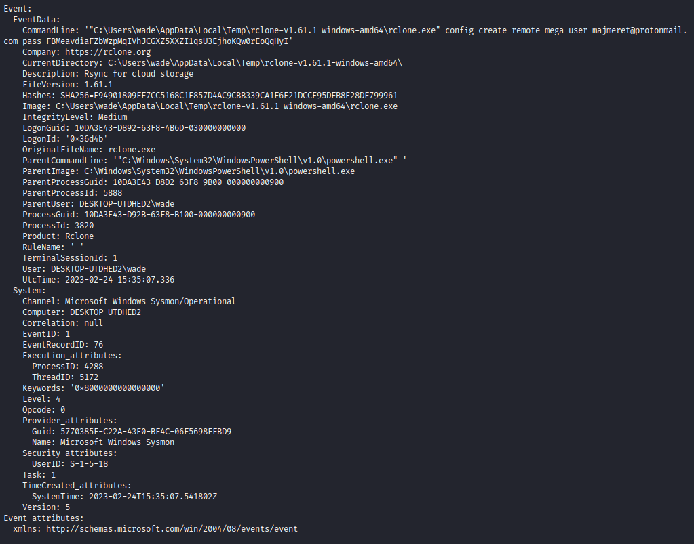
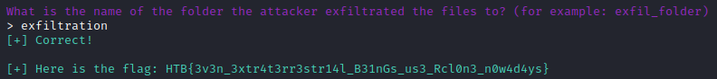

## Forensics - Packet Cyclone

__Challenge description:__

> Pandora's friend and partner, Wade, is the one that leads the investigation into the relic's location. Recently, he noticed some weird traffic coming from his host. That led him to believe that his host was compromised. After a quick investigation, his fear was confirmed. Pandora tries now to see if the attacker caused the suspicious traffic during the exfiltration phase. Pandora believes that the malicious actor used rclone to exfiltrate Wade's research to the cloud. Using the tool called "chainsaw" and the sigma rules provided, can you detect the usage of rclone from the event logs produced by Sysmon? To get the flag, you need to start and connect to the docker service and answer all the questions correctly.

</br>
</br>

# Question 1


We were given some files and we had a docker instance to connect to in order to answer questions.

We had to analyze `.evtx` event log files.

I connected, saw a short info text and saw that we have a first question to answer.

```
+----------------+-------------------------------------------------------------------------------+
|     Title      |                                  Description                                  |
+----------------+-------------------------------------------------------------------------------+
| Packet Cyclone |           Pandora's friend and partner, Wade, is the one that leads           |
|                |                  the investigation into the relic's location.                 |
|                |         Recently, he noticed some weird traffic coming from his host.         |
|                |             That led him to believe that his host was compromised.            |
|                | After a quick investigation, his fear was confirmed. Pandora tries now to see |
|                |  if the attacker caused the suspicious traffic during the exfiltration phase. |
|                |             Pandora believes that the malicious actor used rclone             |
|                |                  to exfiltrate Wade's research to the cloud.                  |
|                |     Using the tool chainsaw and many sigma rules that can be found online,    |
|                |   can you detect the usage of rclone from the event logs produced by Sysmon?  |
|                |                 To get the flag, you need to start and connect                |
|                |         to the docker service and answer all the questions correctly.         |
+----------------+-------------------------------------------------------------------------------+

What is the email of the attacker used for the exfiltration process? (for example: name@email.com)
> 
```

We are advised to use the tool [chainsaw](https://github.com/WithSecureLabs/chainsaw) which I installed.

I searched with chainsaw and a regex pattern first for the email.

`./chainsaw search '@' Logs | egrep "\b[a-zA-Z0-9.-]+@[a-zA-Z0-9.-]+.[a-zA-Z0-9.-]+\b"`



Solution: `majmeret@protonmail.com`

# Question 2

Question: `What is the password of the attacker used for the exfiltration process? (for example: password123)`

Command: `chainsaw search 'majmeret@protonmail' Logs`



Solution: `FBMeavdiaFZbWzpMqIVhJCGXZ5XXZI1qsU3EjhoKQw0rEoQqHyI` 

# Question 3

Question: ` What is the Cloud storage provider used by the attacker? (for example: cloud) `

Solution: `mega`

# Question 4

Question: ` What is the ID of the process used by the attackers to configure their tool? (for example: 1337)`

Solution: ` 3820`

# Question 5

Question: `What is the name of the folder the attacker exfiltrated; provide the full path. (for example: C:\Users\user\folder)`

Command: `chainsaw search 'exfiltra' Logs`

Solution: `C:\Users\Wade\Desktop\Relic_location`

# Question 6

Question: ` What is the name of the folder the attacker exfiltrated the files to? (for example: exfil_folder)`

Command: `chainsaw search 'exfiltra' Logs`

Solution: `exfiltration`

# Flag


