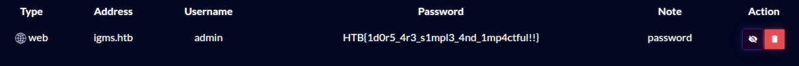

## web - Passman

__Challenge description:__

>Pandora discovered the presence of a mole within the ministry. To proceed with caution, she must obtain the master control password for the ministry, which is stored in a password manager. Can you hack into the password manager?

</br>
</br>

## Enumeration

We have a web application with a login panel.

If we don't have a user yet, we can register one, which I did.

After login we see a lightweight page and we can add phrases to the page.


Well, that's what we see in the browser.
If we look at the traffic in Burp we see that we are dealing with `GraphQL`.

Here is the request and response from a query for the phrases.


Under `/graphql` is the endnode.

With the following query we can enumerate the schema.
We can see `fields`,`types`,`arguments` and `mutations`.

The `mutations`:

- `RegisterUser`
- `LoginUser`
- `UpdatePassword`
- `AddPhrase`

Interesting was `UpdatePassword`.


This functionality was not yet integrated in the dashboard.

### Solution

The solution was to exploit this function.

It does not seem to check from whom we update the password.

With the following query I updated the `admin` password:

```json
{"query":"mutation($username: String!, $password: String!) { UpdatePassword(username: $username, password: $password) {  message, token } }","variables":{"username":"admin","password":"password123"}}
```


I logged in as `admin` with the password I set.

The flag was saved as a phrase in the dashboard.


