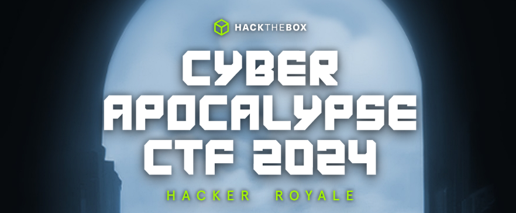

# Cyber Apocalypse 2024

 
 
 

- [Forensics](#Forensics)
  - [It Has Begun](#It-Has-Begun)
  - [An unusual sighting](#An-unusual-sighting)
  - [Urgent](#Urgent)
  - [Phreaky](#Phreaky)
  - [Persue The Tracks](#Persue-The-Tracks)
  - [Fake Boost](#Fake-Boost)
- [Web](#Web)
  - [Flag Command](#Flag-Command)
  - [TimeKORP](#TimeKORP)
  - [KORP Terminal](#KORP-Terminal)
  - [Labyrinth Linguist](#Labyrinth-Linguist)
  - [LockTalk](#LockTalk)
- [Reversing](#Reversing)
  - [LootStash](#LootStash)
  - [BoxCutter](#BoxCutter)
  - [PackedAway](#PackedAway)
- [Misc](#Misc)
  - [Character](#Character)
  - [Unbreakable](#Unbreakable)
 
 
 
 

## Forensics

### It Has Begun

[It Has Begun](./Forensics/It_Has_Begun/It_Has_Begun.md)

 

### An unusual sighting

[An unusual sighting](./Forensics/It_Has_Begun/It_Has_Begun.md)

 

### Urgent

[Urgent](./Forensics/Urgent/Urgent.md)

 

### Phreaky

[Phreaky](./Forensics/Phreaky/Phreaky.md)

 

### Persue The Tracks

[Persue The Tracks](./Forensics/Persue_The_Tracks/Persue_The_Tracks.md)

 

### Fake Boost

[Fake Boost](./Forensics/Fake_Boost/Fake_Boost.md)

 
 
 

### Flag Command

[Flag Command](./Web/Flag_Command/Flag_Command.md)

 

### TimeKORP

[TimeKORP](./Web/TimeKORP/TimeKORP.md)

 

### KORP Terminal

[KORP Terminal](./Web/KORP_Terminal/KORP_Terminal.md)

 

### Labyrinth Linguist

[Labyrinth Linguist](./Web/Labyrinth_Linguist/Labyrinth_Linguist.md)

 

### LockTalk

[LockTalk](./Web/LockTalk/LockTalk.md)

 
 
 

## Reversing

### LootStash

[LootStash](./Reversing/LootStash/LootStash.md)

 

### BoxCutter

[BoxCutter](./Reversing/BoxCutter/BoxCutter.md)

 

### PackedAway

[PackedAway](./Reversing/PackedAway/PackedAway.md)

 
 
 

## Misc

### Unbreakable

[Unbreakable](./Misc/Unbreakable/Unbreakable.md)

 

### Character

[Character](./Misc/Character/Character.md)
