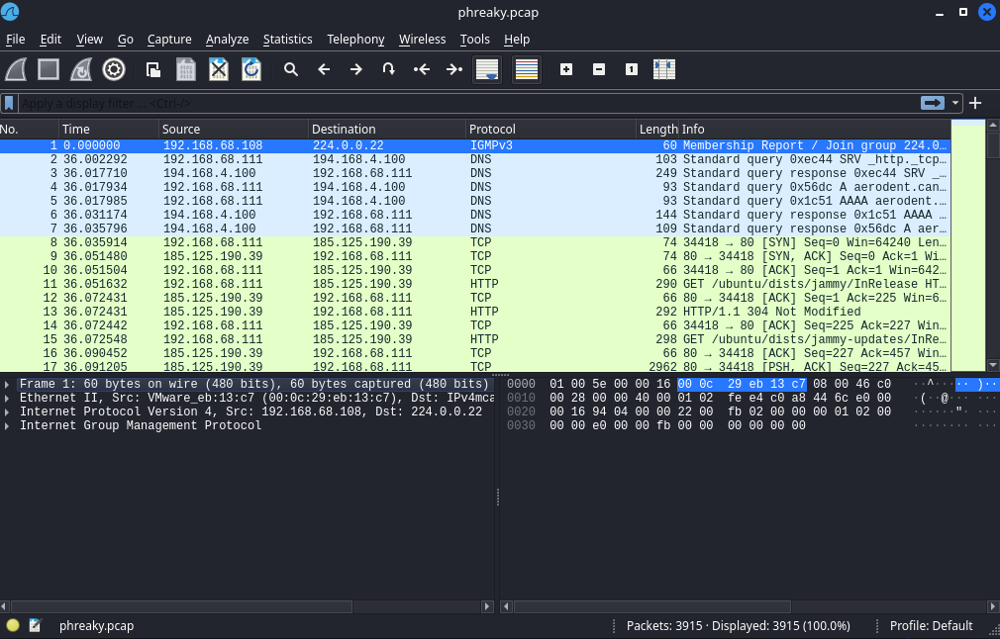
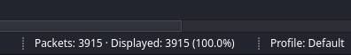
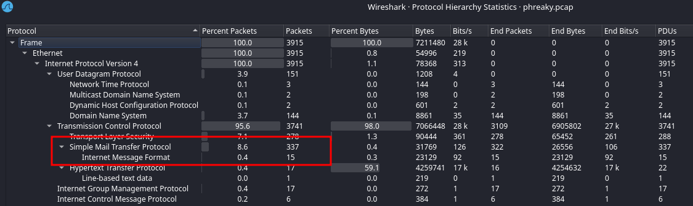
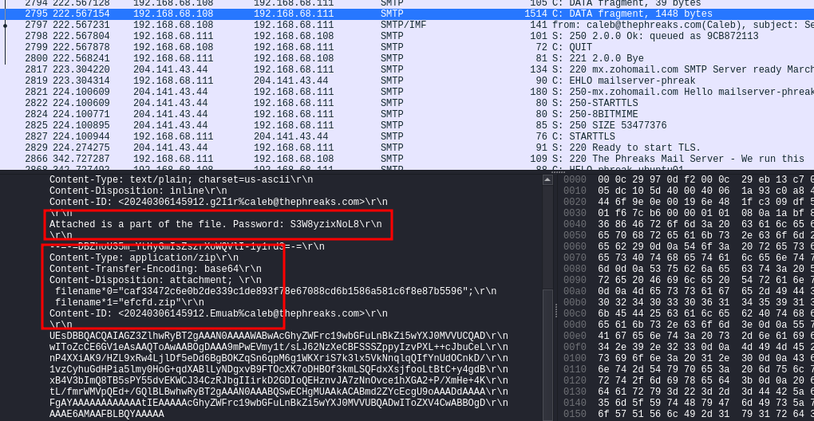
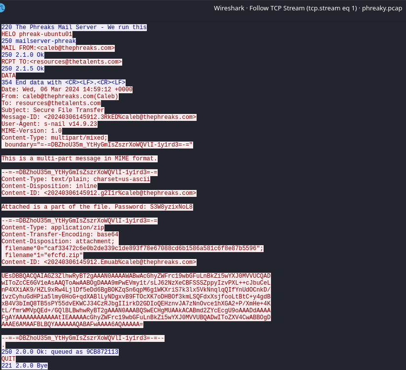
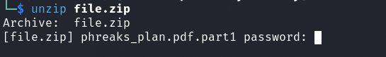
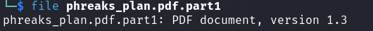
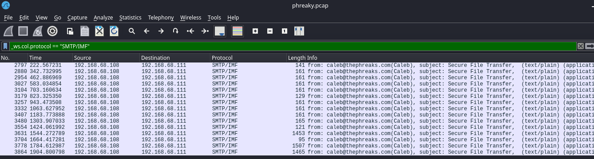
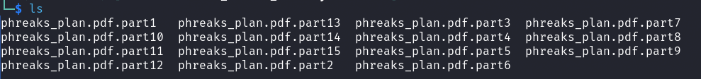
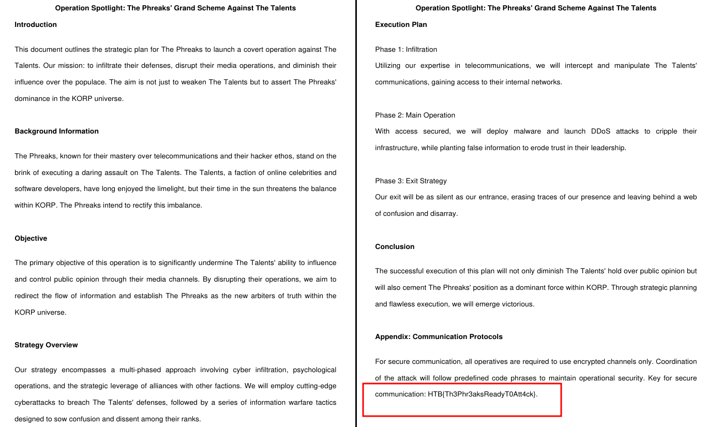

# Forensics - Phreaky

## Description
> In the shadowed realm where the Phreaks hold sway,
A mole lurks within, leading them astray.
Sending keys to the Talents, so sly and so slick,
A network packet capture must reveal the trick.
Through data and bytes, the sleuth seeks the sign,
Decrypting messages, crossing the line.
The traitor unveiled, with nowhere to hide,
Betrayal confirmed, they'd no longer abide.

 
 

## Walkthrough

In this challenge we are given a file called `phreaky.pcap`.

A network capture file.

I opened the file in wireshark.

In total we have __3915__ packages in the record file.

Well, that's not exactly a few packages, let's see what protocols can be found here under: `Statistics -> Protocol Hierarchy`.

So I filtered for `smtp` packages and had a look around.

I found SMTP packages with zip file attachments and interesting information like: "Attached is a part of the file. Password: S3W8yzixNoL8"

So I took the base64 encoded attachment and saved it as a zip file.

When trying to unzip it, we see that a password is required.

The password from the SMTP package here `S3W8yzixNoL8` works and we get a pdf file called `phreaks_plan.pdf.part1`.

Okay, so as we can see we get a pdf file, or better a part of a pdf file.

Using the right-click menu on such a package `Apply as filter` I filtered for all packages that have such attachments.

With the filter `_ws.col.protocol == "SMTP/IMF"` I found a total of __15__ such packages.

Okay, now I repeated the whole procedure with the remaining file attachments and unzipped them until I had all 15 pdf parts together.

Now to merge these files...

First I found a `sed h` command which gave me a file that could be opened, but was still corrupt and I only saw half of the PDF document.

A second try much simpler with a `cat` command gave me a file with the complete text and I saw the whole flag.

`cat phreaks_plan.pdf.part* > phreaks_plan.pdf`

__Flag:__

