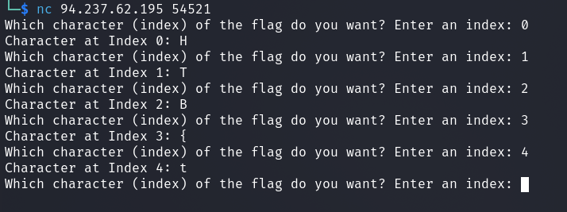
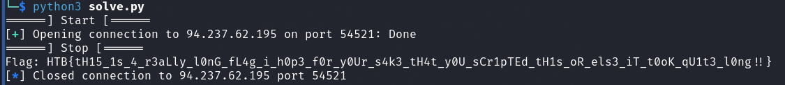

# Misc - Character

## Description
> Security through Induced Boredom is a personal favourite approach of mine. Not as exciting as something like The Fray, but I love making it as tedious as possible to see my secrets, so you can only get one character at a time!

<br>
<br>

## Walkthrough

In this challenge there was an online instance to which you could establish a netcat session.

We can easily query the flag step by step by querying the index of the char of the flag.



In the competition itself, I actually fetched the long flag manually, copied the terminal output and merged the flag with a bit of bash-magic because it worked faster for me.

<br>
<br>

### Bonus: Script

That was solved but still a bit inelegant...

After the competition at the __AfterEvent Party__ where all challenges were still available for experimentation, I found this simple challenge a cool opportunity to dive into scripting with the help of `pwntools`.

__solve.py__

```python3
#!/usr/bin/python3
from pwn import *
import sys

host = '94.237.62.195'
port = 54521


print('======] Start [======')

conn = remote(host,port)
conn.recvuntil(b': ')

flag = ''
part = ''
for i in range(1000):
    conn.sendline(str(i).encode())

    part = conn.recvline().decode().split(':')[-1].strip()

    if part == '}':
        print('======] Stop [======')
        flag += part
        print('Flag:',flag)
        sys.exit()

    flag += part

```

__Flag:__




