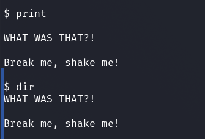
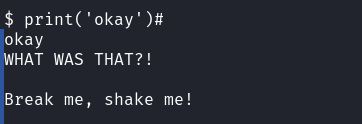
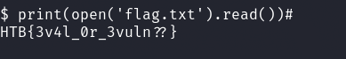

# Misc - Unbreakable

## Description
> Think you can escape my grasp? Challenge accepted! I dare you to try and break free, but beware, it won't be easy. I'm ready for whatever tricks you have up your sleeve!

<br>
<br>


## Walkthrough

This challenge was about bypassing a __PyJail__.

The challenge code was available for download.

So we can see which characters are filtered here via a blacklist...

__Blacklist:__

```python3
blacklist = [ ';', '"', 'os', '_', '\\', '/', '`',
              ' ', '-', '!', '[', ']', '*', 'import',
              'eval', 'banner', 'echo', 'cat', '%',
              '&', '>', '<', '+', '1', '2', '3', '4',
              '5', '6', '7', '8', '9', '0', 'b', 's',
              'lower', 'upper', 'system', '}', '{' ]
```

... and also how our user input is processed and the conditions that occur as a result.

__PyJail Loop:__

```python3
while True:
  ans = input('Break me, shake me!\n\n$ ').strip()

  if any(char in ans for char in blacklist):
    print(f'\n{banner1}\nNaughty naughty..\n')
  else:
    try:
      eval(ans + '()')
      print('WHAT WAS THAT?!\n')
    except:
      print(f"\n{banner2}\nI'm UNBREAKABLE!\n")
```

If we use a blacklisted character or word we will see the `banner1`, the smiley.

If our input causes an error we will get the `banner2`, the muscular rabbit, by the `except` instruction.

Much more interesting is that section:

```python3
<SNIP>
    try:
      eval(ans + '()')
      print('WHAT WAS THAT?!\n')
<SNIP>
```

Our input ends up in the variable `ans` and goes to an `eval()` function.

Our user input is also appended with `()`.

If the `eval()` function does not cause an error we get the output "WHAT WAS THAT?!".

<br>
<br>

### Solution

I now tried to break out of the __PyJail__ with the help of built in functions such as `help`.

With `help` I found a way to escape from the pyjail locally, but this did not work with the online instance via netcat.

The problem was that we always get these brackets `()` attached.

We can use builtin functions, but we cannot pass a value to these functions.

Here is an example to illustrate this with `print()` and `dir()`.



After some trial and error I found a bypass using the `#` character which comments out the appending of the annoying `()` brackets.

__Bypass:__ `print('okay')#`



Okay, now that the bypass was found, I just had to see how to get the flag.

I obtained the flag using `open()` and `read()`.

__Read Flag:__ `print(open('flag.txt').read())#`



<br>
<br>

## Challenge Code

```python3
#!/usr/bin/python3

banner1 = '''
                   __ooooooooo__
              oOOOOOOOOOOOOOOOOOOOOOo
          oOOOOOOOOOOOOOOOOOOOOOOOOOOOOOo
       oOOOOOOOOOOOOOOOOOOOOOOOOOOOOOOOOOOOo
     oOOOOOOOOOOOOOOOOOOOOOOOOOOOOOOOOOOOOOOOo
   oOOOOOOOOOOOOOOOOOOOOOOOOOOOOOOOOOOOOOOOOOOOo
  oOOOOOOOOOOO*  *OOOOOOOOOOOOOO*  *OOOOOOOOOOOOo
 oOOOOOOOOOOO      OOOOOOOOOOOO      OOOOOOOOOOOOo
 oOOOOOOOOOOOOo  oOOOOOOOOOOOOOOo  oOOOOOOOOOOOOOo
oOOOOOOOOOOOOOOOOOOOOOOOOOOOOOOOOOOOOOOOOOOOOOOOOOo
oOOOO     OOOOOOOOOOOOOOOOOOOOOOOOOOOOOOO     OOOOo
oOOOOOO OOOOOOOOOOOOOOOOOOOOOOOOOOOOOOOOOOO OOOOOOo
 *OOOOO  OOOOOOOOOOOOOOOOOOOOOOOOOOOOOOOOO  OOOOO*
 *OOOOOO  *OOOOOOOOOOOOOOOOOOOOOOOOOOOOO*  OOOOOO*
  *OOOOOO  *OOOOOOOOOOOOOOOOOOOOOOOOOOO*  OOOOOO*
   *OOOOOOo  *OOOOOOOOOOOOOOOOOOOOOOO*  oOOOOOO*
     *OOOOOOOo  *OOOOOOOOOOOOOOOOO*  oOOOOOOO*
       *OOOOOOOOo  *OOOOOOOOOOO*  oOOOOOOOO*
          *OOOOOOOOo           oOOOOOOOO*
              *OOOOOOOOOOOOOOOOOOOOO*
                   ""ooooooooo""
'''

banner2 = '''
⠀⠀⠀⠀⠀⠀⠀⠀⠀⠀⠀⠀⠀⠀⠀⠀⣠⣤⣤⣤⣀⠀⠀⠀⠀⠀⠀⠀⠀⠀⠀⠀⠀⠀⠀⠀⠀⠀⠀⠀⠀⠀⠀⠀⠀⠀⠀⠀⠀⠀⠀⠀⠀⠀⠀⠀⠀⠀⠀⠀⠀
⠀⠀⠀⠀⠀⠀⠀⠀⠀⠀⠀⠀⠀⠀⠀⣴⡟⠁⠀⠉⢿⣦⡀⠀⠀⠀⠀⠀⠀⠀⠀⠀⠀⠀⠀⠀⠀⠀⠀⠀⠀⠀⠀⠀⠀⠀⠀⠀⠀⠀⠀⠀⠀⠀⠀⠀⠀⠀⠀⠀⠀
⠀⠀⠀⠀⠀⠀⠀⠀⠀⠀⠀⠀⠀⠀⢸⡿⠀⠀⠀⠀⠀⠻⣧⡀⠀⠀⠀⠀⠀⠀⠀⠀⠀⠀⠀⠀⠀⠀⠀⠀⠀⠀⠀⠀⠀⠀⠀⠀⠀⠀⠀⠀⠀⠀⠀⠀⠀⠀⠀⠀⠀
⠀⠀⠀⠀⠀⠀⠀⠀⠀⠀⠀⠀⠀⠀⣿⡇⠀⢀⠀⠀⠀⠀⢻⡇⠀⠀⠀⠀⠀⠀⠀⠀⠀⠀⠀⠀⠀⠀⠀⠀⠀⠀⠀⠀⠀⠀⠀⠀⠀⠀⠀⠀⠀⠀⠀⠀⠀⠀⠀⠀⠀
⠀⠀⠀⠀⠀⠀⠀⠀⠀⠀⠀⠀⠀⠀⣿⡇⠀⣼⣰⢷⡤⠀⠈⣿⡀⠀⠀⠀⠀⠀⠀⠀⠀⠀⠀⠀⠀⠀⠀⠀⠀⠀⠀⠀⠀⠀⠀⠀⠀⠀⠀⠀⠀⠀⠀⠀⠀⠀⠀⠀⠀
⠀⠀⠀⠀⠀⠀⠀⠀⠀⠀⠀⠀⠀⠀⢹⣇⠀⠉⣿⠈⢻⡀⠀⢸⣧⠀⠀⠀⠀⠀⠀⠀⠀⠀⠀⠀⠀⠀⠀⠀⠀⠀⠀⠀⠀⠀⠀⠀⠀⠀⠀⠀⠀⠀⠀⠀⠀⠀⠀⠀⠀
⠀⠀⠀⠀⠀⠀⠀⠀⠀⠀⠀⠀⠀⠀⢸⣿⠀⠀⢹⡀⠀⢷⡀⠘⣿⠀⠀⠀⠀⠀⠀⠀⠀⠀⠀⠀⠀⠀⠀⠀⠀⠀⠀⠀⠀⠀⠀⠀⠀⠀⠀⠀⠀⠀⠀⠀⠀⠀⠀⠀⠀
⠀⠀⠀⠀⠀⠀⠀⠀⠀⠀⠀⠀⠀⠀⠀⢻⣧⠀⠘⣧⠀⢸⡇⠀⢻⡇⠀⠀⠀⠀⠀⠀⠀⠀⠀⠀⠀⠀⣤⣤⠶⠾⠿⢷⣦⣄⠀⠀⠀⠀⠀⠀⠀⠀⠀⠀⠀⠀⠀⠀⠀
⠀⠀⠀⠀⠀⠀⠀⠀⠀⠀⠀⠀⠀⠀⠀⠈⣿⡆⠀⠘⣦⠀⣇⠀⠘⣿⣤⣶⡶⠶⠛⠛⠛⠛⠶⠶⣤⣾⠋⠀⠀⠀⠀⠀⠈⢻⣦⠀⠀⠀⠀⠀⠀⠀⠀⠀⠀⠀⠀⠀⠀
⠀⠀⠀⠀⠀⠀⠀⠀⠀⠀⠀⠀⠀⠀⠀⠀⠘⣿⣄⠀⠘⣦⣿⠀⠀⠋⠁⠀⠀⠀⠀⠀⠀⠀⠀⠀⢨⡟⠀⠀⠀⠀⠀⠀⠀⢸⣿⠀⠀⠀⠀⠀⠀⠀⠀⠀⠀⠀⠀⠀⠀
⠀⠀⠀⠀⠀⠀⠀⠀⠀⠀⠀⠀⠀⠀⠀⠀⠀⠈⢿⣦⠀⠛⠃⠀⠀⠀⠀⠀⠀⠀⠀⠀⠀⠀⠀⠀⣸⠁⠀⠀⠀⠀⠀⠀⠀⢸⡿⠀⠀⠀⠀⠀⠀⠀⠀⠀⠀⠀⠀⠀⠀
⠀⠀⠀⠀⠀⠀⠀⠀⠀⠀⣀⠀⠀⠀⠀⠀⠀⢠⣿⠏⠁⠀⢀⡴⠃⠀⠀⠀⠀⠀⠀⠀⠀⠀⠀⠀⡏⠀⠀⠀⠀⠀⠀⠀⢰⡿⠁⠀⠀⠀⠀⠀⠀⠀⠀⠀⠀⠀⠀⠀⠀
⠀⠀⠀⠀⠀⠀⠀⢠⠶⠛⠉⢀⣄⠀⠀⠀⢀⣿⠃⠀⠀⡴⠋⠀⠀⠀⠀⠀⠀⠀⠀⠀⠀⠀⠀⠀⢷⠀⠀⠀⠀⠀⠀⣴⡟⠁⠀⠀⠀⠀⠀⠀⠀⠀⠀⠀⠀⠀⠀⠀⠀
⠀⠀⠀⠀⠀⠀⠀⣀⣠⡶⠟⠋⠁⠀⠀⠀⣼⡇⠀⢠⡟⠁⠀⠀⠀⠀⠀⠀⠀⠀⠀⠀⠀⠀⠀⠀⠘⢷⣄⣀⣀⣠⠿⣿⡆⠀⠀⠀⠀⠀⠀⠀⠀⠀⠀⠀⠀⠀⠀⠀⠀
⠀⠀⠀⠀⠀⠀⠀⠋⠁⠀⠀⠀⠀⣀⣤⣤⣿⠀⠀⣸⠁⠀⠀⠀⠀⠀⠀⠀⠀⠀⠀⠀⠀⠀⠀⠀⠀⠀⠉⠉⠉⠀⠀⢻⡇⠀⠀⠀⠀⢠⣄⠀⢶⣄⠀⠀⠀⠀⠀⠀⠀
⠀⠀⠀⠀⠀⠀⠀⠀⢀⣤⣾⠿⠟⠛⠋⠹⢿⠀⠀⣿⠀⠀⠀⠀⠀⠀⠀⠀⠀⠀⠀⠀⠀⠀⠀⠀⠀⠀⠀⠀⠀⠀⠀⢸⣿⡀⠀⠀⠀⠀⠘⢷⡄⠙⣧⡀⠀⠀⠀⠀⠀
⠀⠀⠀⠀⠀⠀⢀⣴⠟⠋⠁⠀⠀⠀⠀⠘⢸⡀⠀⠿⠀⠀⠀⣠⣤⣤⣄⣄⠀⠀⠀⠀⠀⠀⠀⣠⣤⣤⣀⡀⠀⠀⠀⢸⡟⠻⣿⣦⡀⠀⠀⠀⠙⢾⠋⠁⠀⠀⠀⠀⠀
⠀⠀⠀⠀⣠⣾⠟⠁⠀⠀⠀⠀⠀⠀⠀⠀⠈⣇⠀⠀⠀⠀⣴⡏⠁⠀⠀⠹⣷⠀⠀⠀⠀⣠⡿⠋⠀⠀⠈⣷⠀⠀⠀⣾⠃⠀⠀⠉⠻⣦⡀⠀⠀⠀⠀⠀⠀⠀⠀⠀⠀
⠀⠀⠀⣴⠟⠁⠀⠀⠀⠀⠀⠀⠀⠀⠀⠀⠀⠹⡆⠀⠀⠀⠘⢷⣄⡀⣀⣠⣿⠀⠀⠀⠀⠻⣧⣄⣀⣠⣴⠿⠁⠀⢠⡟⠀⠀⠀⠀⠀⠙⢿⣄⠀⠀⠀⠀⠀⠀⠀⠀⠀
⠀⠀⣾⡏⠀⠀⠀⠀⠀⠀⠀⠀⠀⠀⠀⠀⠀⢠⡽⣦⡀⣀⠀⠀⠉⠉⠉⠉⠀⢀⣀⣀⡀⠀⠉⠉⠉⠁⠀⠀⠀⣠⡿⠀⠀⠀⠀⠀⠀⠀⠈⢻⣧⡀⠀⠀⠀⠀⠀⠀⠀
⠀⢰⣿⠀⠀⠀⠀⠀⠀⠀⠀⠀⠀⠀⠀⠀⠀⠸⠃⠈⢿⣿⣧⣄⠀⠀⠰⣦⣀⣭⡿⣟⣍⣀⣿⠆⠀⠀⡀⣠⣼⣿⠁⠀⠀⠀⠀⠀⠀⠀⢀⣤⣽⣷⣤⣤⠀⠀⠀⠀⠀
⠀⢀⣿⡆⠀⠀⠀⢀⣀⠀⠀⠀⠀⠀⠀⢀⣴⠖⠋⠁⠈⠻⣿⣿⣿⣶⣶⣤⡉⠉⠀⠈⠉⢉⣀⣤⣶⣶⣿⣿⣿⠃⠀⠀⠀⠀⢀⡴⠋⠀⠀⠀⠀⠀⠉⠻⣷⣄⠀⠀⠀
⠀⣼⡏⣿⠀⢀⣤⠽⠖⠒⠒⠲⣤⣤⡾⠋⠀⠀⠀⠀⠀⠈⠈⠙⢿⣿⣿⣿⣿⣿⣾⣷⣿⣿⣿⣿⣿⣿⣿⡿⠃⠀⠀⣀⣤⠶⠋⠀⠀⠀⠀⠀⠀⠀⠀⠀⠈⢻⣧⠀⠀
⢰⣿⠁⢹⠀⠈⠀⠀⠀⠀⠀⠀⠀⣿⠷⠦⠄⠀⠀⠀⠀⠀⠀⠀⠘⠛⠛⠿⣿⣿⣿⣿⣿⣿⣿⣿⡿⠟⠉⢀⣠⠶⠋⠉⠁⠀⠀⠀⠀⠀⠀⠀⠀⠀⠀⠀⠀⠀⢹⣧⠀
⣸⡇⠀⠀⠀⠀⠀⠀⠀⢰⡇⠀⠀⣿⡀⠀⠀⠀⠀⠀⠀⠀⠀⠀⠀⠀⠀⢸⣿⠀⠉⠉⠛⠋⠉⠙⢧⠀⠀⢸⠁⠀⠀⠀⠀⠀⠀⠀⠀⠀⠀⠀⠀⠀⠀⠀⠀⠀⠀⣿⡆
⣿⡇⠀⠀⠈⠆⠀⠀⣠⠟⠀⠀⠀⢸⣇⠀⠀⠀⠀⠀⠀⠀⠀⠀⠀⠀⠀⢸⢿⠀⠀⠀⠀⠀⠀⠀⠈⠱⣄⣸⡇⠠⠀⠀⠀⠀⠀⠀⠀⠀⠀⠀⠀⠀⠀⠀⠀⠀⠀⣻⡇
⢻⣧⠀⠀⠀⠀⠀⣸⣥⣄⡀⠀⠀⣾⣿⡄⠀⠀⠀⠀⠀⠀⠀⠀⠀⠀⠀⢸⢸⠀⠀⠀⠀⠀⠀⠀⠀⠀⠀⢹⡇⠀⠀⠀⠀⠀⠀⠀⠀⠀⠀⣴⠂⠀⠀⠀⠀⠀⠀⣿⡇
⢸⣿⣦⠀⠀⠀⠚⠉⠀⠈⠉⠻⣾⣿⡏⢻⣄⡀⠀⠀⠀⠀⠀⠀⠀⠀⠠⣟⢘⠀⠀⠀⠀⠀⠀⠀⠀⢀⣴⠟⢳⡄⠀⠀⠀⠀⠀⠀⠀⠀⠐⡟⠀⠀⠀⠀⠀⠀⢀⣿⠁
⢸⡏⠀⠀⠀⠀⠀⠀⠀⠀⠀⠀⠀⠉⠻⣇⠈⠻⠷⠦⠤⣄⣀⣀⣀⣀⣠⣿⣿⣄⠀⠀⠀⠀⠀⣠⡾⠋⠄⠀⠈⢳⡀⠀⠀⠀⠀⠀⠀⠀⣸⠃⠀⠀⠀⠀⠀⠀⣸⠟⠀
⢸⣿⠀⠀⠀⠀⠀⠀⠀⠀⠀⠀⠀⠀⠀⠘⣧⣔⠢⠤⠤⠀⠀⠈⠉⠉⠉⢤⠀⠙⠓⠦⠤⣤⣼⠋⠀⠀⠀⠀⠀⠀⠹⣦⠀⠀⠀⠀⠀⢰⠏⠀⠀⠀⠀⠀⢀⣼⡟⠀⠀
⠀⢻⣷⣖⠦⠄⣀⠀⠀⠀⠀⠀⠀⠀⠀⠀⣷⠈⢳⡀⠈⠛⢦⣀⡀⠀⠀⠘⢷⠀⠀⠀⢀⣼⠃⠀⠀⠀⠀⠀⠀⠀⠀⠈⠳⡄⠀⠀⣠⠏⠀⠀⠀⠀⣀⣴⡿⠋⠀⠀⠀
⠀⠀⠙⠻⣦⡀⠈⠛⠆⠀⠀⠀⣠⣤⡤⠀⠿⣤⣀⡙⠢⠀⠀⠈⠙⠃⣠⣤⠾⠓⠛⠛⢿⣿⠀⠀⠀⠀⠀⠀⠀⠀⠀⠀⠀⢿⡴⠞⠁⢀⣠⣤⠖⢛⣿⠉⠀⠀⠀⠀⠀
⠀⠀⠀⠀⠈⠙⢷⣤⡁⠀⣴⠞⠁⠀⠀⠀⠀⠈⠙⠿⣷⣄⣀⣠⠶⠞⠋⠀⠀⠀⠀⠀⠀⢻⡆⠀⠀⠀⠀⠀⠀⠀⠀⠀⠀⢀⣤⠶⠞⠋⠁⠀⢀⣾⠟⠀⠀⠀⠀⠀⠀
⠀⠀⠀⠀⠀⠀⠀⠉⠻⣷⡷⠀⠀⠀⠀⠀⠀⠀⠀⠀⢙⣧⡉⠁⠀⠀⠀⠀⠀⠀⠀⠀⠀⠈⠢⣤⣀⣀⠀⠀⠈⠂⢀⣤⠾⠋⠀⠀⠀⠀⠀⣠⡾⠃⠀⠀⠀⠀⠀⠀⠀
⠀⠀⠀⠀⠀⠀⠀⠀⠀⠸⣿⡀⠀⠀⠀⠀⠀⠀⠀⠀⢹⣿⡇⠀⠀⠀⠀⠀⠀⠀⠀⠀⠀⠀⠀⠀⠉⠉⠉⠉⠉⠉⠉⠁⠀⠀⢀⣠⠎⣠⡾⠟⠁⠀⠀⠀⠀⠀⠀⠀⠀
⠀⠀⠀⠀⠀⠀⠀⠀⠀⠀⢹⣧⠀⣦⠀⠀⠀⠀⠀⠀⠀⣿⣇⢠⣄⠀⠀⠀⠀⠀⠀⠀⠀⠀⠀⣀⠀⠀⠀⠀⠀⠀⠀⠀⠤⢐⣯⣶⡾⠋⠀⠀⠀⠀⠀⠀⠀⠀⠀⠀⠀
⠀⠀⠀⠀⠀⠀⠀⠀⠀⠀⠘⢿⣄⠸⣆⠀⠀⠲⣆⠀⠀⢸⣿⣶⣮⣉⡙⠓⠒⠒⠒⠒⠒⠈⠉⠁⠀⠀⠀⠀⠀⢀⣶⣶⡿⠟⠋⠁⠀⠀⠀⠀⠀⠀⠀⠀⠀⠀⠀⠀⠀
⠀⠀⠀⠀⠀⠀⠀⠀⠀⠀⠀⠀⠛⠷⠾⠷⣦⣾⠟⠻⠟⠛⠁⠀⠈⠛⠛⢿⣶⣤⣤⣤⣀⣀⠀⠀⠀⠀⠀⠀⠀⣨⣾⠟⠀⠀⠀⠀⠀⠀⠀⠀⠀⠀⠀⠀⠀⠀⠀⠀⠀
⠀⠀⠀⠀⠀⠀⠀⠀⠀⠀⠀⠀⠀⠀⠀⠀⠀⠀⠀⠀⠀⠀⠀⠀⠀⠀⠀⠀⠀⠉⠉⠉⠙⠛⠛⠛⠻⠿⠿⠿⠿⠛⠁⠀⠀⠀⠀⠀⠀⠀⠀⠀⠀⠀⠀⠀⠀⠀⠀⠀⠀
⠀⠀⠀⠀⠀⠀⠀⠀⠀⠀⠀⠀⠀⠀⠀⠀⠀⠀⠀⠀⠀⠀⠀⠀⠀⠀⠀⠀⠀⠀⠀⠀⠀⠀⡀⠀⠀⠀⠀⠀⠀⠀⠀⠀⠀⠀⠀⠀⠀⠀⠀⠀⠀⠀⠀⠀⠀⠀⠀⠀⠀
'''

blacklist = [ ';', '"', 'os', '_', '\\', '/', '`',
              ' ', '-', '!', '[', ']', '*', 'import',
              'eval', 'banner', 'echo', 'cat', '%',
              '&', '>', '<', '+', '1', '2', '3', '4',
              '5', '6', '7', '8', '9', '0', 'b', 's',
              'lower', 'upper', 'system', '}', '{' ]

while True:
  ans = input('Break me, shake me!\n\n$ ').strip()

  if any(char in ans for char in blacklist):
    print(f'\n{banner1}\nNaughty naughty..\n')
  else:
    try:
      eval(ans + '()')
      print('WHAT WAS THAT?!\n')
    except:
      print(f"\n{banner2}\nI'm UNBREAKABLE!\n")
```
