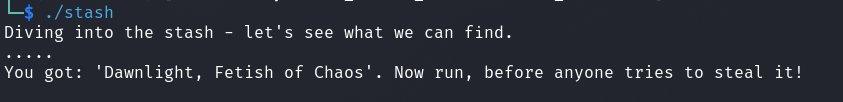
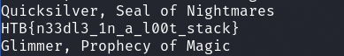

# Reversing - LootStash

## Description
> A giant stash of powerful weapons and gear have been dropped into the arena - but there's one item you have in mind. Can you filter through the stack to get to the one thing you really need?

 
 

## Walkthrough

In this challenge we were given a binary called `stash`.

When we run this we only get to see the following.

 

### Solution

With the help of `strings` we can read the flag from the binary.

