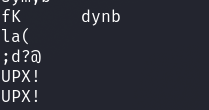
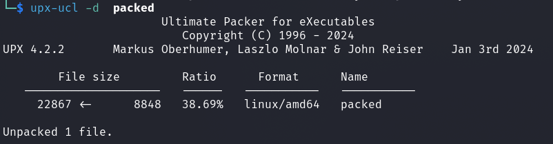
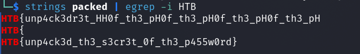

# Reversing - PackedAway

## Description
> To escape the arena's latest trap, you'll need to get into a secure vault - and quick! There's a password prompt waiting for you in front of the door however - can you unpack the password quick and get to safety?

 
 

## Walkthrough

In this challenge there was a binary called `packed`.

First I used the `strings` command and I noticed the following.

Apparently this is an `UPX` packed binary.

With the help of `upx-ucl` we can unpack the binary and get the original code.

 

__Command:__ `upx-ucl -d packed`

Now I could run 'strings' again and got the flag.

 

__Command:__ `strings packed | egrep -i HTB`

