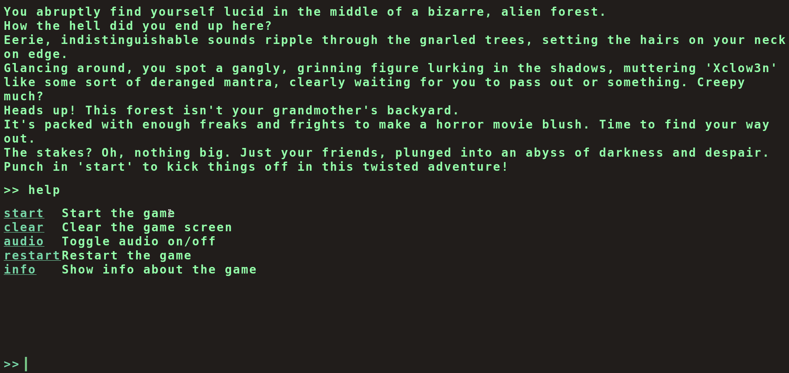
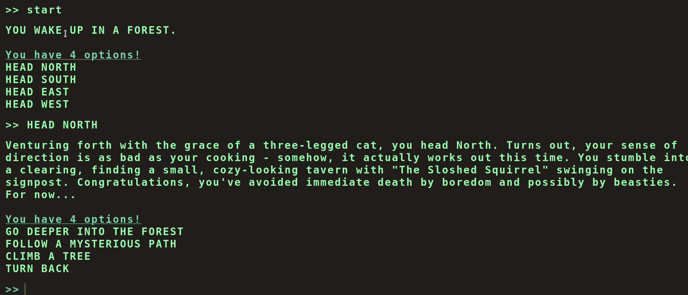
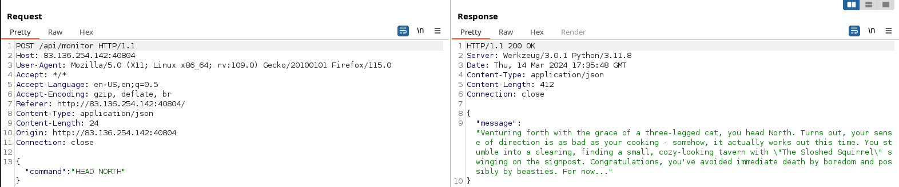
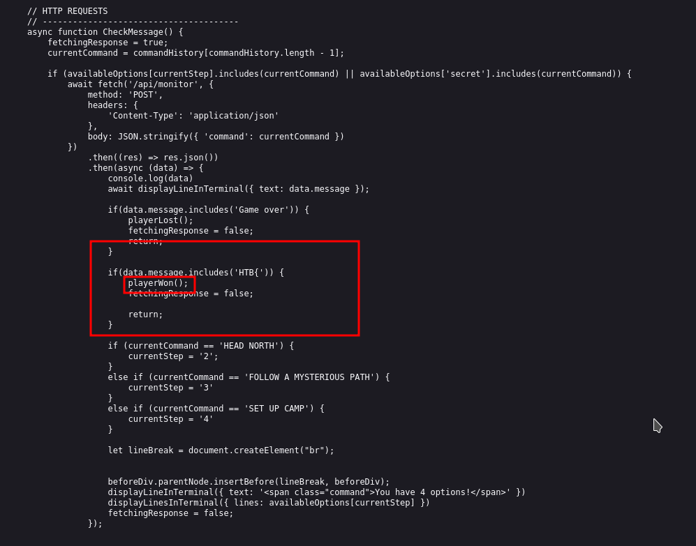
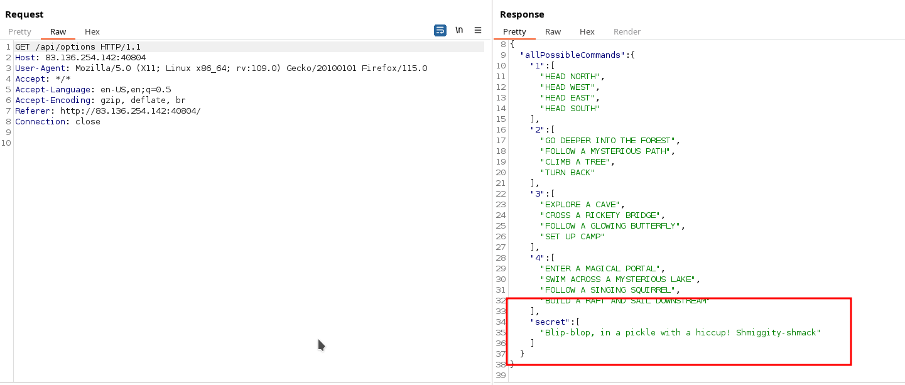
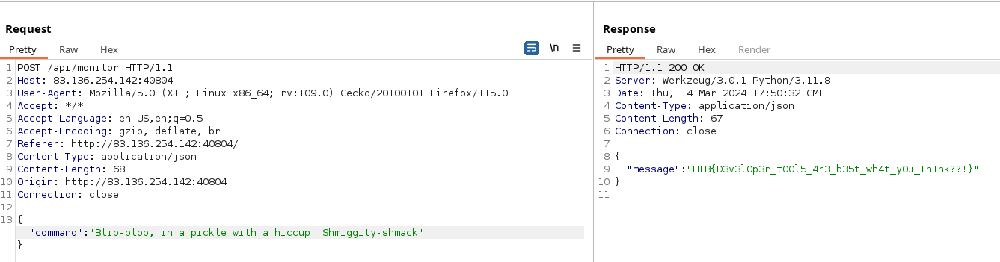

# Web - Flag Command

## Description
> Embark on the "Dimensional Escape Quest" where you wake up in a mysterious forest maze that's not quite of this world. Navigate singing squirrels, mischievous nymphs, and grumpy wizards in a whimsical labyrinth that may lead to otherworldly surprises. Will you conquer the enchanted maze or find yourself lost in a different dimension of magical challenges? The journey unfolds in this mystical escape!

 
 

## Walkthrough

For this challenge there was an online web instance and no code to download.

We have a kind of game and the whole thing is represented visually as a terminal.

Well, I played around with the functions, looked at the source code and passed my activities through burp to see what was going on in the background

In Burp I saw that the commands in the game go to an API end node `/api/monitor`.

First I got a bit lost with the following Javascript code from the embedded file `/static/terminal/js/main.js`.

I intercepted an API response and manipulated it and put `HTB{` in the response.

So I won the game, but didn't get a flag...

 

### Solution

I found another interesting api path `/api/options`.

All possible commands for the game were listed and interesting was another command called `secret`

So I sent the API this secret command and got the flag.

