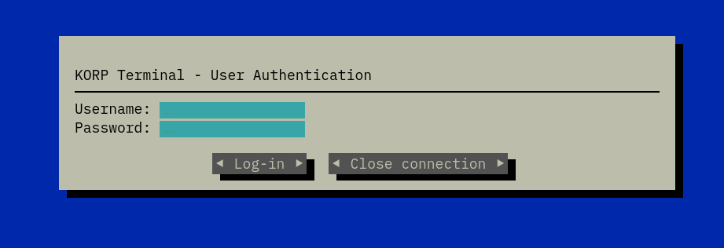
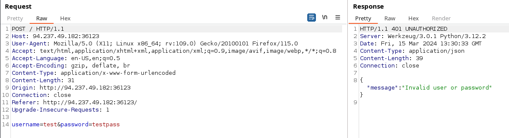
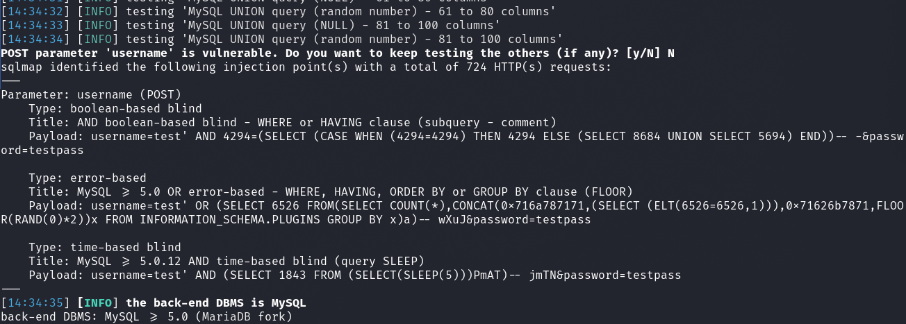
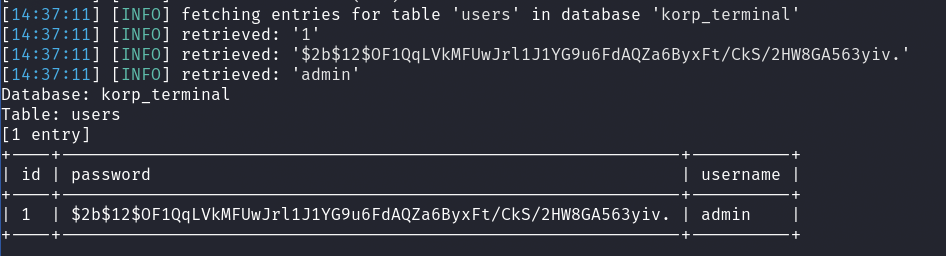
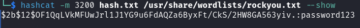
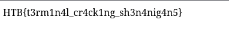

# Web - KORP Terminal

## Description
> Your faction must infiltrate the KORP™ terminal and gain access to the Legionaries' privileged information and find out more about the organizers of the Fray. The terminal login screen is protected by state-of-the-art encryption and security protocols.

 
 

## Walkthrough

In this challenge, there was a web instance without the corresponding challenge code.

I looked at the website and saw the following:

I ran Burp Proxy and sent a log-in attempt through burp and the request/response looked like this:

I saved the request to a file called `req.txt` and ran `sqlmap`.

__Command:__ `sqlmap -r req.txt --level 5 --risk 3 --batch --ignore-code=401`

Sqlmap quickly confirmed a vulnerability.

I enumerated the database and dumped a hash of the user `admin`.

Now, I cracked the hash using `hashcat` and the mode `-m 3200` (bcrypt).

I now logged in with `admin:password123` and got the flag.

__Flag:__

