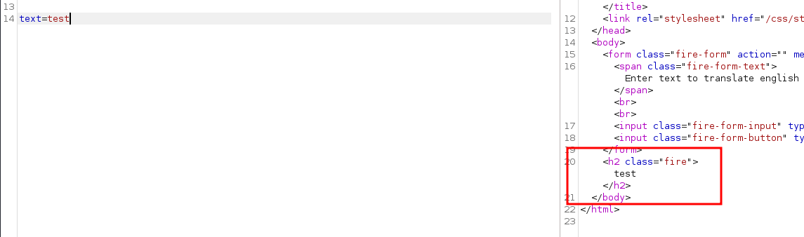

# Web - Labyrinth Linguist

## Description
> You and your faction find yourselves cornered in a refuge corridor inside a maze while being chased by a KORP mutant exterminator. While planning your next move you come across a translator device left by previous Fray competitors, it is used for translating english to voxalith, an ancient language spoken by the civilization that originally built the maze. It is known that voxalith was also spoken by the guardians of the maze that were once benign but then were turned against humans by a corrupting agent KORP devised. You need to reverse engineer the device in order to make contact with the mutant and claim your last chance to make it out alive.

<br>
<br>

## Walkthrough

In this challenge there was a web instance and the corresponding source code to download.

We have a web page where we can enter text and then the text is displayed fancy cryptically.

Now I started the Burp Intruder and fuzzed for different input like all printable ASCII characters to see if anything causes anomalies, error messages or other interesting behavior.

I also looked at the challenge code.


Challenge Code in Tree-Like format: `tree -a`

```
├── Dockerfile
├── build-docker.sh
├── challenge
│   ├── .gitignore
│   ├── pom.xml
│   └── src
│       └── main
│           ├── java
│           │   └── Main.java
│           └── resources
│               ├── static
│               │   ├── css
│               │   │   └── style.css
│               │   └── font
│               │       └── Ancient_G_Written.ttf
│               └── templates
│                   └── index.html
├── config
│   └── supervisord.conf
├── entrypoint.sh
└── flag.txt
```

Java...ok.

When I looked in the file `pom.xml` where dependencies are to be found I found the following interesting:


Velocity is a template engine for Java that I am hearing about for the first time.

My first thought was that we were probably dealing with a __SSTI vulnerability__ here.

So I looked for Velocity SSTI payloads on the internet and made a small list to fuzz.

It was noticeable that with some payloads, the application no longer returned anything where the user input would normally be visible.

__POST DATA:__ `text=test`



__POST DATA:__ `text=#set($str=$class.inspect("java.lang.String").type)`


I also intentionally built syntactical errors into the payload and then saw the payload in the response.

This confirmed the vulnerability.

Now I started to build an exploit without much knowledge of Java/Velocity which failed.

Fortunately, I found a working payload on [github](https://github.com/epinna/tplmap/issues/9) which I reused and it worked.


Okay, nice!

So I replaced the part `ls -al` with other commands and got the final flag with `cat ../flag4f34ea2a19.txt`.


<br>
<br>

### Resources
> Here are a few resources that helped me

https://portswigger.net/research/server-side-template-injection

https://antgarsil.github.io/posts/velocity/

https://github.com/epinna/tplmap/issues/9

