# Web - LockTalk

## Description
> In "The Ransomware Dystopia," LockTalk emerges as a beacon of resistance against the rampant chaos inflicted by ransomware groups. In a world plunged into turmoil by malicious cyber threats, LockTalk stands as a formidable force, dedicated to protecting society from the insidious grip of ransomware. Chosen participants, tasked with representing their districts, navigate a perilous landscape fraught with ethical quandaries and treacherous challenges orchestrated by LockTalk. Their journey intertwines with the organization's mission to neutralize ransomware threats and restore order to a fractured world. As players confront internal struggles and external adversaries, their decisions shape the fate of not only themselves but also their fellow citizens, driving them to unravel the mysteries surrounding LockTalk and choose between succumbing to despair or standing resilient against the encroaching darkness.

 
 

## Foreword

This challenge was really very cool.

It was a 2-step challenge of exploiting two __CVE vulnerabilities__.

I worked a lot with a local docker instance and did the second step before the first one, which is why I start with __Step 2__ in my walkthrough.

 
 

## Walkthrough

For this Challenge, we were given a web instance and the code/docker.

As always, I looked at the wesite first.

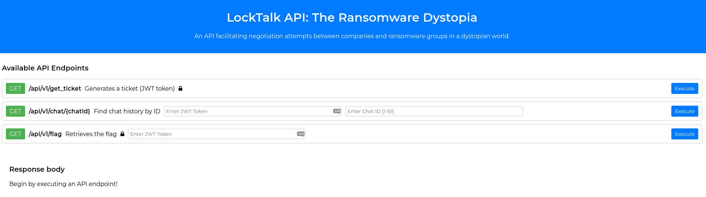

I saw three menus and tried to interact with them somehow.

At the first API endpoint `get_ticket` which probably generates a __JWT__ for us, I only ever saw the hint that we are not authorized (403).

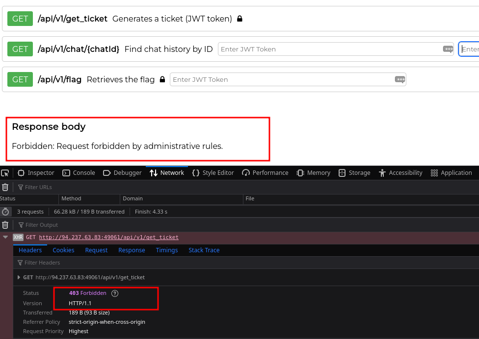

And for the other two menus, a __JWT__ would be necessary.

So I took a closer look at the challenge code to see if there might be other API endpoints, the dependencies and so on.

A look at the `requirements.txt` file was interesting.

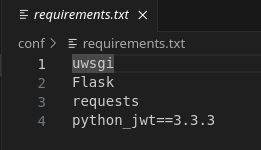

I searched for vulnerabilities to `python_jwt==3.3.3` and quickly found what I was looking for: [github.com](https://github.com/advisories/GHSA-5p8v-58qm-c7fp)

A __POC__ for the exploitation was also quickly found as well: [github.com](https://github.com/user0x1337/CVE-2022-39227)

 
 

## Step 2: CVE-2022-39227

Now I wanted to confirm this vulnerability, but it looked like I needed a valid __JWT__ and I couldn't find a way to get one from the application.

The only endnode that promises and generates a __JWT__ always spits out __403__.

So I had a look how exactly this endnode is blocked.

I found what I was looking for in the `haproxy.cfg` file.

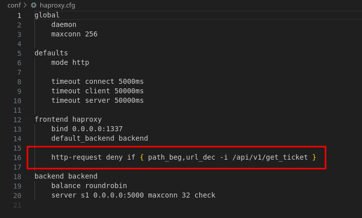

I deleted this line and let docker and the application run locally for testing.

And yes, now I got a __JWT__ from the application with which I could now continue testing.

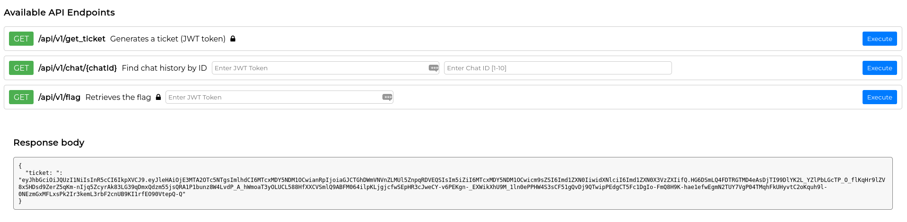

For example, you could now also use the __JWT__ to display chats from the application.

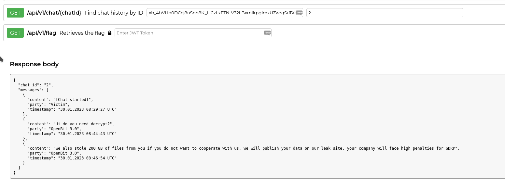

But now to the exploitation.

I passed our token to the [POC](https://github.com/user0x1337/CVE-2022-39227) and set `administrator` as parameter `-i`, because the flag endnode requires this as we can see in the source code in the file `routes.py`.

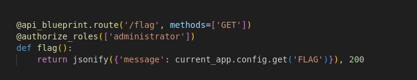

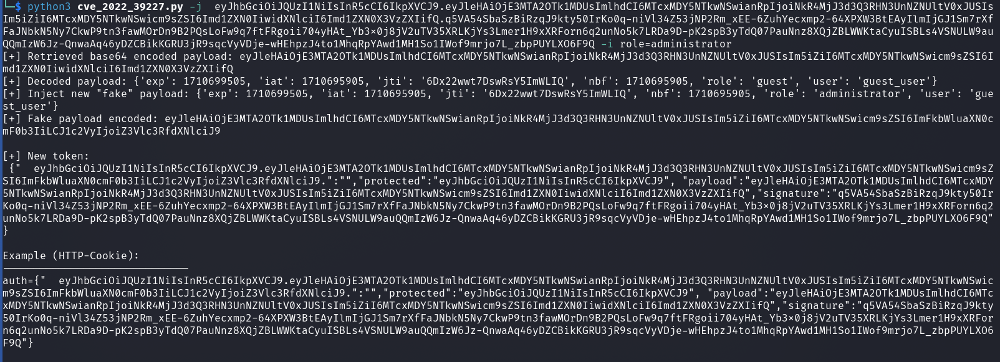

This token then had to be inserted as a whole with the brackets `{}` as `Authorization:` header field and I saw the local fake flag already!

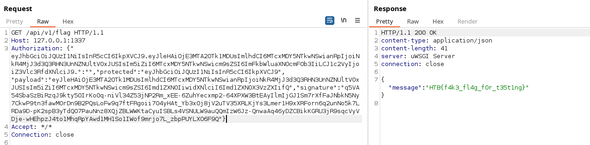

 
 

## Step 1: CVE-2023-45539

Now I had done the second step before the first and had already confirmed the vulnerability to the JWT thing.

The problem with the online instance is still that we can't get a valid __JWT__.

Now I looked online for vulnerabilities to `haproxy`, because this blocks access to `/api/v1/get_ticket`.

I found various vulnerabilities and bypasses for HAProxy.

This article was helpful: [haproxy.com](https://www.haproxy.com/blog/august-2023-cve-2023-40225-empty-content-length-header-vulnerability-fixed)

A simple appending of a `#` sign gave me a JWT.

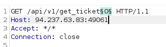

 
 

### Final Flag

Now I practiced these steps on the online instance one after the other and I got the flag.

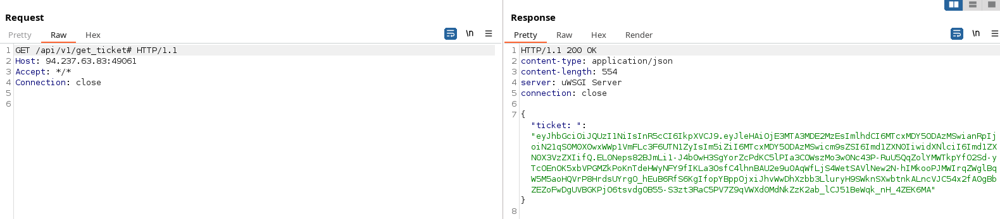

