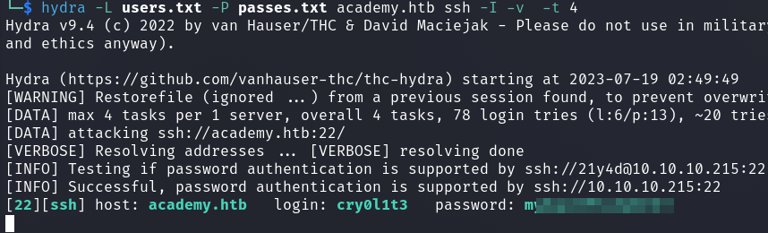

# HackTheBox - Academy

As usual, it starts with a port scan

`nmap -sS -p- -T4 -sV -sC <IP>`

We have an open webserver and an SSH service running and another port open on 33060.

I enumerated the website by hand and also ran various tools.

The site ended up being quite lightweight, so I started with three functionalities for various exploitation attempts.

- `/login.php`
- `/register.php`
- `/admin.php`

A login page for users and for admins and a registration page.

I took a closer look at these three functionalities in Burp.

While registering a test user I noticed a POST parameter which is set to `0` by default.

The name of the parameter `roleid` suggests that it is responsible for the rights management of the user on the page.

I intercepted the request when registering my user and set the value to `1`.

Afterwards I tried to log in with my user at `/admin.php` which worked.

Here I got the name to a subdomain __dev-staging-01__ which I put into my `/etc/hosts` file and looked what is behind it.

We see a laravel application as well as other useful information.

I first tried to log in with the credentials which are visible on port `33060` via mysql tools which does not work.

Later I searched the Metasploit framework for exploits to __laravel__ and got two suggestions.

I used the exploit __laravel_token_unserialize__

However, for the exploit to work we need to provide the __APP_KEY__ option with the key that is displayed on the page.

Now the exploit works and I got a reverse-shell as `www-data`.

## www-data --> cry0l1t3

I wanted to see what is in the database, so I searched for php config files first.

Under `/var/www/html/academy/public` I found a `config.php` file and got the access data to the mysql database.

Now I successfully logged into the database.

`mysql -u root -H localhost -p`

In the `academy` database of the web application I found only one table named `user` whose entries I collected.

I saved the md5 hashes to a textfile and tried to crack them which came up empty.

I only got simple passwords of the test users which did not help me.

Later when enumerating the system I found another password in a `.env` file under `/var/www/html/academy`.

Since there were quite a few users on the system, I created a small userlist and a small password list with all the credentials found so far.

With `hydra` I found a valid access to a linux user account.

I logged in via SSH and finally got the user flag.

## cry0l1t3 --> mrb3n

The next step before the root user was a horizontal privilege escalation to user `mrb3n`.

I ran `linpeas.sh` and the password of `mrb3n` jumped into my eyes.

But let's stop here for a moment and break down why and what happened here.

Our current user `cry0l1t3` belongs to the group `adm`.

This is a system group whose users have the right to read sensitive log files under `/var/log/`.

With `aureport --tty` we can manually analyze log files and search for commands containing access data.

At this point I learned something new without being stuck for long, nice!

So I switched further to the user `mrb3n`.

## mrb3n --> root

The final step to `root` went quickly when I saw the output of `sudo -l`.

A look at [GTFOBins](https://gtfobins.github.io/gtfobins/composer/) to `composer` tells us how to get to the root user in this case with sudo.

I followed the given steps and obtained the final flag as `root` user.

