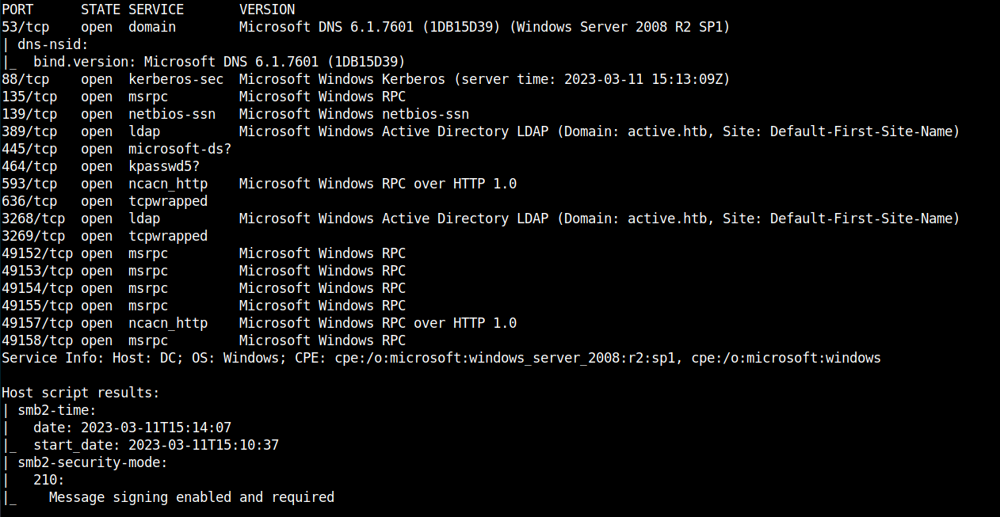
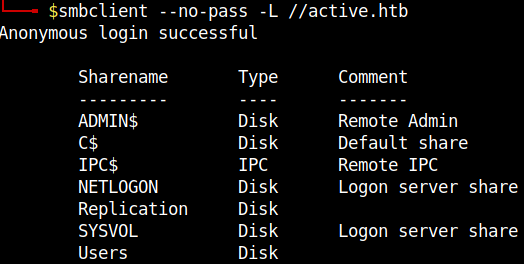
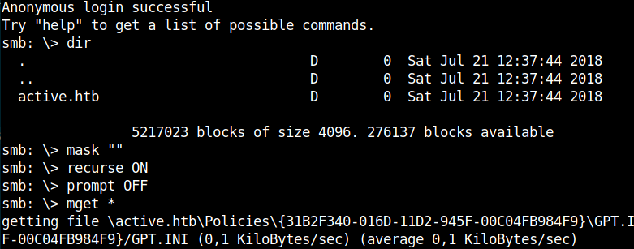
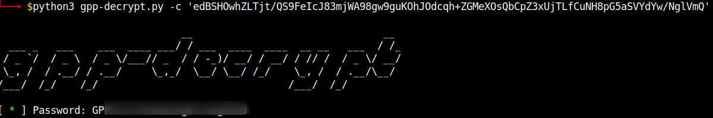
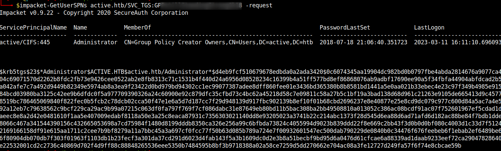
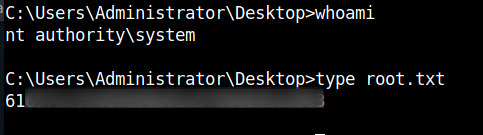

## HackTheBox - Active

We start and look with nmap which ports are open.

`nmap -sS -sV -T4 <IP>`

There are all sorts of ports open and services running on the machine.
As expected from the name of the box, we see that we are dealing with Active Directory and see the domain `active.htb` which I put in the `/etc/hosts` file.

I looked to see if we could get files from the SMB server.

`smbclient --no-pass -L //active.htb`

`Replication` could be accessed without a password and I downloaded everything to myself.

I examined the contents and the files.
The file `./Policies/{31B2F340-016D-11D2-945F-00C04FB984F9}/MACHINE/Preferences/Groups/Groups.xml` turned out to be interesting.
A `GPP file` which is created when a new `Group Policy Preference` is created.

I found a username `userName="active.htb\SVC_TGS"` and a `cpassword` with a cryptic value and looked for a tool to crack this password.

I quickly found it and got the password.

# PrivEsc

The privelege escalation was done quickly fortunately, as the first thing I tried was a `Kerberoasting`.

I used the tool `impacket-GetUserSPNs` for this attack and got a hash.

I looked on the [Example hashes](https://hashcat.net/wiki/doku.php?id=example_hashes) page of hashcat which mode we have to use,cracked and saw the administrator password.

`hashcat -m 13100 hash.txt /usr/share/wordlists/rockyou.txt`

With `impacket-psexec` I established a shell and got the flags.

`impacket-psexec active.htb/Administrator:<PASSWORD>@<IP>`

