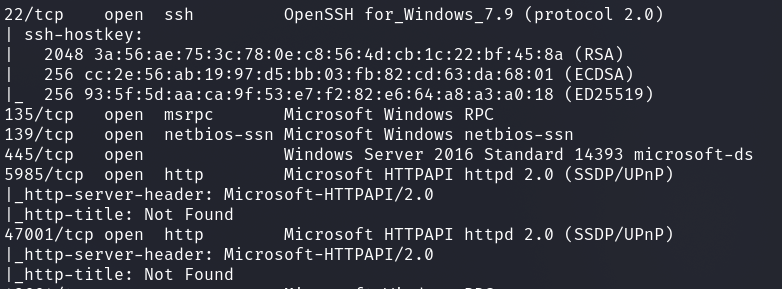
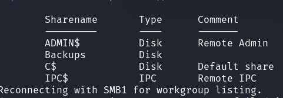
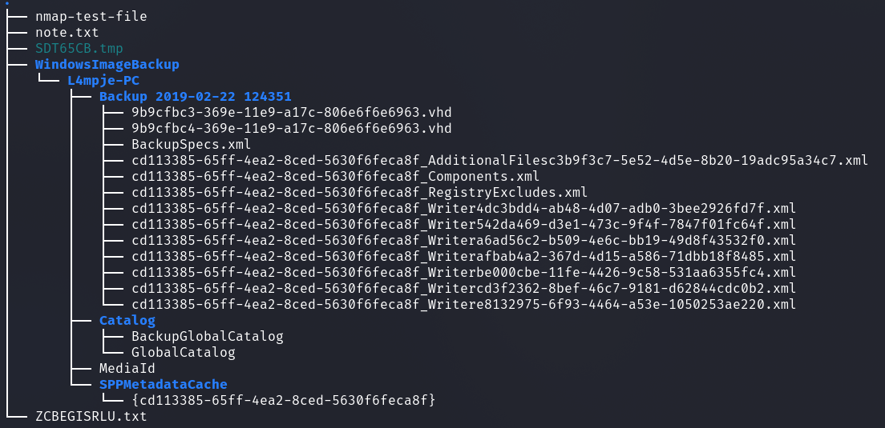
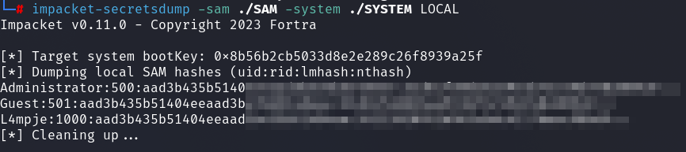
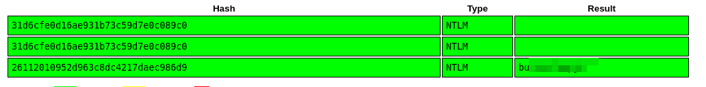
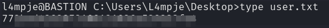
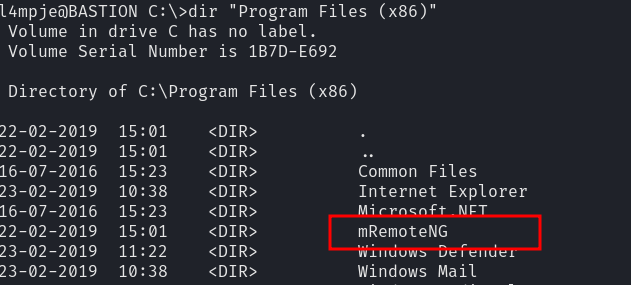
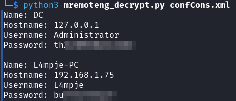
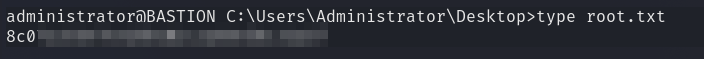

# HackTheBox - Bastion

I started with an nmap scan.

`nmap -sS -p- -T4 -sC -sV <IP>`

First I focused on the SMB server which was accessible without credentials.

`smbclient --no-pass -L //<IP>`

The `Backups` folder sounds interesting, let's take a closer look.

So I downloaded the Bakup folder to my machine which took some time...

__Content:__

`tree -a`

Interesting are of course the `.vhd` files.

I mounted this first to be able to inspect the contents.

`guestmount --add 9b9cfbc4-369e-11e9-a17c-806e6f6e6963.vhd --inspector --ro /mnt/vhd`

I first looked at some common directories like Desktop,Documents and so on and then I looked at the `SAM` and `SYSTEM` files.

I dumped the NTLM hashes...

... and got the password right on [Crackstation](https://crackstation.net/) without much cracking effort.

I logged into the machine via SSH and got the user flag.

## Privilege Escalation

Now I enumerated the system manually.

One of the first things I do is look at what programs are installed on the system.

From a Windows Privilege Escalation course I remembered that `mRemoteNG` stores access data in a `.xml` file.

I fetched this xml file __confCons.xml__ from the path `C:\Users\L4mpje\AppData\Roaming\mRemoteNG` and saved it on my Attacker machine.

The password is not stored in clear text.

So I used the [Tool](https://github.com/gquere/mRemoteNG_password_decrypt) and decrypted the password.

I got the administrators password, logged in via SSH and retrieved the final flag.

