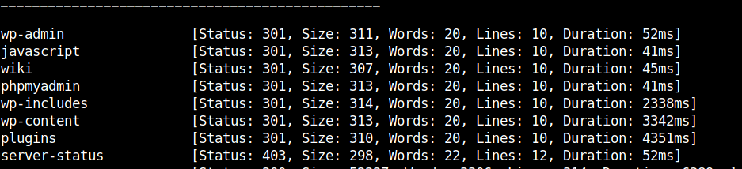

## HackTheBox - Blocky

# Enumeration

I started with the usual portscan and looked which ports are open for us.

`nmap -p- -sS -sV -T4 10.129.255.5`

We have a few ports open to interact with.
I carefully started to enumerate the webserver.

FFUF showed some interesting results.

`ffuf -w raft-medium-directories.txt -u http://blocky.htb/FUZZ -ic`

Okay, many things have already been set up here.
We have a *phpmyadmin*, a *wordpress* and a *wiki* which is "under construction".
Those were the things I jumped on first and enumerated further.

Then later I took a look at the path `/plugins` first.

Interesting, maybe it goes further here.
I downloaded the two plugins and unpacked them.

`jar xf BlockyCore.jar`

BlockyCore seemed to be a self made plugin.
in the file `BlockyCore.class` I discovered SQL credentials.

# User

I logged into `phpmyadmin`.
Now we are at a point where we can read or manipulate any data from the database.

Interesting is of course the user database of wordpress.
The user table `wp-users`.

I first had the idea to exchange the wordpress hash of the admin with a hash whose password we know to get access to the wordpress to install a reverse shell there.

But to my surprise it was enough to take the newly discovered user `notch` and the already known SQL password to log in to SSH with it.
*Password Reuse*....Nice!

I was logged in and got the flag!

# PrivEsc

The privelege escalation was done pretty quickly.

I looked at what rights we have with sudo `sudo -l`.

I could run everything via sudo, so a simple `sudo su` was enough and I was root.

