# HackTheBox - Blunder

We start with a simple portscan as always.

`nmap -sS -T4 -sV <IP>`

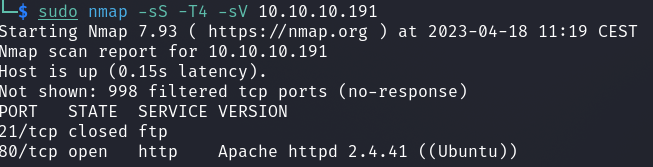

We see an FTP server, but its port is `closed` and an open web server on port `80`.

When we visit the site we see a blog page set up with a few facts about different things.

I started to enumerate the page manually and to run the usual tools like `FFUF`.

Under the path `/admin` we can see a login panel to `Bludit` and a quick search for it tells us that this is a CMS.

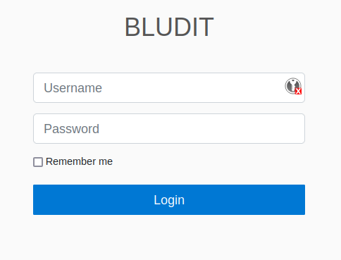

I found out a more exact version using the Firefox developer console in the `Network` tab.

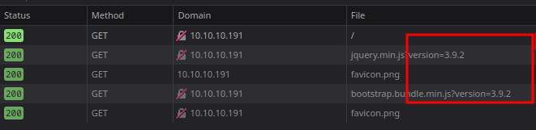

This version seems to have a `RCE` vulnerability and furthermore I found an `Auth Brute Force Bypass`.
I used an Auth-bypass script and first started to find a valid access with the typical `admin` user which did not work for a long time.

When I looked at the results of `FUFF`, I saw an interesting file on the webserver called `todo.txt` whose content was as follows:

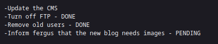

Ok, lo and behold we found a user named `fergus`.
I started to brute the user `fergus` with some most used passwords.
But that didn`t work either and I was a bit stuck.

Later I got the idea to create a custom bruteforce list with the tool `cewl` with all used words on the page.

And finally it worked:

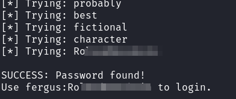

With this access data I could now proceed to the next exploit and got a reverse shell as user `www-data`.

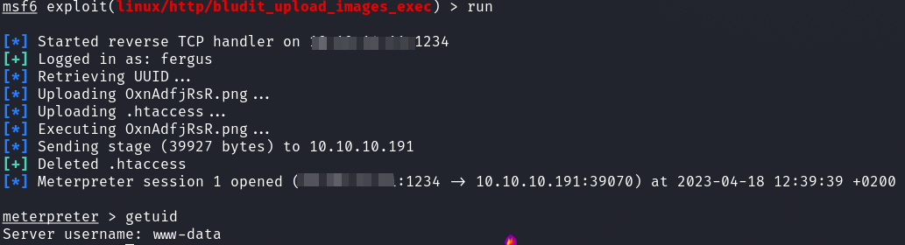

## PrivEsc 1: www-data -> hugo

I started to enumerate the system.
It took a little while until I found the essentials.

Interesting was that under the path `/var/www` were two folders of different bludit versions.

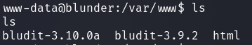

I took a closer look at these folders and on the newer version under the path `/var/www/bludit-3.10.0a/bl-content/databases` was a file `users.php` which contains settings for a used user named `Hugo` which is also found on our Linux system.

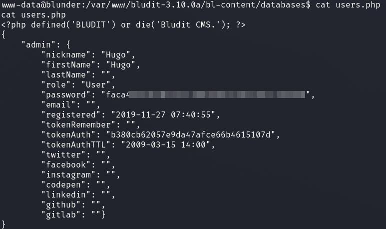

I tried to crack the password with the `rockyou.txt` wordlist which failed.
With the switch `-g` which generates random rules I started again and the password was cracked.

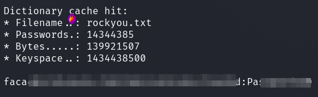

I logged in with the password as user `hugo` and got the user flag.

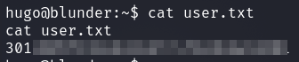

## PrivEsc 2: hugo -> root

The Privelege Escalation was done quickly, unlike the previous section.
One of the first things I looked at was `sudo`.

`sudo -l` shows us the following.

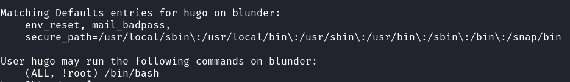

Well, we can run `/bin/bash` as any user we want, just not as `root` which we want to get.

I looked at the sudo version with `sudo -V`.

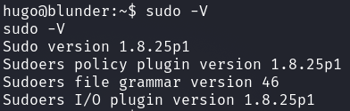

I looked to see if this version was vulnerable and found a simple exploit: [CVE-2019-14287](https://www.exploit-db.com/exploits/47502).

`sudo -u#-1 /bin/bash` does the job and I got the flag.

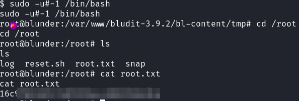
