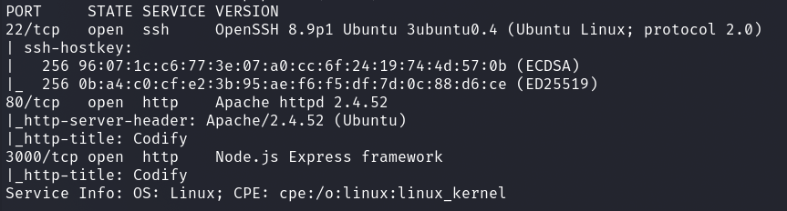
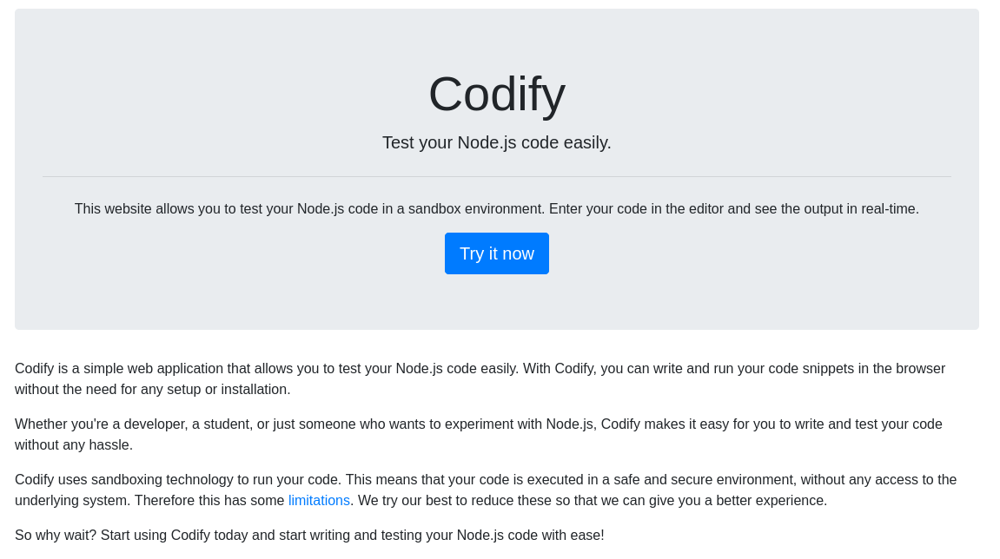
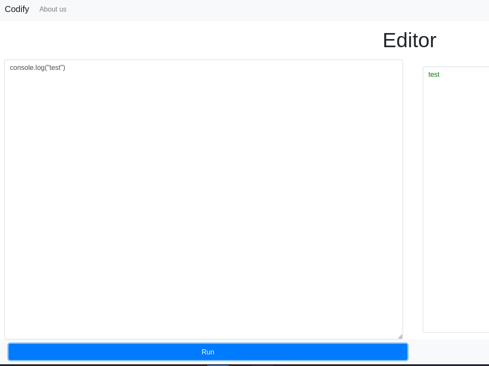
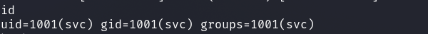
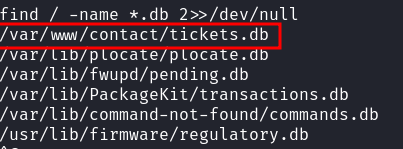
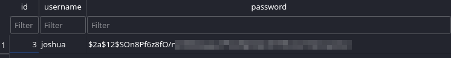
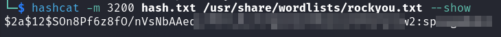
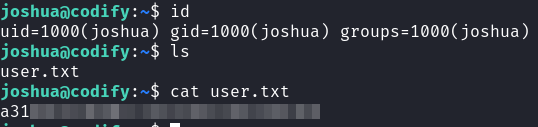
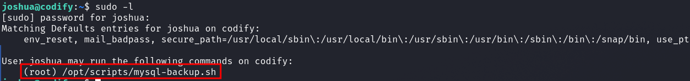
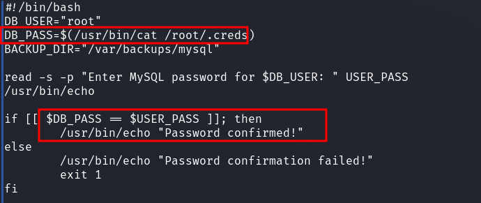

# HackTheBox - Codify

I started with a port scan.



We see three open ports from which I first accessed the web server.



It seems that we don't have to enumerate much the box.

We see a website and know immediately what it is for.

We can run Node.js code in a sandbox and test it.

Well, let's do that!



Arriving at the editor, we see an input and output window where we can play around with JS / Node.js code.

Now I googled for keywords __Node.js__ and __Sandbox Escape__ and quickly found a working [POC](https://gist.github.com/leesh3288/e4aa7b90417b0b0ac7bcd5b09ac7d3bd).

So I started a netcat listener, pasted the POC into the editor and added reverse shell code to the `execSync(' ')` function.

And I got something to see on my netcat listener.



## svc -> joshua

The user __svc__ does not yet take us to the first flag.

So I enumerated the system carefully and found an interesting database file which I wanted to take a closer look at.



As the database is not particularly large, I transferred it to myself by encoding it into base64:

`base64 /var/www/contact/tickets.db`

And saved the base64 string to a file and then decoded it and converted it as its original file.

`cat temp | base64 -d >> tickets.db`

I looked in the `sqlitebrowser` to see what was in the database.

The database was very small and I quickly found a `bcrypt` hash from the user __joshua__ which I cracked with `hashcat`.





With the password I logged in via SSH and there was the first flag.



## joshua -> root

Now I used `sudo -l` to see if we could run any commands under root and found what I was looking for.



So I took a look at the script.



It took me a while to figure out the trick.

So let's briefly break down what happens here.

We have a backup script here.

The backup script reads in a password that is located under `/root/.creds`, which we cannot access.

It compares our input with the read password.

If the condition is correct, the script performs a database backup.

I first entered many special characters when executing the script, and with the wildcard `*` character, the condition got TRUE and it was executed.

Then I realized what to do

Using the wildcard character we can enumerate the password.

I enumerated the password according to the following pattern.

```
#Try
a*          #FAIL
b*          #FAIL
c*          #FAIL
...
k*          #TRUE

#Password
k*		    #works
kl*		    #works
klj*		#works
kljh*		#works
kljh1*		#works

<SNIP>
```

That was a bit tedious and gave me a cramping hand for a moment, but still a cool simple bypass.

With the enumerated password I logged in as root using `sudo su` and got the root flag.


