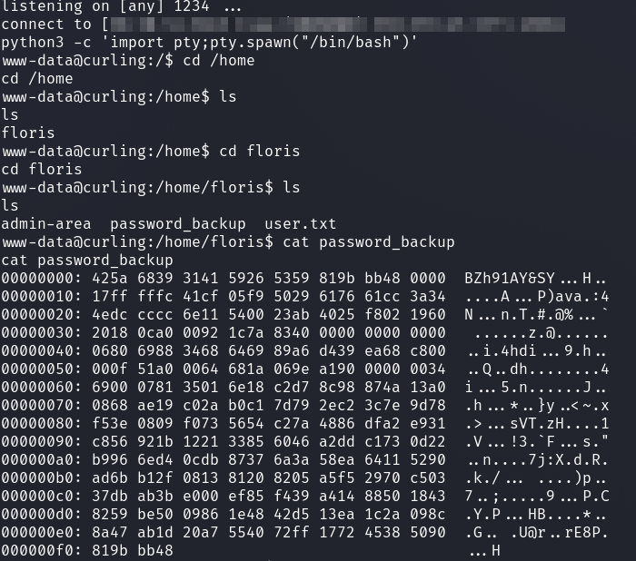

# HackTheBox - Curling

As always, it starts with a port scan.

We see an open web server and SSH server.

So I took a look at the web server.

The layout looked familiar to me as Joomla.

A click on __Wappalyzer__ addon confirms this.

I looked at the page and made my basic enumerations.

Looking in the source code for __HTTP-Comments__ I found something interesting.

I looked onto `/secrets.txt` and got a __base 64__ encoded string which I decoded.

Now I tried to log in with the password under guessed usernames like `admin` but failed.

So I went back to the Joomla content and got a username called `Floris`.

Now I successfully logged in with the two things I found and was in the Joomla CMS.

I just had a quick look to see if there were any other users in the CMS, but there were not.

I was logged in as __Floris__ as __Super User__.

In the `Control Panel` -> `Install Extensions` I installed a [webshell plugin](https://github.com/p0dalirius/Joomla-webshell-plugin/tree/master) from which I then established a reverse shell.

## www-data -> floris

In the `home` directory of user `floris` I found an interesting file called `password_backup`.

Looks like a hashdump of `xxd`.

I fetched the file and had a quick look at how to reverse this hashdump, which is very easy with the `-r` switch.

I used the `file` command to display the file type.

The file was easy to extract on kali and I got a `password.txt` file which contained the password of the user `floris`.

I logged in via __SSH__ and got the first flag.

## floris -> root

In the home directory of floris I noticed an interesting folder which is now relevant for the final Privilege Escalation.

I quickly used the __pspy64__ tool to see if any regular operations were taking place.

And yes!

We have an interesting `curl` command that does something with the input and output file.

The whole thing is executed as __UID 0__, so __root__.

But what happens here?

The `-K` switch reads in a config file that curl works with and with the `-o` switch the output ends up in the `report` file.

Which now also explains the previous content of the two files.

Curl retrieves the url `127.0.0.1` and outputs it to the report file.

 
 

__Root Flag:__

Curl is a really comprehensive tool and accepts more protocols than just HTTP.

Furthermore, we can also read files with `file://`.

So I got the root flag Quick & Lazy by changing the url parameter in the input config as follows.

And got it from the output in the `report` file.

