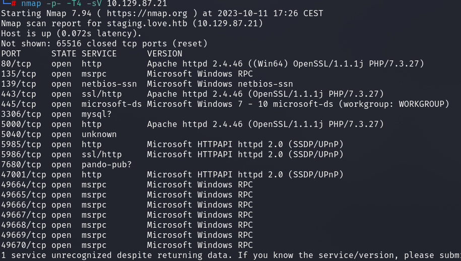
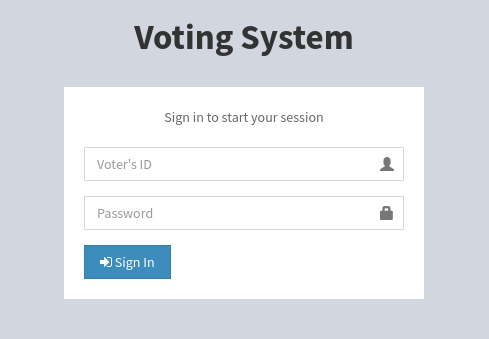
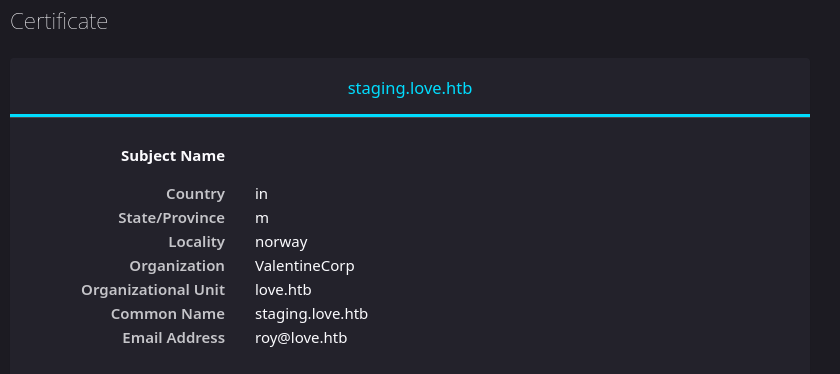
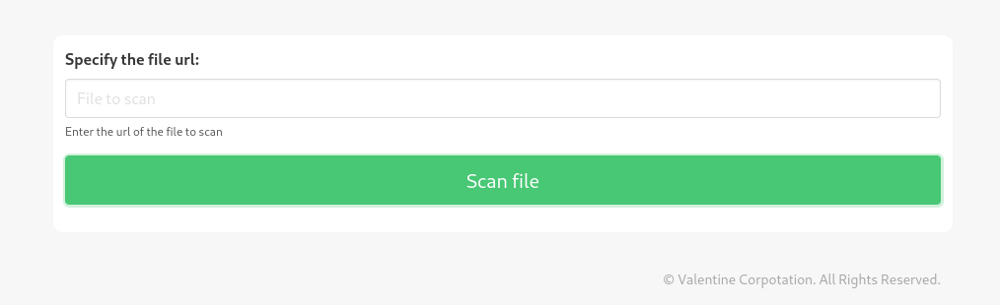
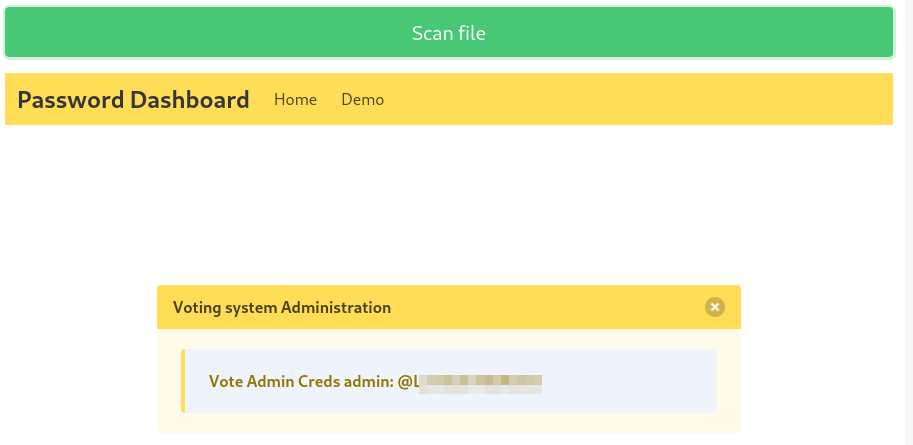
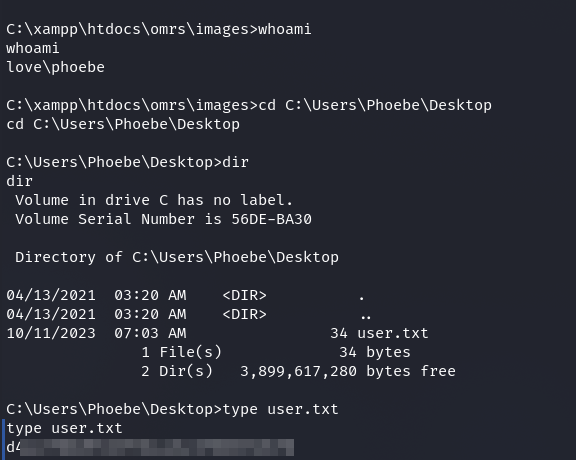
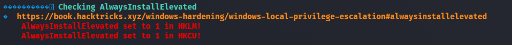
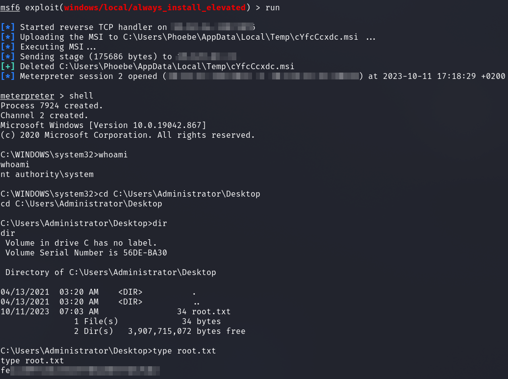

# HackTheBox - Love

I started with a portscan.

`nmap -p- -T4 -sV 10.129.87.21`

We see some open ports open.



I first looked at what is hidden behind the webserver ports.

Behind port 80 we see the access to a __voting system__-.



And behind port 5000 I only got a `403 / Forbidden` message.

On port 443 the same, but I looked at the certificate and saw a domain / subdomain.




So now I entered the domain and subdomain in my `/etc/hosts` file and could see what is on port `5000`.

I got to see a __Free File Scanner__ service.

In the top left tab there was a __Demo__ menu which takes us to a `/beta.php` page with the possibility to enter a __URL__.



The name `beta.php` prompted me to play around with the input field.

Since we are invited to enter a URL, my first thought here was to look for a __SSRF__ vulnerability.

And I was very surprised when instant access data jumped into my face when I entered it: `http://127.0.0.1:5000`.



Okay, then we move on to the __voting system__.

Previously, I had already done some research and seen an __Authenticated RCE__ exploit on exploit-db, which we can now use with our credentials.

The [Exploit](https://www.exploit-db.com/exploits/49445) needed only minimal modification.

I changed the URL paths in the script and set the IP of my attacker machine and the port of my netcat listener.

Executed and I got a shell as user `Phoebe` and fetched the first flag.



## Privilege Escalation

Now I enumerated the system a bit manually and since Windows Defender is turned off, I let __WinPEAS__ run for now.

I went through the output of WinPEAS and the following jumped out at me.



We see a message that the "AlwaysInstallElevated" Registry Keys are enabled.

Which I confirmed again manually:

```cmd
reg query HKCU\SOFTWARE\Policies\Microsoft\Windows\Installer /v AlwaysInstallElevated
```

```cmd
reg query HKLM\SOFTWARE\Policies\Microsoft\Windows\Installer /v AlwaysInstallElevated
```

For exploitation I used the metasploit module `windows/local/always_install_elevated`.

I got a most privileged shell as `nt authority\system` and fetched the final flag.




