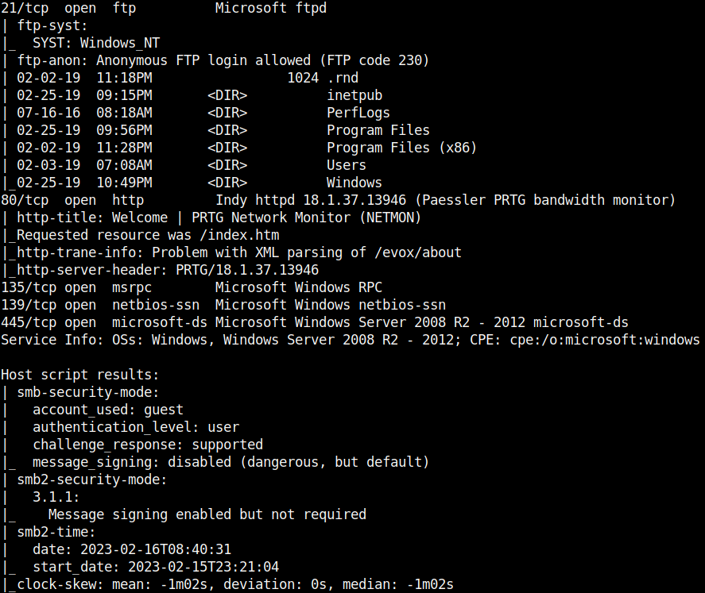
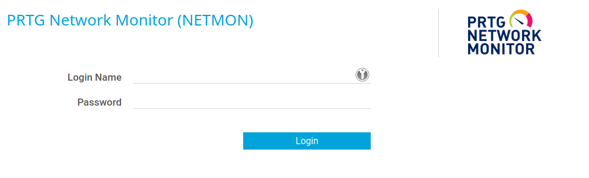
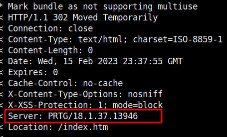
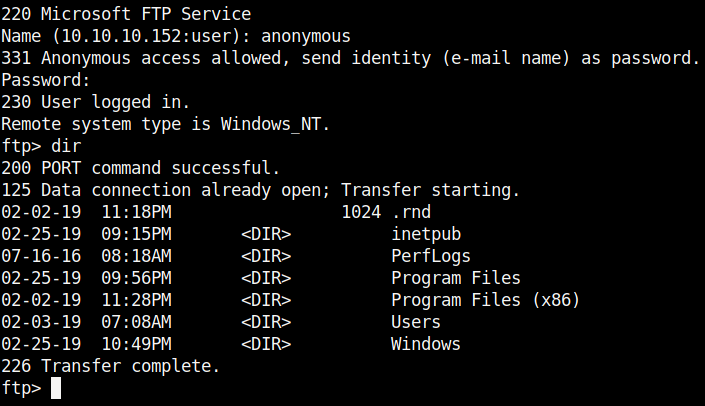
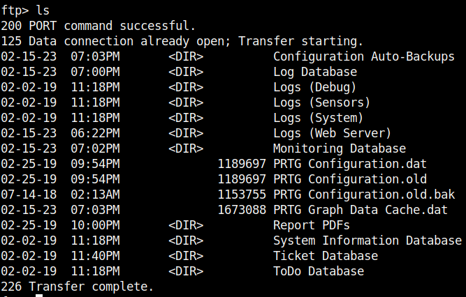
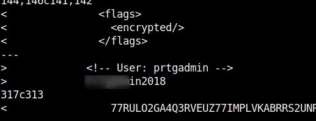
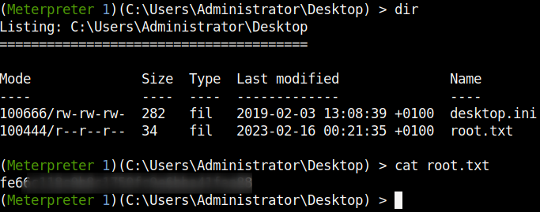

## HackTheBox - Netmon

It starts with a usual portscan.

`nmap -p- -T4 -sV -Pn -sC <IP>`



We see some open ports and the first thing I decided to do was to see what was running on the web server.



We see the login page to **PRTG Network Monitor**, a software for network monitoring.

Well, let's see if this tool is somehow vulnerable.
During my first search for information, I quickly learned that there are vulnerable versions and quickly found the corresponding exploit.

https://www.exploit-db.com/exploits/46527

*This vulnerability affects versions prior to 18.2.39*

Okay, good, but does our installed software also fall under this?
I started to do the usual enumerations and saw which version was installed when I looked at the response headers from the webserver.

`curl -v <IP>`



Fine, so our version is vulnerable!

But our RCE is "Authenticated", so we still have to find out the login credentials somehow.
I went looking for default credentials and found some that I tried, but to no avail.
A few manual attempts to get access using weak passwords also failed.

But we still have a few more open ports that could be interesting!
So back to the nmap results and I saw that the FTP server has an **Anonymous** account that we can log in with.



So I looked around on the FTP server for useful files and information, looked at some configs and logs that were not helpful until I came across the file **PRTG Configuration.dat**.

The file was in XML format and contained interesting things:

```xml
                <login>
                  prtgadmin
                </login>
                <name>
                  PRTG System Administrator
                </name>
                <ownerid>
                  100
                </ownerid>
                <password>
                  <flags>
                    <encrypted/>
                  </flags>
                  <cell col="0" crypt="PRTG">
                    PDWXMOPZT43U2GKGR3YCBILXDMLAUZVBN27KGBOPKXRQ====
                  </cell>
                  <cell col="1" crypt="PRTG">
                    M24VKFRECBEGN3ZQNGSET723GFIPVHYX
                  </cell>
                </password>
```

Unfortunately, the passwords seem to be encrypted.

I was looking for information on whether there is any way to decrypt them.
I found no way to decrypt the passwords, but I did find warnings that the software encrypts the passwords but still creates automatically generated backup copies in which the passwords are stored in plain text.
OK, now our search has a goal!

Under the path `\ProgramData\Paessler\PRTG Network Monitor` I found three configuration files.



The file `PRTG Configuration.dat` and `PRTG Configuration.old` are identical which a hash sum comparison confirmed, however the backup file `PRTG Configuration.old.bak` is slightly different.

So I used the `diff` command and quickly found the supposed password.

`diff PRTG\ Configuration.old PRTG\ Configuration.old.bak`



I tried the password directly but it didn't work.
Well, maybe the admin uses a new password every year and only changes the year at the end.
And it worked!

With a 2019 the current password was found and I was logged in.

Now we can run the RCE exploit with the credentials.
Metasploit provides us with the exploit which worked fine.

I was **NT AUTHORITY\SYSTEM** and got the root flag.


