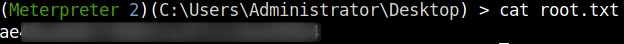

## HackTheBox - Optimum

# User

I start with the usual portscan to see which ports are open to us.

`nmap -sS -T4 -sV <IP>`

We see only one open web server on port 80.
A quick research on this service and version quickly lets us know that this service is vulnerable.

Metasploit provides us with an exploit.

The exploit worked fine, I got reverse shell and fetched the user flag.

# System

The privilege escalation was done with metasploit's `multi/recon/local_exploit_suggester` module just as quickly.
The exploit suggester modul suggested two possible exploits to me.

The second exploit worked, I got a session as `NT AUTHORITY\SYSTEM` and fetched the root flag.

