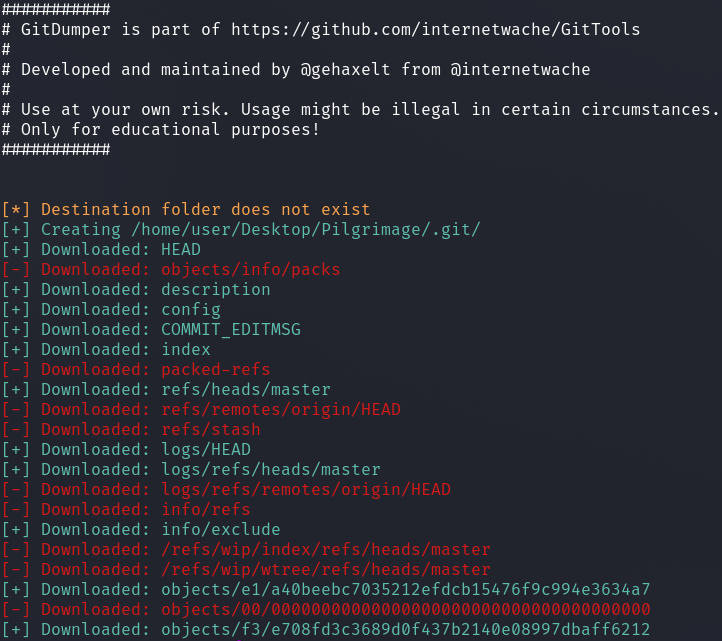

# HackTheBox - Pilgrimage

I started with a port scan.

`nmap -sS -p- -T4 -sV -sC <IP>`

We see an open SSH service and something as yet unknown on port `50051`.

So, what is running on this high port?

Nmap was not able to identify the port.

I tried to interact with the port somehow with netcat to get more information somehow.

The connection terminated after each input without output.

Later, on an open netcat connection without interaction, I saw that the connection was terminated with a piece of information.

Ok, now I had some information to work with.

I found out how to communicate with curl over HTTP/2 and got some more useful information.

`curl --http2 --http2-prior-knowledge <IP>:50051 -v`

We see a response header with `content-type: application/grpc`.

I looked online and learned that there is a __gRPC endpoint__ running.

So I read up on the basics and found out which tools are the best to interact with it.

[gRPC Security Series: Part 1-3](https://medium.com/@ibm_ptc_security/grpc-security-series-part-1-c0059362c4b5) proved to be a very informative guide.

With the following commands I first listed the services of the application. 

`grpcurl -plaintext 10.10.11.214:50051 list`

`grpcurl -plaintext 10.10.11.214:50051 list SimpleApp`

Then I listed the data fields that each option requires.

`./grpcurl -plaintext 10.10.11.214:50051 describe .LoginUserRequest`

`./grpcurl -plaintext 10.10.11.214:50051 describe .RegisterUserRequest`

`./grpcurl -plaintext 10.10.11.214:50051 describe .getInfoRequest`

We now know the names of the parameters that the options expect.

I went to the tool __Postman__ to test the application.

For what purpose `SimpleApp.getInfo` is not clear.

Here we only get the message that an authorization header is missing.

So I registered a user first.

After that I used the login function and got a token.

I add the token as a key-value pair for the `getInfo` request as header under the tab `Metadata`.

Also a parameter with the name `id` is expected here.

I started fuzzing the parameter and found that the application always returned an error except when the id is set to the value `1`.

__{ "id": "1" }__

I tried to insert a simple calculation operation and got no error at `2-1`.

__{ "id": "2-1" }__

Well, there is probably a vulnerability to __SQL injection__ here.

Manual SQL injection payloads followed.

The following payload showed me that this is a `SQLite` database.

__{ "id": "1 UNION SELECT sqlite_version()" }__

I manually enumerated the database and extracted a user named `sau` plus password.

__{ "id": "1 UNION SELECT password FROM 'accounts'" }__

Now I had a username and password and logged into the machine via SSH.

I got access and the first flag.

## sau --> root

I enumerated the system and found an interesting port `8000` when checking the sockets.

Using __Port Forwading__ I made the application accessible on my machine.

`ssh -L 8000:127.0.0.1:8000 sau@10.10.11.214`

I quickly found an exploit on [exploit-db.com](https://www.exploit-db.com/exploits/51532).

I set up a netcat listener, ran the exploit with a reverse shell command and got the `root` user.

