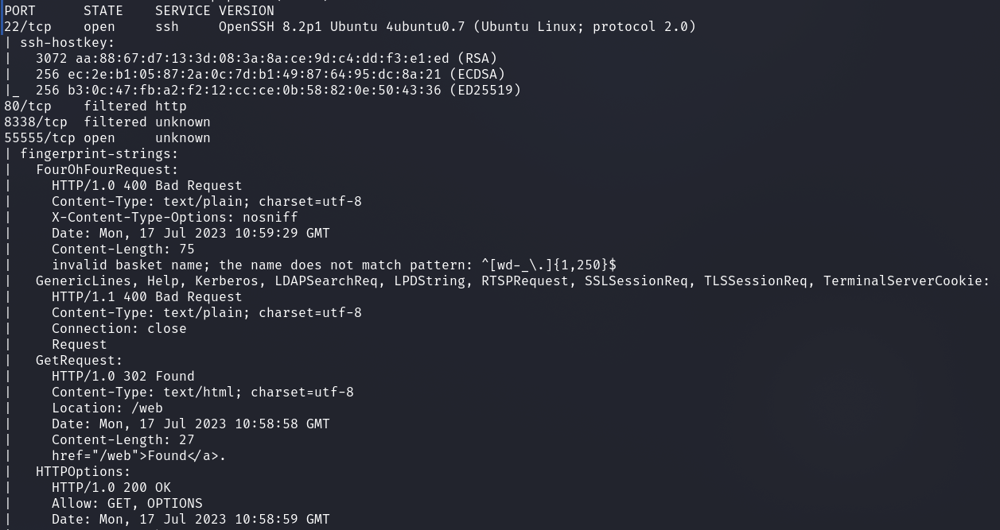
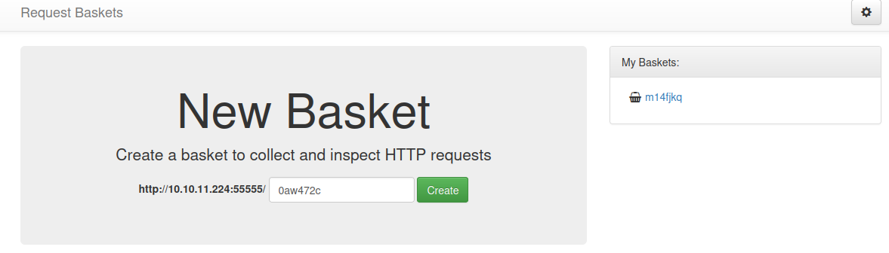
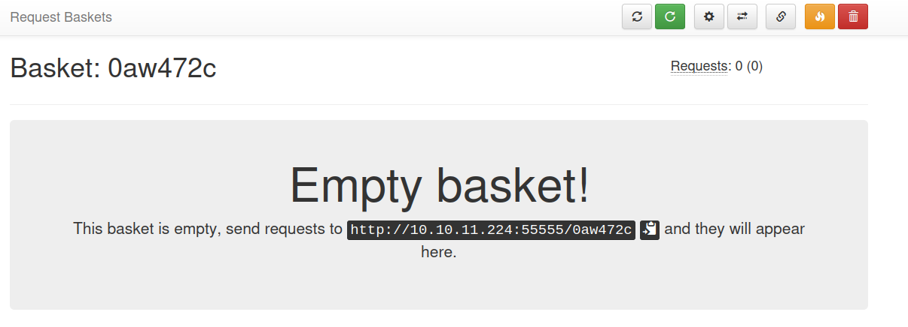
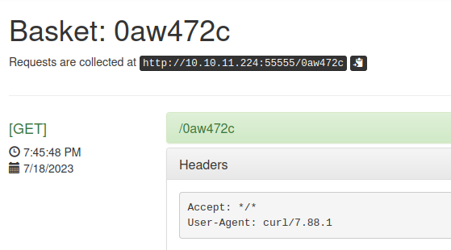
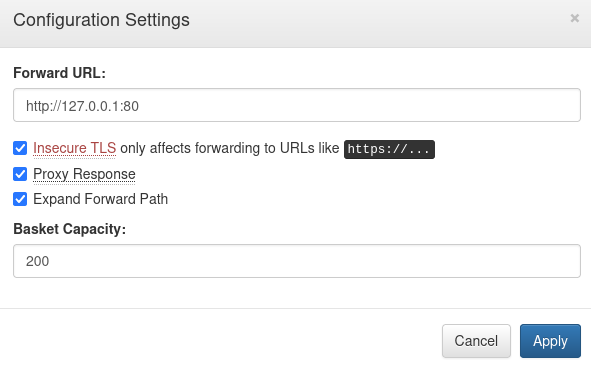
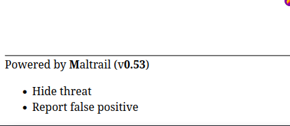
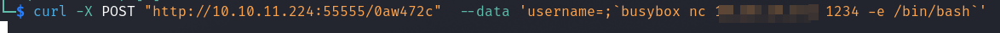
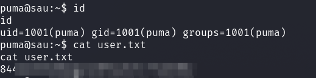
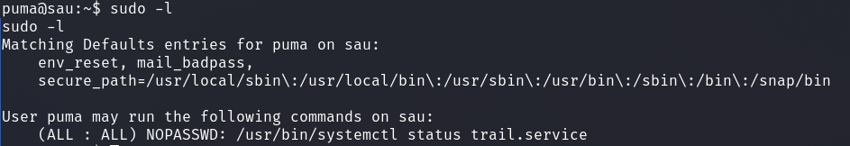

# HackTheBox - Sau

I started with a full port scan.

`nmap -p- -sS -T4 -sV -sC <IP>`

We see an open SSH server, two filtered ports and a webserver on an unusually high port.

Then let's see what is on port `55555`.

Interesting, so we can setup baskets here, get a url of the basket and we can then inspect HTTP request header.

I looked around for more options and functionalities.

Of special interest was that we can specify a __forward URL__ at __Settings__.

I set the forward URL to the localhost ip with port 80 `http://127.0.0.1:80`.

Now when we go to our basket in our browser we can see what is behind the port even though it is filtered.

A quick online search for __Maltrail (v0.53)__ quickly revealed an __Unauthenticated OS Command Injection vulnerability__  with a simple __POC__.

The exploit was executed with a simple curl command:

We just have to make sure that we set the basket settings correctly and the forward is set to `http://127.0.0.1/login` correctly

Netcat listener set, curl command issued and I got a reverse shell as user `puma` and the first flag.

## puma --> root

If we type `sudo -l` we see that we can run `/usr/bin/systemctl status trail.service` without password and as any user.

On [GTFOBins](https://gtfobins.github.io/gtfobins/systemctl/) we can look up how to exploit this.

`sudo -u root /usr/bin/systemctl status trail.service` and using `!sh` we can hop into a root shell.
