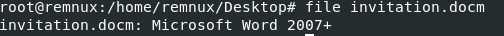
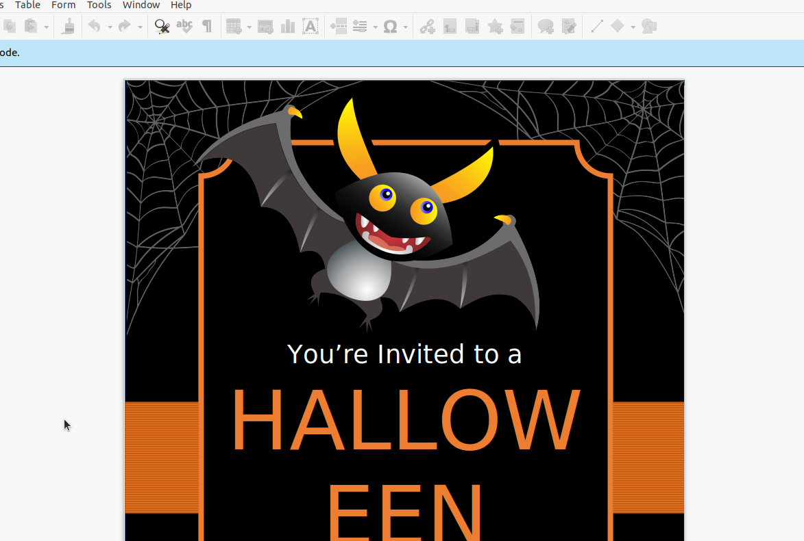
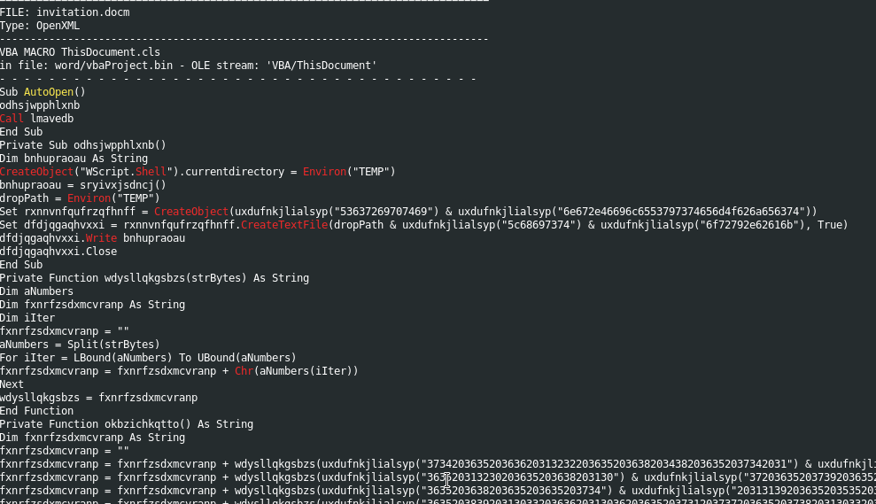
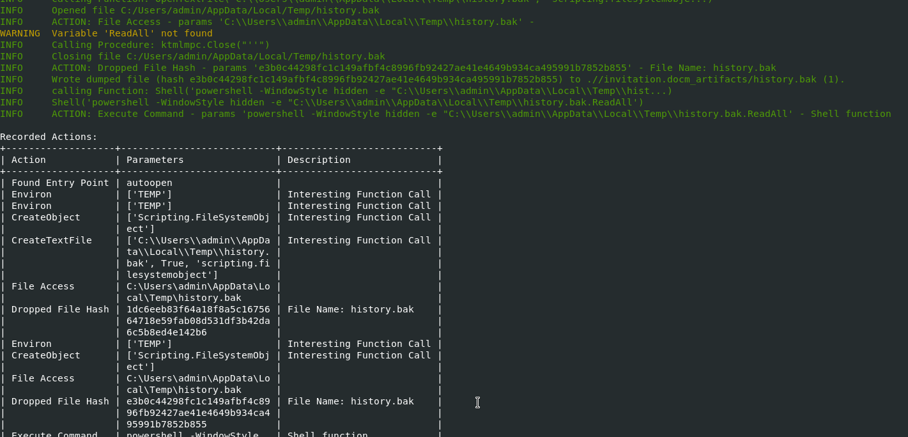
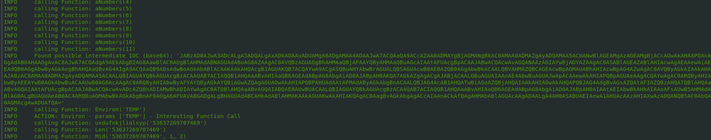
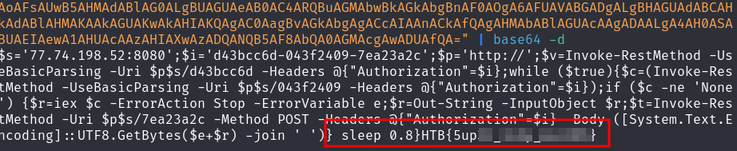

# Forensics - Halloween Invitation

## Description
> An email notification pops up. It's from your theater group. Someone decided to throw a party. The invitation looks awesome, but there is something suspicious about this document. Maybe you should take a look before you rent your banana costume.

## Walkthrough

I unzipped the challenge zip file and got a file called `invitation.docm`.

The name and the obligatory `file` comand, confirms that we are dealing with a Microsoft office document.

Opened normally, we see a simple invitation card.

Now I used __olevba__ to see if there was a macro in this document.

`olevba invitation.docm`

We quickly see that there is a macro in the document.

Lines like `CreateObject("WScript.Shell").currentdirectory = Environ("TEMP")` immediately caught my eye, so the embedded macro wants to work in the temporary working directory of the OS.

Suspicious.

Well, but the code is now obfuscated and we don't yet know what exactly is supposed to happen when it is opened.

Now I used the tool __ViperMonkey__, a VBA engine that emulates macro execution and provides us with useful information about what should happen when the macro is executed.

`vmonkey invitation.docm`

At the end of the output we get a lot of information about what the macro does, which files it wants to store, where and under which names and so on.

It became even more interesting in the output above with a base64 output during the emultation.

I decoded the base64 string and got the flag.

