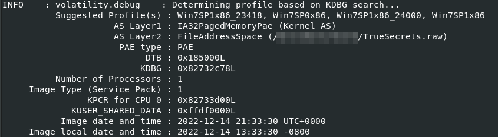
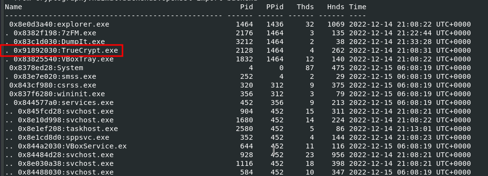
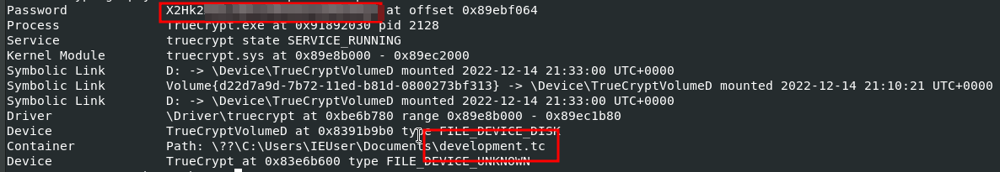
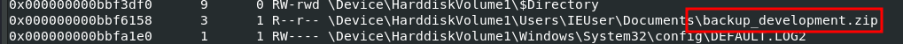
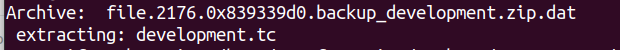
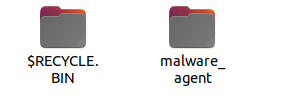
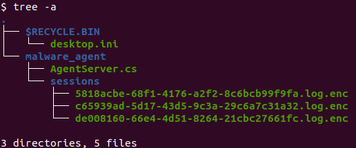
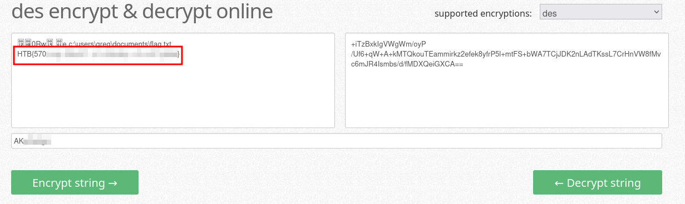
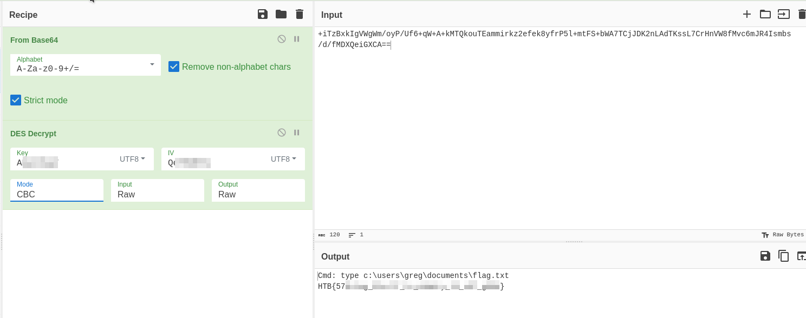

# Forensics - TrueSecrets

## Description
> Our cybercrime unit has been investigating a well-known APT group for several months. The group has been responsible for several high-profile attacks on corporate organizations. However, what is interesting about that case, is that they have developed a custom command & control server of their own. Fortunately, our unit was able to raid the home of the leader of the APT group and take a memory capture of his computer while it was still powered on. Analyze the capture to try to find the source code of the server.

## Walkthrough

I extracted the challenge file and we are given a file called `TrueSecrets.raw`.

According to the challenge description, we are dealing with a __Memory Capture__.

So I opened my Remnux VM and started investigating the memory capture using `volatility` (2 & 3). 

I started to run a general info command which gives me basic information about the OS of the capture and suggested profiles for volatility2.

`vol.py -f TrueSecrets.raw imageinfo`



OK, so our Meomry capture was probably done on a Windows 7 and we are recommended to continue working with those profiles.

So I continued with further scans via volatility: `pstree,psscan,cmdline....` and tried out a bit.

A scan for running processes shows a few interesting things, for example.

`vol.py -f TrueSecrets.raw --profile=Win7SP0x86 pstree`



Okay, the computer was obviously running __TrueCrypt__, a popular software for encrypting data to keep it secret.

Fits in with our challenge name, that's what we need to keep looking for.


Volatility also has Truecrypt plugins to get more information about Truecrypt: `truecryptsummary, truecryptpassphrase, truecryptmaster`.

`vol.py -f TrueSecrets.raw --profile=Win7SP0x86 truecryptsummary`



`truecryptsummary` gives us a good summary, mount information, name of the TC container AND the most important thing, the password!

So our backend code we are looking for will probably be in this truecrypt container.

I proceeded with a filescan and found that.

`vol.py -f TrueSecrets.raw --profile=Win7SP0x86 filescan`



Well, I then dumped all files by default and copied out all potentially interesting files according to my search pattern.

I extracted the file named `file.2176.0x839339d0.backup_development.zip.dat` which Volatility gave me and the truecrypt container appeared.

`unzip file.2176.0x839339d0.backup_development.zip.dat`



I installed TrueCrypt, opened the file container using the password I found earlier and the server code was found.



`tree -a`



Ok, so we have encrypted session log files and the file `AgentServer.cs` will probably contain interesting code which I'll just insert here.

```cs
using System;
using System.IO;
using System.Net;
using System.Net.Sockets;
using System.Text;
using System.Security.Cryptography;

class AgentServer {

    static void Main(String[] args)
    {
        var localPort = 40001;
        IPAddress localAddress = IPAddress.Any;
        TcpListener listener = new TcpListener(localAddress, localPort);
        listener.Start();
        Console.WriteLine("Waiting for remote connection from remote agents (infected machines)...");

        TcpClient client = listener.AcceptTcpClient();
        Console.WriteLine("Received remote connection");
        NetworkStream cStream = client.GetStream();

        string sessionID = Guid.NewGuid().ToString();

        while (true)
        {
            string cmd = Console.ReadLine();
            byte[] cmdBytes = Encoding.UTF8.GetBytes(cmd);
            cStream.Write(cmdBytes, 0, cmdBytes.Length);

            byte[] buffer = new byte[client.ReceiveBufferSize];
            int bytesRead = cStream.Read(buffer, 0, client.ReceiveBufferSize);
            string cmdOut = Encoding.ASCII.GetString(buffer, 0, bytesRead);

            string sessionFile = sessionID + ".log.enc";
            File.AppendAllText(@"sessions\" + sessionFile,
                Encrypt(
                    "Cmd: " + cmd + Environment.NewLine + cmdOut
                ) + Environment.NewLine
            );
        }
    }

    private static string Encrypt(string pt)
    {
        string key = "<REDACTED>";
        string iv = "<REDACTED>";
        byte[] keyBytes = Encoding.UTF8.GetBytes(key);
        byte[] ivBytes = Encoding.UTF8.GetBytes(iv);
        byte[] inputBytes = System.Text.Encoding.UTF8.GetBytes(pt);

        using (DESCryptoServiceProvider dsp = new DESCryptoServiceProvider())
        {
            var mstr = new MemoryStream();
            var crystr = new CryptoStream(mstr, dsp.CreateEncryptor(keyBytes, ivBytes), CryptoStreamMode.Write);
            crystr.Write(inputBytes, 0, inputBytes.Length);
            crystr.FlushFinalBlock();
            return Convert.ToBase64String(mstr.ToArray());
        }
    }
}
```

The code very briefly broken down encrypts CMD commands using __DES__.

Using the key found, we are able to decrypt the session logs.

First I used this quick & dirty [online tool](https://encode-decode.com/des-encrypt-online/).



But with a nicer CyberChef recipe, I wanted to solve it a little more elegantly for the sake of completeness.


