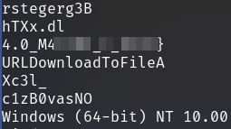
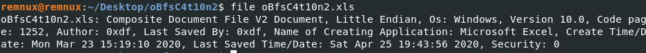
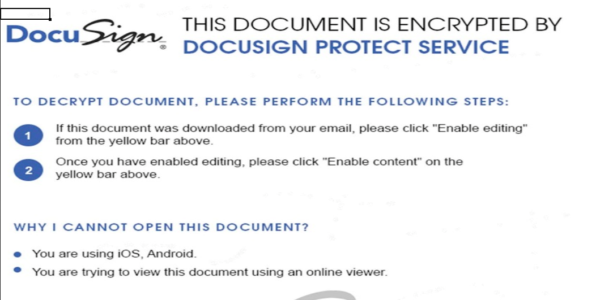
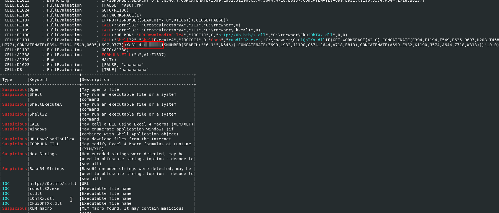
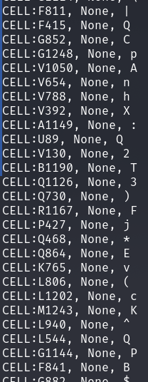
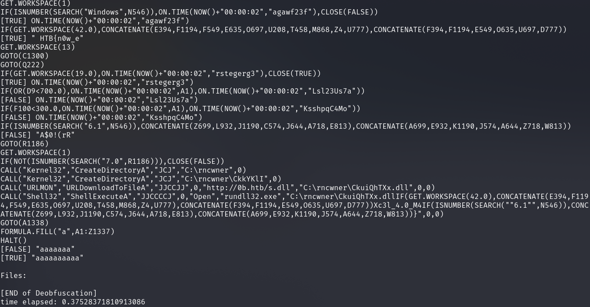
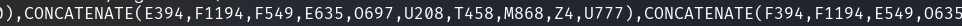

# Forensics - oBfsC4t10n2

## Description
> Another Phishing document. Dig in and see if you can find what it executes.

## Walkthrough

We have a file called __oBfsC4t10n2.xls__.

I started with a few basics like getting exif data, file command, looking at size and strings.

In the strings command I found a part, the end of the flag.

The `file` command confirms that we are dealing with an Excel file.

When opened, the document looks like this.

Ok, so far so good, but what next?

I first used the [olevba](https://github.com/decalage2/oletools/wiki/olevba) tool to see what was going on behind the scenes of the document and whether we could detect any malicious code.

We see code that works with the cells of the document `CONCATENATE(...`, `GOTO(C1300)` and so on.

I used the tool [XLMMacroDeobfuscator](https://github.com/DissectMalware/XLMMacroDeobfuscator) to show me a list of what is in the cells.

`python3 deobfuscator.py --file .//oBfsC4t10n2.xls -x`

And showed me the payload code separately as follows.

`python3 deobfuscator.py --file ./oBfsC4t10n2.xls --no-indent --output-formula-format "[[INT-FORMULA]]"`

So I puzzled together the first part of the flag from this Concatenations function:

I put the flag together with the findings from the previous steps and redeemed them.

## Further Information

Two articles about __XLM / Excel 4.0__ macros which have helped me I would like to link here.

https://hatching.io/blog/excel-xlm-extraction/

https://clickallthethings.wordpress.com/2020/04/06/covid-19-excel-4-0-macros-and-sandbox-detection/
