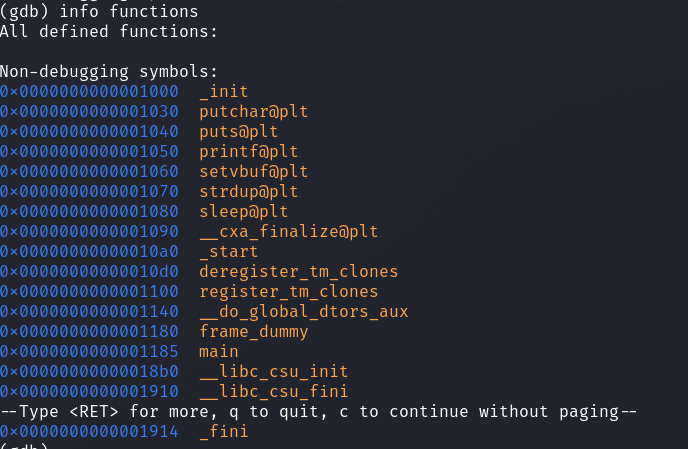
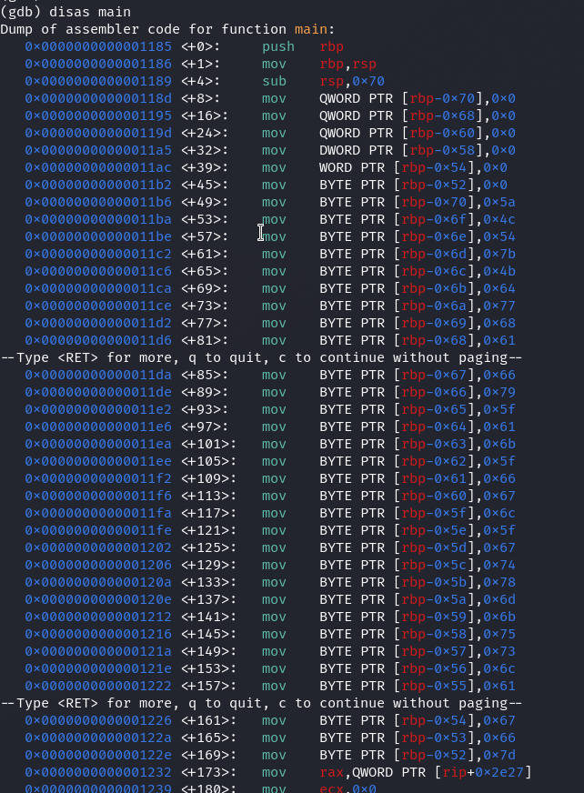
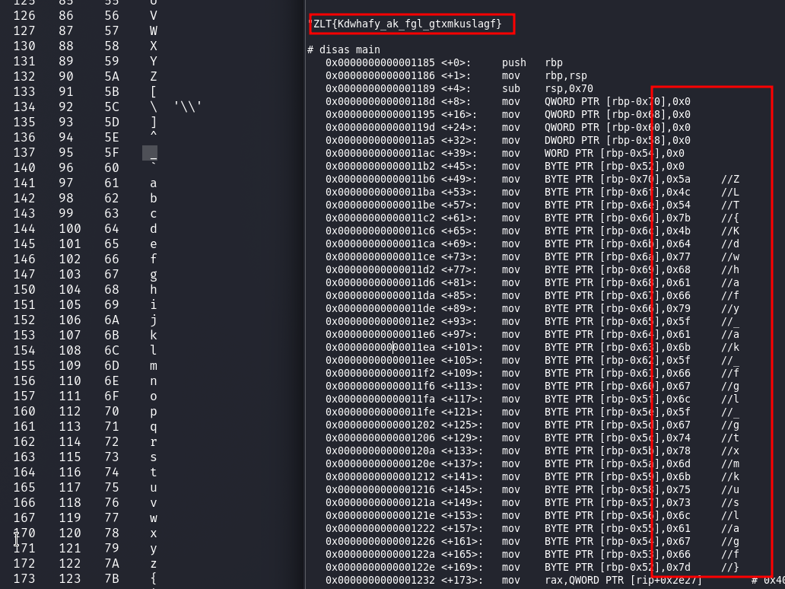
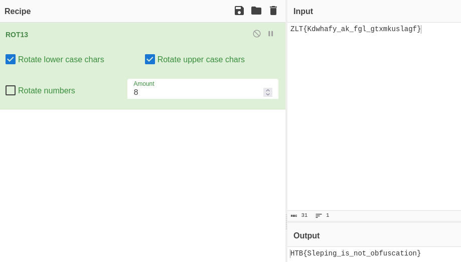

# Reversing - Ouija

__Description:__

> You've made contact with a spirit from beyond the grave! Unfortunately, they speak in an ancient tongue of flags, so you can't understand a word. You've enlisted a medium who can translate it, but they like to take their time...

## Walkthrough

Since reversing is a new area I want to dive into more for the year 2024, this simple challenge was ideal.

I downloaded the challenge .zip file and unzipped it.

We are given a file called __ouija__.

After a few basic checks like `strings`,`file` and so on I opened the file with `gdb`.

Then I listed all the functions using `info functions`.

Now I listed the assembler instructions using `disas main`

We see many of these instructions at the beginning of the disassembled code: ` mov BYTE PTR [rbp-0x70],0x5a` for example.

These instructions initialize individual bytes in the local memory space of the current function's stack frame by assigning specific hexadecimal values.

Each `mov BYTE PTR [rbp-offset]`, value statement sets the byte at the given offset relative to the base pointer `(rbp)` to a specific value.

So I opened the ascii manpage in linux, and wrote down the hex in readable ascii characters, and concatenated them.

The result looked something like a flag.

But without our desired HTB prefix.

Well, since the special characters of the flag are in the right place but the letters looks still random, we are probably dealing with a __ROT shift__ of the letters.

I opened CyberChef and with a shift of the letters by __8__ the flag was now readable.

