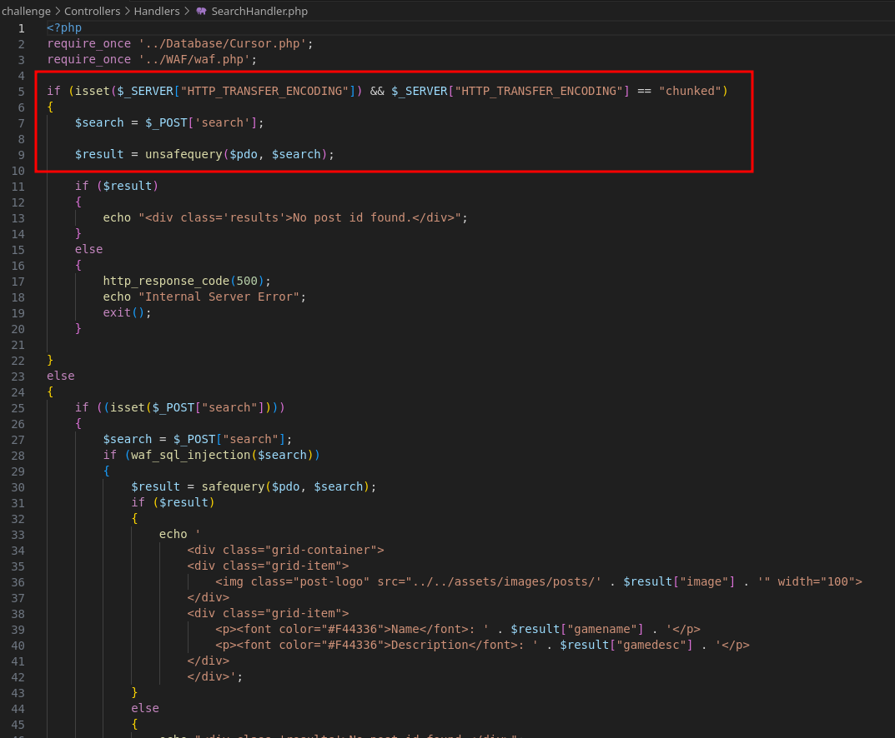
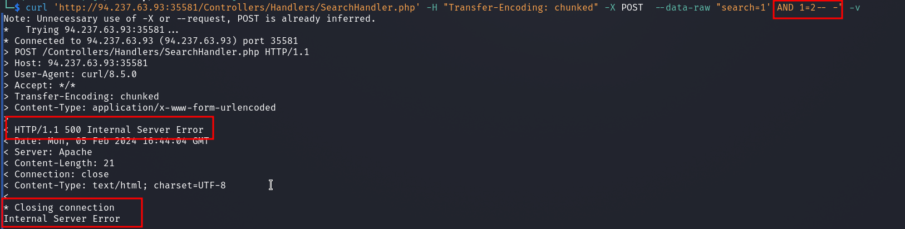

# Web - 0xBOverchunked

## Description
> Are you able to retrieve the 6th character from the database?

## Walkthrough

We have a web challenge where the source code is also available to us.

I went to the website first and we have a simple input field and we can enter numbers and get information about different gameboy characters.

Well...at least up to number 5.

For number 6 we get the information that we are not allowed to see it.

Because that's where our flag is, as we can see from the sql file `init.sql`.

I first played around with the input field and tried it out.

When we try SQL Injection we get the following output

Well OK, let's take a look at the challenge code.

The highlighted area is of particular importance.

If a HTTP header field called `Transfer-Encoding:` with the value `chunked` is set in the query, a function called `unsafequery` is used.

Let's go to the code of these functions.

In the file `Cursor.php` we see our `unsafequery` function and the safe one.

Our insecure function is vulnerable to SQL injection, the other one is not because it uses prepared statements.

It is also important to note here that the function is written in such a way that the status code `500` is returned for a non-valid MYSQL query.

### Solution

Ok, so all we need to do is add a HTTP header field `Transfer-Encoding: chunked` and then we can perform the SQL injection.

With `curl` I manually confirmed the SQL gap first.

__Valid:__

__Error:__

I then performed the exploitation with `sqlmap` and used the `--header` flag.

`sqlmap --dbms sqlite -u "http://<IP>/Controllers/Handlers/SearchHandler.php" --method=POST --data "search=1" -p search --header "Transfer-Encoding: chunked"`

The vulnerability was confirmed and I dumped the database/flag.

