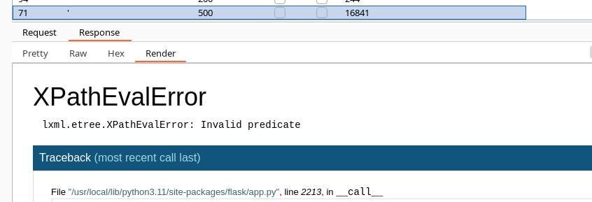

# Web - E.Tree

## Description
> After many years where humans work under the aliens commands, they have been gradually given access to some of their management applications. Can you hack this alien Employ Directory web app and contribute to the greater human rebellion?

## Walkthrough

For this Challenge, we were given the Challenge code and an online instance.

First, as always, I took a look at the online instance.


We see a page with a search field where we can enter names.

Under `/leaderboard` we have a "Hall of fame".


Let's take a name from the Hall of fame and see what the application tells us when we enter the name.


If we simply enter some gibberish, we get a negative output and we are told that this staff does not exist.


So far so good, let's move on to the challenge code.

__Challenge Code in tree-like format:__

```
├── Dockerfile
├── build-docker.sh
├── challenge
│   ├── application
│   │   ├── app.py
│   │   ├── blueprints
│   │   │   └── routes.py
│   │   ├── config.py
│   │   ├── static
│   │   │   ├── css
│   │   │   │   └── main.css
│   │   │   ├── favicon.png
│   │   │   └── js
│   │   │       └── main.js
│   │   ├── templates
│   │   │   ├── index.html
│   │   │   └── leaderboard.html
│   │   └── util.py
│   ├── military.xml
│   ├── requirements.txt
│   └── run.py
└── config
    └── supervisord.conf
```

The __util.py__ file was of particular interest.


Here I already became aware of the comment "who cares about parameterization" and the import `from lxml import etree` shows us what kind of data processing we are dealing with here.

Now I took a look at the file `military.xml`.

And here is a small section of it, and here is also our flag in two parts.


## Exploitation

Now I started to try the exploitation and used __Burp__.

Here is an example of a valid search.


I first fuzzed the field with the __Burp Intruder__ on all printable ascii characters to detect error messages and other anomalies.


The only character that causes an HTTP-500 error was a single quote `'` and shows us an XPATH error.



The resources on [Hacktricks](https://book.hacktricks.xyz/pentesting-web/xpath-injection) were helpful for the progress of the exploitation.

The first thing I found out with this injection type was that we can work with boolean values.

With `' or '1'='1` we get a POSITIVE response:


And with `' or '1'='2` we get a NEGATIVE response.


So far so good, we already have valid queries and see that we can work with boolean responses.

So I played around a bit and looked for a way to extract data / our flag.

I found this query useful: `'or //selfDestructCode[contains(., '')] or'`

With this we can check if there is a certain string in the `<selfDestructCode>` element where our flag is stored.

And I already found a proof of concept:

The string 'HTB{' gives us a positive feedback:


While `DONT_EXIST` gives us a negative response.


Okay great!

All I had to do now was to brute the flag char by char using the Burp intruder and a printable Ascii list.

So I bruted the flag char by char and looked for the positive responses.


