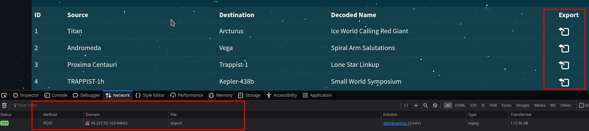

# Web - Orbital

## Description
> In order to decipher the alien communication that held the key to their location, she needed access to a decoder with advanced capabilities - a decoder that only The Orbital firm possessed. Can you get your hands on the decoder?

## Walkthrough

In this challenge, we are given the challenge code and an online instance.

The first thing I did was look at the site and came across a login portal.


Now I took a look at the challenge code.


These lines of code handle our login.

The comment also leads us in the direction that there is probably a __SQLi vulnerability__ here.

I intercepted a normal login attempt via burp, saved the request in a `login.req` text file and ran __sqlmap__.

__Command:__ `sqlmap -r login.req --level 4 --risk 3 --dbms=mysql --batch`


SQLmap quickly confirmed a vulnerability and showed us available databases.

In the database `orbital` was a table called `user` which I dumped and got a md5-hash.


The hash was quickly cracked using `hashcat`.


Now I could log into the application and had access to further functions.

Interesting here was an `export` function with which we can download audio files from the web server.



Intercepted in Burp, the whole thing looked like this.


Now to the challenge code of this export function:


The comment leads us in the right direction again and shows us a weak filter which is probably trying to prevent __Local File Inclusions__.

Any input `../` is filtered out.

A small illustration of how the filter works:

```
Input    | After passing Filter
---------+---------------------
../      | <NOTHING>
.../     | .
..//     | ./
..././   | ../
```

So our bypass for LFI is `..././` and we can use it to move through the file system and include other files.

I included the `/etc/passwd` file and our LFI is confirmed.


But what about our flag?

According to the unpacked file, the flag should be in the webroot directory.

I ran the docker instance locally and saw that the flag is replaced and renamed.


OK,then I'll just get the flag under `/signal_sleuth_firmware`!


